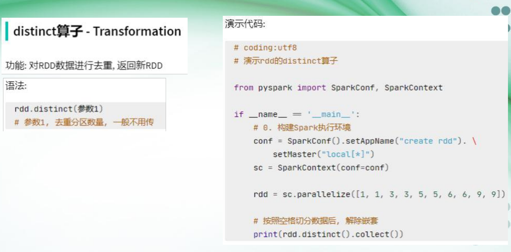

# 第1讲：大数据概论
## 课件批注
大数据计算的四种主要形式及其常用框架：

## 知识笔记
1. `Apache Flink`是由Apache软件基金会开发的开源流处理框架，其核心是用`Java和Scala`编写的分布式流数据流引擎。
2. Spark和Flink发展至今，基本上已经是实时计算领域的事实标准。
3. `大数据`、`云计算`、`物联网`是IT领域的最新发展趋势。
4. Nvidia、阿里巴巴等公司正在加紧开发Spark对GPU的支持。

# 第2讲：大数据存储架构`HDFS`
## 课件批注
Google为Hadoop提供了灵感来源：

HDFS、YARN、MapReduce的关系：

Hadoop生态系统概览：

HDFS的缺点：


## 知识笔记
### 历史事实
1. Gogg Cutting -开发-> Lucene -子项目-> Nutch -扩展后并入-> Hadoop --> 并入Apache基金会
### Hadoop框架整体概述（本应单独成板块）
1. Hadoop Distributed File System，简称HDFS，是一个分布式文件系统。
    - NameNode（nn）：也可称为“主节点”（`Master Node`），存储文件的元数据，如文件名，文件目录结构，文件属性（生成时间、副本数、文件权限），以及每个文件的块列表和块所在的DataNode等。
    - DataNode(dn)：也可称为“从节点”（`Slave Node`），在本地文件系统存储文件块数据，以及块数据的校验和。
    - Client：即用户的客户端，主要有以下功能：
          1. 文件切分。文件上传HDFS的时候，Client将文件切分成一个个的`Block`，然后进行上传；
          2. 与NameNode交互，获取文件的位置信息；
          3. 与DataNode交互，读取或者写入数据；
          4. 提供一些命令来管理HDFS，比如NameNode格式化；
          5. 可以通过一些命令来访问HDFS，比如对HDFS增删改查操作。
    - Secondary NameNode(2nn)：并非NameNode的热备。当NameNode挂掉的时候，它并不能马上替换NameNode并提供服务.辅助NameNode，分担其工作量，比如定期合并`Fsimage`和`Edits`，并推送给NameNode。**通常**不放在NameNode主机中，放在一个独立的机器上。
    - Standby NameNode(snn)：NameNode的热备。当NameNode挂掉的时候，snn会自动替换为`Active NameNode`提供服务，同事具有SecondaryNameNode的功能。
2. Yet Another Resource Negotiator，简称YARN，是Hadoop的资源管理器。
    - ResourceManager(rm)：负责集群的资源调度，管理集群的资源（内存、CPU等）。
    - NodeManager(nm)：负责管理单个节点的资源，例如启动容器，管理容器的资源。
    - ApplicationMaster(am)：负责管理单个任务。
    - Container：在NodeManager上运行的进程，负责执行任务相当于一台独立的服务器，里面封装了任务运行所需要的资源，如内存、CPU、磁盘、网络等资源。
3. MapReduce是Hadoop的分布式计算框架，将计算分为2个部分
    - Map：将输入数据按照一定的规则进行分组，每个分组就是一个key，key对应的value就是分组的数据。主要阶段有：`Input/Spliting`、`Mapping`和`Shuffle`，其中`Shuffle`又可分为`Partition`、`Sort`和`Merge`，部分情况下也可以引入`Combine`在Mapper中完成对部分数据的局部聚合（分块的Reduce）。
    - Reduce：对Map的结果进行合并汇总。
    - MapReduce的特点
         1. 易于编程
         2. 扩展能力强
         3. 高容错（HDFS备份机制）
         4. 适合PB级以上数据的**离线处理**
4. Hadoop项目结构的不同部分总结：
    - HDFS：Hadoop分布式文件系统，负责存储数据，管理数据，提供数据访问接口。
    - YARN：分布式计算框架，负责调度资源
    - ZooKeeper：分布式协调服务，负责管理集群状态，提供分布式锁。
    - Hbase：Hadoop上的`非关系型`的分布式数据库，负责存储数据，管理数据，提供数据访问接口。
    - MapReduce：离线计算框架。
    - Tez：DAG计算框架，运行在YARN之上的下一代Hadoop查询处理框架.
    - Spark：实时内存计算框架。
    - Flume：一个专门用于日志收集和传输的分布式服务。Flume 的核心功能是可靠、高效地收集、聚合和传输数据（尤其是日志数据），它的目标是作为日志采集工具，为流计算框架提供数据来源。
    - sqoop：一个用于在Hadoop与传统数据库之间进行数据传递的`TEL工具`。
    - Hive：一个Hadoop上的数据仓库
    - Oozie：Hadoop上的工作流管理系统。
    - Ambari ：一个用于管理和构建 Hadoop 集群的 Web UI。


### HDFS分布式文件系统
1. 组成与结构2（见Hadoop板块）
2. 主要优点
    - 兼容廉价的硬件设备
    - 流数据读写
    - 大数据集
    - 简单的文件模型
    - 强大的跨平台兼容性
3. 主要缺点
    - 不适合`低延时`数据访问，如毫秒级数据存储
    - 无法高效存储大量小文件（`寻址时间可能超过读取时间`）
    - 不支持`并发写入`和`随机写入`
4. 默认缺省
    - HDFS的Block默认副本数是`3`（一份`同主机`，一份`同机架异主机`，一份`异机架异主机`）
    - HDFS的Block默认大小是`128MB`（2.x版本前为`64MB`）
    - 文件不到`128MB`，默认独立一个Block
    - Secondary NameNode默认`1小时`执行一次合并备份生成`fsimage.chkpoint`
    - Secondary NameNode默认`1分钟`检查一次`NameNode`的操作次数
    - Secondary NameNode默认`1百万次操作`执行一次合并备份生成`fsimage.chkpoint`
    - DataNode默认`3秒`向`NameNode`发送`heartbeat`
    - DataNode默认`6小时`向`NameNode`汇报一次`自己节点的块信息`
    - DataNode默认`1小时`汇报一次`自己节点的数据目录信息`
    - NameNode默认`5分钟`主动检查一次无心跳DataNode
    - NameNode默认`10次`NameNode发送的心跳（默认`2次`检查后）
    - NameNode默认`10.5分钟`（2次检查+等10次心跳，称为`超时时间`）没收到DataNode心跳就认为该DataNode挂了。
5. 优化原则
    - HDFS块的大小设置主要取决于`磁盘读写速率`
    - NameNode会选择离待上传数据最近的DataNode作为上传目标，这个距离的计算可以出题：

1. 写数据流程
    1. 客户端请求，NameNode检查`文件是否已存在`和`父目录是否已存在`，并返回是否可上传。
    2. 客户端请求Block 的分配，NameNode返回Block及其所有副本存储的多个`DataNode`（如：dn1,dn2,dn3）
    3. 客户端向接受非副本上传的`dn1`发送请求，dn1向dn2，dn2向dn3递归请求调用，形成通信管道，dn1,dn2,dn3逐级应答客户端
    4. 客户端仅向`dn1`以`Packet`为单位上传Block，然后由dn1,dn2完成副本的递归传递
    5. 对于下一个Block，客户端向NameNodel重新请求并重复步骤2-4。
2. HDFS读数据流程
    - 客户端通过DistributedFileSystem向NameNode请求下载文件，NameNode通过查询元数据，找到文件块所在的DataNode地址。
    - 挑选一台DataNode（就近原则，失败后随机）服务器，请求读取数据。
    - DataNode开始传输数据给客户端（从磁盘里面读取数据输入流，以`Packet`为单位来做校验）。
    - 客户端以`Packet`为单位接收，先在本地缓存，然后写入目标文件。
3. 元数据因为经常需要进行随机访问还有响应客户请求，因此存储在NameNode节点的`内存`中。
4. NameNode的存储在硬盘中的容错机制主要有：
    - `fsimage`用于备份完整元数据的文件目录和结构等（除第一次`NameNode`启动由其自己创建外，均由`Secondary NameNode`合并生成），
    - `Edits`是`只写`的文件系统修改日志，有较高效率。
    - 合并以上两者可以实现对元数据的合成，而该合并往往由独立的`Secondary NameNode`（有时也由`Standby NameNode`代行）执行以提高NameNode的运行效率。
5. `NameNode HA`是`Hadoop 2.x`后引入的元数据同步机制，主要是提供了一个`Standby NameNode`。
6.  所有操作都遵循`先更新日志再执行操作`的容错原则
7.  DataNode的存储主要有以下运行机制
8.  NameNode针对DataNode的心跳的返回信息包括`对数据块的操作命令`

# 第3、4讲：大数据计算架构`MapReduce`

## 知识笔记
### 历史事实
源自于Google的论文，发表于2004年12月，Hadoop MapReduce是`Google MapReduce`的克隆版。
### 结构与功能
1. 优势与特点
    - 易于编程
    - 扩展能力强
    - 高容错性
    - 适合PB级以上海量数据的`离线处理`
2. 不擅长与缺点
    - 实时计算（`Storm`一样的毫秒或秒级运算）
    - 流式计算（数据`静态输入`，不能动态变化）
    - DAG计算（多个应用存在依赖关系，模块中方法`并行`的同时，模块本身`串行`，后一个应用的输入为前一个应用的输出）
3. 基本控件
    - `Client`：与MapReduce 1.0的Client类似，用户通过Client与YARN交互，提交MapReduce作业，查询作业运行状态，管理作业等。
    - `MRAppMaster`：功能类似于 1.0中的JobTracker，但不负责资源管理。功能包括：`任务划分`、资源申请并将之二次分配给`Map Task`和`Reduce Task`、`任务状态监控和容错`。
    - JobTracker（已弃用，由YARN取代）：负责集群的调度，管理集群的资源（内存、CPU等）,**通常**会独立放在一个主机上，也可以和`NameNode`放在同一主机中。
    - TaskTracker（已弃用，由YARN取代）：负责运行单个任务，管理任务运行所需要的资源，例如内存、CPU、磁盘、网络等资源，通常在每个`DataNode`都会运行一个，负责执行任务。
4. 核心组件
    - `InputSplits`：定义了输入到单个Map任务的输入数据，将文件分为`64MB/128MB`的大小配置文件，可控制单个Mapper处理的文件大小，以及单个节点上`所有map任务的最大数量`。
    - `RecordReader`：定义了如何从数据上转化为一个`键值对`的详细方法，并将数据输出到Mapper类中。默认的`LineRecordReader`类提供了默认的`TextInputFormat`。
    - `Mapper`：做用户定义的`map`操作，有两个额外的参数`OutputCollector`以及`Reporter`，前者用来收集中间结果，后者用来获得环境参数以及设置当前执行的状态。现在两者已全部封装为`Mapper.Context`。
    - `Combiner`：合并相同key的键值对，减少partitioner时候的数据通信开销，Combiner组件的父类就是`Reducer`，但在mapper执行节点执行。
    - `Partitioner`：map结束后，用户可以提供一个Partitioner类，用来决定一个给定的键值对传输的具体位置。
    - `Shuffle`：partitioner处理之后，数据会被在所有节点间分配到各个reducer上，shuffle就是将这些数据进行分发的过程。
    - `Sort`：Reducer接收到的键值对会被hadoop框架自动根据键进行排序，默认是升序。
    - `Merge`：对芬片和排序后的数据进行合并。
    - `Reducer`：做用户定义的`reduce`操作，
    - `RecordWriter`：默认的`LineRecordWriter`是`TextOutputFormat`将键值对以`key \t value`的形式输出一行结果。
5. 默认缺省
    - MapReduce中最小的计算单元为`Split`默认大小和HDFS的block一样，均为`128MB`。
    - MapReduce中的`Split`默认与block`一一对应`，但也可由用户任意控制。
    - 一旦MRAppMaster运行失败，由YARN的`ResourceManager`负责重新启动，最多重启次数可由用户设置，默认是`2次`。
    - Map Task/Reduce Task默认每`3秒`向`MRAppMaster`汇报一次心跳。
    - 一旦Task挂掉，则`MRAppMaster`将为之重新申请资源并运行，重新运行次数默认`4次`。
    - 分片数据解析为键值对的默认类型是`TextInputFormat`，有如下性质：
        1. 键为`该行首在文件中的字节偏移量`，类型为`LongWritable`。
        2. 值为`该行内容`，类型为`Text`。
        3. 若行被截断，则读取下一block的前几个字符
    - 数据输出为键值对的默认类型是`TextOutputFormat`，有如下性质：
        1. 以行为单位输出
        2. 内容是`key \t value`
6. 推测执行机制
    - 存在的意义：作业完成时间取决于`最慢的任务`的完成时间
        1. 一个作业由若干个Map任务和Reduce任务构成
        2. 因`硬件老化`、`软件Bug`等，某些任务可能运行非常慢
    - 推测执行机制的原理
        1. 发现拖后腿的任务，比如某个任务运行速度远慢于任务平均速度，就会为拖后腿任务`启动一个备份任务`，同时运行，结果采用`先运行完的任务的结果`。
    - 执行推测任务的前提条件
        1. 每个Task只能有一个备份任务（已创建过就不再创建） 
        2. 当前Job已完成的Task必须不小于0.05（5%）
        3. 开启推测执行参数设置。mapred-site.xml文件中默认是打开的。
    - 不能启用推测执行机制的情况
        1. 任务间存在`严重的负载倾斜`
        2. 特殊任务，比如任务存在`向数据库中写数据`的行为
        3. `mapred-site.xml`文件中的推测任务相关功能参数设置为0
7. 容错处理的原理
    - 由Hadoop系统自己解决
    - 主要方法是将失败的任务进行再次执行
    - 为了加快执行的速度，Hadoop也会自动重复执行同一个任务，以最先执行成功的为准（投机执行）
    - TaskTracker会把状态信息汇报给JobTracker，最终由JobTracker决定重新执行哪一个任务**（已弃用）**
8. - TaskTracker会把状态信息汇报给JobTracker，最终由JobTracker决定重新执行哪一个任务**（已弃用）**
8. 总体工作机制分类
    - MapTask
        1. `Read`：从`InputsSplits`中解析数据
        2. `Map`：执行用户重写的`map`函数
        3. `Collect`：在用户编写map()函数中，当数据处理完成后，一般会调用OutputCollector.collect()输出结果。在该函数内部，它会将生成的key/value分区（调用Partitioner），并写入一个环形内存缓冲区中。
        4. `Spill`：即“溢写”，当环形缓冲区满后，MapReduce会将数据写到本地磁盘上，生成一个临时文件。需要注意的是将数据写入本地磁盘之前，先要对数据进行一次`本地排序`，并在必要时对数据进行合并、压缩等操作。
    - Reduce Task
        1. `Copy`：ReduceTask从各个MapTask上远程拷贝一片数据，并针对某一片数据，如果其大小超过一定阈值，则写到磁盘上，否则直接放到内存中。
        2. `Merge`：在远程拷贝数据的同时，ReduceTask启动了两个后台线程对内存和磁盘上的文件进行合并，以防止内存使用过多或磁盘上文件过多。
        3. `Sort`：按照MapReduce语义，用户编写reduce()函数，输入数据是按key进行聚集的一组数据。为了将key相同的数据聚在一起，Hadoop采用了基于排序的策略。由于各个MapTask已经实现对自己的处理结果进行了局部排序，因此，ReduceTask只需对所有数据进行一次归并排序即可。
        4. `Reduce`：reduce()函数将计算结果写到HDFS上。
    - 任务并行度配置
        - MapTask的并发数由`切片数决定`
        - ReduceTask的并发数默认为`1`可通过`job.NumReduceTasks(k);`手动设置。
### 资源调度框架YARN
1. 基本组件
    - `ResourceManager(RM)`：`处理客户端请求`、`监控NodeManager`、`启动或监控ApplicationMaster`、`分配和调度资源`。
    - `NodeManager(NN)`：管理`所在节点`的资源，执行`ResourceManager`和`ApplicationMaster`的命令。
    - `ApplicationMaster(AM)`：`数据切分`、`为Application申请资源并实施分配`、`对任务进行监控和容错`。
    - `YarnRunner`：运行在`客户端`的类，负责`提交MapReduce作业`，向`ResourceManager`申请`应用程序`，并启动`ApplicationMaster`，后续调度工作由它接管。
    - `Container`：YARN中的`资源抽象`，封装了“内存”、“CPU”、“磁盘”、“网络”等，是最小的执行和调度单位。
2. `YARN`的运行机制
    1. MapReduce程序提交到客户端所在的节点。
    2. YarnRunner向ResourceManager申请一Application。
    3. ResourceManager将该应用程序的`资源路径`返回给YarnRunner。
    4. 该程序将运行所需资源`提交到HDFS上`。
    5. 程序资源提交完毕后，申请运行`MRAppMaster`。
    6. ResourceManager将用户的请求初始化成一个`Task`。
    7. 其中一个NodeManager领取到`Task`。
    8. 该NodeManager创建容器Container，并产生`MRAppmaster`。
    9. `Container`从HDFS上拷贝资源到本地。
    10. MRAppmaster向ResourceManager申请运行`MapTask`资源。
    11. ResourceManager将运行MapTask任务分配给另外两个NodeManager，另两个NodeManager分别领取任务并创建容器。
    12. MapReduce向两个接收到任务的NodeManager发送程序启动脚本，这两个NodeManager分别启动`MapTask`，`MapTask对数据分区排序`。
    13. `MrAppMaster`等待所有MapTask运行完毕后，向ResourceManager申请容器，运行ReduceTask。
    14. ReduceTask向MapTask获取相应分区的数据。
    15. 程序运行完毕后，MapReduce会向ResourceManager申请`注销自己`。
   **整个作业提交过程**可以概括为：`作业提交`、`作业初始化`、`任务分配`、`任务运行`、`进度和状态更新`、`作业完成`。
3. MapReduce运行较慢的原因
    - 计算机性能不足： CPU、内存、磁盘、网络。
    -  IO操作优化不足：`数据倾斜`、` Map或Reduce数量设置不合理`、` Map运行时间太长导致reduce挂起过久`、`小文件过多`、`大量不可分块的超大文件`、` Spill`次数过多、`Merge`次数过多等。
    -  其中`数据倾斜`主要有两类：
        1. 数据频率倾斜——某一个区域的数据量远大于其他区域
        2. 数据大小倾斜——部分记录的大小远远大于平均值
4. MapReduce的优化方法
    - 数据输入优化：`合并小文件`（如使用`CombineTextInputFormat`作为输入类）
    -  Map阶段优化：减少`Spill`次数（增大触发内存上限）、减少`Merge`次数（增大触发文件数目）、使用`Combiner`减少IO。
    -  Reduce阶段优化：`合理设置Map或Reduce数量`（太少出现`Reducer等待`，太多出现`资源竞争`）、`设置 Map和Reduce并行`（那不达到一定 Map达到一定程度就开始Reduce）、`避免使用Reduce`（譬如使用`Combiner`）、`合理设置Reduce端的缓存`（一般是`开启即可`，因为默认`硬盘IO`）
    -   IO传输优化：`数据压缩`（一般使用`SequenceFile`二进制文件）
    -   `数据倾斜`优化：`抽样和范围分区`、`自定义分区`（基于对`输出键`的背景知识）、`使用Combiner`、使用`Map Join`，避免`Reduce Join`
    -  

# 第5讲：Spark计算框架
## Scala语言入门
1. 数据类型介绍
    - `Byte`： 8位整数
    - `Short`： 16位整数
    - `Int`： 32位整数
    - `Long`： 64位整数
    - `Float`： 32位浮点数
    - `Double`： 64位浮点数
    - `Char`： 16位字符
2. 各种组合数据类型的索引方式

| 数据结构     | 索引方式                                   | 备注                                           |
| ------------ | ------------------------------------------ | ---------------------------------------------- |
| **数组**     | 使用 `()` 访问，索引从 0 开始              | 索引越界抛出 `ArrayIndexOutOfBoundsException`  |
| **列表**     | 使用 `apply` 或 `lift` 方法                | lift返回 `Option` 类型，避免越界异常           |
| **集合**     | 无索引，使用迭代访问                       | 无序集合，无法通过索引直接访问元素             |
| **映射**     | 使用键（key）访问值（value）               | 索引越界会抛出异常，可用 `get` 和 `getOrElse`  |
| **字符串**   | 使用 `()` 访问单个字符，索引从 0 开始      | 索引越界抛出 `StringIndexOutOfBoundsException` |
| **序列**     | 使用 `()` 访问，类似数组                   | 支持索引访问                                   |
| **可变集合** | 使用 `()` 访问和修改                       | 支持修改和索引访问                             |
| **元组**     | 使用 `._n` 或 `productElement(n)` 访问元素 | **索引是从 1 开始的**                          |
3. `to`包含上限，`until`不包含上限，如`val sq = Seq(1 to 5)`的结果为`Seq(1,2,3,4,5)`而`val sq = Seq(1 until 5)`的结果为`Seq(1,2,3,4)`。
4. Scala有个很特殊的方法`.foreach`，可以在参数中提供对于遍历值的回调函数以实现语法简化：
    - 设arr1是一个一维数组，用foreach遍历该数组每个元素的Scala语句`arr1.foreach(println)`或`arr1.foreach(x => println(x))`或`arr1.foreach(println(_))`。
    - 设arr2是一个二维数组，用foreach遍历该数组每个元素的Scala语句`arr2.foreach(x => x.foreach(println))`或`arr2.foreach(_.foreach(println))`或`arr2.foreach(x => x.foreach(println(_)))`。
5. Scala中`Nil`表示`长度为0得空列表List()`
6. 
## 知识笔记
### Spark整体框架
1. 定义：是用于**大规模数据处理**的`统一分析引擎`。
2. RDD（`弹性分布式数据集`）,是一种分布式`内存`抽象，其使得程序员能够在大规模集群中做`内存运算`，并且有一定的容错方式,为用户屏蔽了`底层对数据的复杂抽象和处理`，为用户提供了一组方便的数据转换与求值方法。
3. Spark主要基于`弹性分布式数据集`构建，`EDD`是整个Spark的核心数据结构。
4. Spark的本质和特点：
    - 对`任意`类型的数据进行`自定义`计算
    - 可以计算`结构化`、`半结构化`、`非结构化`等各种类型的数据
    - 支持使用`Python`、`Java`、`Scala`、`R`和`SQL`等多种语言进行开发
    - 适用面非常广，所以被称统一（`适用面广`）分析引擎（`数据处理`）
5. Spark的框架模块
   - `Spark Core`：`Spark`的核心模块，负责`数据处理`和`分布式计算`
   - `Spark SQL`：
   - `Spark Streaming`
   - `Spark MLlib`
   - `Spark GraphX`
6. Spark的运行模式
1. 本地模式（单机，一个JVM支持，多用于`测试`）
2. `Standalone` 集群模式（使用Spark自带的`资源调度器`）
3. `Spark on YARN` 集群模式（`粗粒度`资源管理器）
4. `Spark on Mesos` 集群模式（基于C++，`细粒度`资源管理器）
5. Spark-Shell（基于Scala，可单机可集群，主要是种使用方式）
6. Spark的主要组件：
    - `Master`：集群资源管理节点，相当于YARN的`ResourceManager`
    - `Worker`：单工作节点资源管理者，相当于YARN的`NodeManager`
    - `Driver`：运行在`Worker`进程内，是应用程序的入口节点，管理`单个Spark任务的工作分配`，相当于YARN的`ApplicationMaster`
    - `Executor`：运行在`Worker`进程内，`执行Spark具体算任务的进程`，相当于YARN的`Container`
    - `Task`：计算任务最小单元，相当于YARN的`Task`
7. Spark的编程对象
    - `SparkContext`：本质是`创建第一个RDD`并提供其功能接口
    - `Sparksession`：`Spark 2.x`以后的编程入口，封装了`SparkContext`、`SQLContext`、`HiveContext`等对象，实现了`SQL查询形式`的Spark调用方式
8. 
### RDD（resilient distributed dataset）
1. 具有以下特点：
    - 分布式数据集，可以处理大数据量
    - 弹性分布式数据集，可以自动容错
    - 不可修改
2. **弹性**如何体现
    - 存储的弹性：内存磁盘`自动切换`
    - 容错的弹性：数据丢失可以`自动恢复`（`检查点`或血缘重算）
    - 计算的弹性：计算出错重试机制
    - 分片的弹性：根据需要`重新分片`
3. RDD的运行机理
    - RDD的`创建`：主要为`paralize`和`makeRDD`（都属于`从集合中创建`的方式，也可以`从外部存储创建RDD`，或是`由其他RDD转换`得到）
    - RDD的`转换`：本质上也是一种`创建新RDD`的方式
    - RDD的`缓存`：有`缓存(Cache)`和`检查点(Checkpoint)`两种形式
    - RDD的`行动`：
    - RDD的`输出`：
4. RDD的`算子`
    - 主要有`转换`和`行动`两个类型
    - `本地对象的API`叫做“函数/方法”，`RDD分布式集合对象的API`叫做“算子”
    - 转换（Transformation）是`懒执行`的，没有行动则`不实际进行转换`
    - 行动（Action）一般只针对`数值型RDD`和`键值对RDD`，且返回值`不是RDD`
5. 常见的转换算子
    - `map`：对RDD中的每个元素进行`映射`，返回一个新的RDD
    - 
    - `filter`：对RDD中的元素进行`筛选`，返回一个新的RDD
    - 
    - `flatMap`：对RDD中的每个元素进行`映射`，返回一个新的RDD，但`映射结果可以是多个元素`
    - 
    - `groupBy`：对RDD中的元素进行`分组`，返回一个新的RDD
    - 
    - `groupByKey`：对RDD中的键值对根据键对值进行`分组`，返回一个新的RDD
    - `reduceByKey`：对RDD中的键值对根据键对值进行`合一`，返回一个新的RDD
    - 
    - `mapPartitions`：对RDD中的每个分区进行`映射`，返回一个新的RDD
    - 
    - `distinct`：对RDD中的元素进行去重，返回一个新的RDD
    - 
    - `union`：对RDD中的元素进行`合并`，返回一个新的RDD
    - 
    - `join/leftOuterJoin/rightOuterJoin`：对两个`而元组形式的`RDD中的元素进行`关联`，返回一个新的RDD
    - 
    - `intersect`：对两个RDD中的元素进行交集，返回一个新的RDD
    - 
    - `glom`：将RDD中的元素`分组`，返回一个新的RDD
    - ![glom]](images/image-18.png)
    - `sortBy`：对RDD中的元素进行排序，返回一个新的RDD
    - 
6. 常见的行动算子
    - `collect`：将RDD中的元素`收集`到Driver端，返回一个数组
    - `count`：统计RDD中元素的个数，返回一个整数
    - `take`：从RDD中获取前n个元素，返回一个数组
    - `fold`：将RDD中的元素进行聚合，返回一个值（且可指定累加初始值，`每个分区都要加初始值`）
    - `reduce`：将RDD中的元素进行聚合，返回一个值（相比fold`不支持初始值`）
    - `first`：获取RDD中的第一个元素
    - `takeOrdered`：从RDD中获取前n个元素，返回一个数组，且元素`按照升序排列`，不可修改
    - `takeSample`：从RDD中获取指定数量的元素，返回一个数组，且元素`不放回`
    - `foreach`：对RDD中的元素进行`遍历`，可执行操作（如print），但没有返回值（Python返回`None`，Scala返回`Unit`）
    - `saveAsTextFile`：将RDD中的元素保存为文本文件，默认以`\t`分割，且元素`不放回`    - 

# 一些重点内容的表格汇总
## 一些常见管理工具的WebUI端口汇总

| **组件**      | **服务**              | **默认端口号** |
| ------------- | --------------------- | -------------- |
|               | NameNode              | 9870           |
| **HDFS**      | Secondary NameNode    | 9868           |
|               | DataNode              | 9864           |
|               | **ResourceManager**   | 8088           |
| **YARN**      | **NodeManager**       | 8042           |
|               | **JobHistory Server** | 19888          |
|               | Spark Master          | 8080           |
| **Spark**     | Spark-Shell           | 4040           |
|               | Spark History Server  | 18080          |
| **Hive**      | HiveServer2           | 10000          |
| **HBase**     | HBase Master          | 16010          |
| **ZooKeeper** | 客户端端口            | 2181           |
| **Flume**     | HTTP Source           | 41414          |
| **Oozie**     | Oozie Web UI          | 11000          |
| **Ambari**    | Ambari Server         | 8080           |

---
## 几个容易混淆的流处理框架与批处理框架的汇总

| 批处理框架名称   | 定性           | 简介                                                     |
| ---------------- | -------------- | -------------------------------------------------------- |
| Hadoop MapReduce | 批处理框架     | 经典的分布式计算框架，用于处理大规模批量数据。           |
| Spark            | 批处理框架     | 内存计算为核心，支持批处理、流处理和机器学习等多种任务。 |
| Hive             | 数据仓库工具   | 基于 Hadoop 的数据仓库，支持 SQL 风格的批量数据查询。    |
| Tez              | 批处理框架     | Hadoop 生态中的 DAG 执行引擎，用于替代 MapReduce。       |
| Pig              | 数据流编程工具 | Hadoop 生态中的一种高级语言，用于批量数据处理。          |

---


| 流处理框架名称   | 定性         | 简介                                                                      |
| ---------------- | ------------ | ------------------------------------------------------------------------- |
| Flume            | 数据收集工具 | 专注于日志和数据的收集与传输，不能直接进行流计算。                        |
| Flink            | 流批一体框架 | 支持流批一体，且流处理性能出众，但最初擅长批处理，千万别和 Flume 搞混了！ |
| Kafka            | 流处理框架   | 分布式消息队列系统，主要用于数据传输和缓冲，不是专门的流计算框架。        |
| Kafka Streams    | 流处理框架   | 基于 Kafka 的轻量级流处理库，支持实时数据流处理。                         |
| Storm            | 流处理框架   | 分布式流计算框架，擅长低延迟、事件驱动的数据处理。                        |
| Spark Streaming  | 微批处理框架 | Spark 的流处理组件，基于**微批次**实现流式数据处理。                      |
| Pulsar Functions | 流处理框架   | Apache Pulsar 中的轻量级流处理引擎，适用于简单任务。                      |
| Beam             | 流批一体框架 | Apache Beam 提供统一的编程模型，支持多种后端执行引擎。                    |
## Hadoop与Spark的比较

| **对比项**     | **Hadoop**                                                                 | **Spark**                                                                                   |
|----------------|-----------------------------------------------------------------------------|--------------------------------------------------------------------------------------------|
| **类型**       | 基础平台，包含计算、存储、调度                                             | 纯计算工具（分布式）                                                                      |
| **场景**       | 海量数据批处理（`磁盘迭代计算`）                                             | 海量数据的批处理（`内存迭代计算`、`交互式`计算）、`海量数据流计算`                               |
| **价格**       | 对机器要求较低，便宜                                                      | 对`内存`有要求，相对较贵                                                                     |
| **编程范式**   | Map + Reduce，`API 较为底层`，算法适应性差                                   | RDD 组成 DAG 有向无环图，`API 较为顶层`，方便使用                                            |
| **数据存储结构**| MapReduce 中间计算结果存储在 HDFS 磁盘上，延迟大                          | RDD 中间运行结果在内存中，延迟小                                                           |
| **运行方式**   | Task 以`进程方式`维护，任务启动慢                                            | Task 以`线程方式`维护，任务启动快，可批量创建提高并行能力                                    |


# 总复习题汇总
1. Hadoop默认的块大小为`128MB`
2. Spark使用`Scala`语言开发
3. Hadoop使用`Java`语言开发
4. Hadoop的资源管理器是`Yarn`（全称为`Yet Another Resource Negotiator`）
5. Hadoop的分布式文件系统是`HDFS`
6. Hadoop的计算框架是`MapReduce`
7. MapReduce的基本计算单元是`Split`
8. MapReduce的Shuffle过程分为`Partition`、`Sort`和`Merge`三个阶段（也可以有第4个`Combine`阶段,其作用为`在Mapper端对数据进行局部聚合`）
9. Scala中的Unit类型相当于`void`类型
10. NameNode的作用是`协调集群中的数据存储（存储元数据）`
11. Scala中的数值类型总共有`Byte`，`Short`，`Int`，`Long`，`Float`，`Double`，`Char`
12. DataNode的作用是`存储拆分后的数据块`
13.  `val lst10 = List(1, 2, 3, 4, 5), println(lst10.foldLeft(0)((x, y) => x - y))`的结果为`-15`（0-1-2-3-4-5=-15）
14.  `val lst10 = List(1, 2, 3, 4, 5), println(lst10.foldRight(0)((x, y)=> x - y))`的结果为`3`（5-(4-(3-(2-(1-0))))=3）
15. Spark中RDD的创建方式有`Paralize`和`makeRDD`
16. Spark运行速度比MapReduce快的原因是`内存计算`和`DAG优化`
17. `JobTracker`是`MapReduce`中的一个核心组件，作用是`协调数据计算任务`
18. Spark的启动命令是`start-all.sh`
19.  MapReduce中Mapper执行map方法的次数等于Split的`行数`
20. RDD的全称是Resilient Distributed Dataset，即`弹性分布式数据集`
21. HDFS的最小存储单位叫`Block`
22. MapReduce适合PB级以上数据的`离线`处理
23. PySpark使用RDD从整数数组`rdd = sc.paralize([10, 27, 65, 22, 82, 86, 75])`取出偶数并乘以2：`rdd.filter(lambda x: x % 2 == 0).map(lambda x: x * 2).collect()`
24. 21的功能使用Scala实现是`val rdd = sc.paralize(Array(10, 27, 65, 22, 82, 86, 75))`后`val result = rdd.filter(x => x % 2 == 0).map(x => x * 2).collect()`
25. 在一个数组`Array arr`中筛出偶数，并乘以2的代码是`arr.filter(_ % 2 == 0).map(_ * 2)`
26. Scala中要输出元组`tuple`中的第四个值，输出语句为`tuple._4`
27. RDD与其父RDD有`窄依赖`和`宽依赖`两种依赖
28. Spark Streaming使用`微批次`的架构把流处理变为连续小规模批处理。
29. SparkSQL中新增了两种数据抽象`DataFrame`和`DataSet`。
30. Storm的开发语言是`Clojure`
31. Kalfka集群包含一个或多个服务器，这种服务器被称为`Broker`
32. 分布式消息系统有两种主要的信息传递模式`点对点`和`发布-订阅`（**其中Kafka消息系统是一种`发布-订阅模式`**）
33. Spark最新的SQL查询起始点是`SparkSession`，其内部封装了`SparkContext`
34. Scala-Shell中直接对DataFrame执行隐式的向RDD的转换需要导入spark中的`implicits._`模块（`import spark.implicits._`）
35. Hadoop中类`TextInputFormat`是默认的FileInputFormat实现类。执行读取每条记录，键是`该行在整个文件中的起始字节偏移量`，为`LongWritable`类型。值是`该行的内容`，为`Text`类型。
36. Spark有`Standalone`、`Spark on YARN`和`Spark on Mesos`三种部署方式
37. 使用Spark开发者需要便携一个程序`Driver`被提交到集群调度运行Worker，在其中定义了一系列多个RDD，冰雕用RDD上的`Action`
38. Spark的驱动器是执行开发程序中的main方法的进程。它负责开发人员编写的用来创建`SparkContext`对象、创建RDD，以及进行RDD的转换操作和行动操作代码的执行。如果你是用spark shell，那么当你启动Spark shell的时候，系统后台自启了一个Spark驱动器程序，就是在Spark shell中预加载的一个叫作sc的`SparkContext`的对象。如果驱动器程序终止了，那么Spark应用也就结束了。
38. Spark的`Executor`是一个工作进程，负责在Spark作业中运行任务，任务间相互独立。Spark应用启动时，该节点被同时启动，并且始终伴随着整个Spark应用的生命周期而存在。
39. 虽然RDD的血缘关系天然地可以实现容错，当RDD的某个分区数据失败或丢失，可以通过血缘关系重建。但是对于长时间选代型应用来说，随着迭代的进行RDDS之间的血缘关系会越来越长，一旦在后续选代过程中出错，则需要通过非常长的血缘关系去重建，势必影响性能。为此，RDD支持`Checkpoint`将数据保存到持久化的存储中，这样就可以切断之前的血缘关系因为它之后的RDD不需要知道它的父RDDs了，它可以从`Checkpoint`处拿到数据。
40. DAG(Directed Acyclic craph)叫做`有向无环图`，原始的RDD通过一系列的转换就就形成了DAG，根据RDD之间的依赖关系的不同将DAG划分成不同的Stage，对于宽依赖，由于有shuffle的存在，只能在父RDD处理完成后，才能开始接下来的计算，因此`宽依赖`是划分Stage的依据。
41. RDDS之间维护着这种血缘大系，也称之为依赖。如下图所示，依赖包括两种，一种是窄依赖，RDDs之间分区是`一一对应`的，另一种是宽依赖，下游RDD的每个分区与上游RDD(也称之为父RDD)的每个分区都有关，是`多对多`的关系。
42. spark对于频繁使用的RDD，可以使用`缓存（Cache）`或`检查点（Checkpoint）`将其保存在内存或磁盘中，避免重复计算。（其中Cache保留了血缘关系，可以重新计算保存的任意RDD，而Checkpoint不保留血缘关系，可直接访问保存的RDD，推测缓存的血缘关系以保证其稳定性）。
43. 窄依赖是`父RDD的每个分区最多只会被子RDD的一个分区使用`，而宽依赖通常会触发`Shuffle`操作，可能导致性能瓶颈和容错下降。
44. Spark集群的主节点是`Master`，负责协调整个集群的资源分配和任务调度。它接收来自客户端提交的应用程序，并为这些应用程序分配资源。
45. `Worker`是spark集群中的工作节点，负责执行实际的计算任务。可以启动多个`Executor`进程，这些进程用于执行任务。
46. `Spark Core`实现了Spark的基本功能，包含任务调度、内存理、错误恢复、与存储系统交互等模块。它还包含了对弹性分布式数据集(Resilient Distributed DataSet，简称RDD)的API定义。
47. `SparkSession`是spark最新的SOL查询起始点，实质上是`SQLContext`和`HiveContext`的组合。（也包含`SparkContext`）。
48. Spark Streaming用于流式数据的处理。Spark Streaming支持的数据输入源很多，例如:`Kafka`、`Flume`、`HDFS`、`ZeroMQ`和`简单的ICP套接字`等。


# 选择题知识点展开
1. HDFS的Block默认副本数是`3`
2. `DataNode`负责HDFS的数据存储
3.  `SecondaryNameNode`辅助NameNode的HDFS的元数据处理和保存（**主要作用是合并fsimage和editlog**）
4.  `NameNode HA`是NameNode的高可用，NameNode HA的实现是Active/Standby的NameNode备份机制。与SecondaryNameNode无关。
5.  Hadoop Client端上传文件是的流程是`直接在Client端切分为Blocks后依次上传文件到HDFS`。
6.  `JobTracker`通常与`NameNode`在同一个节点启动。
7.  `TaskTracker`通常会在每个`DataNode`节点启动一个。
8.  `var t = List(1, 2, 3, 5, 5), println(t.reduce(_-_))`的输出值为`-14`(1-2-3-5-5=-14)
9.  与`Spark Streaming`相似的流计算组件是`Storm`
10. Kafka分布式消息队列系统，主要用于数据传输和缓冲，不是专门的流计算框架。但也有`Kafka Streams`基于Kafka实现了流处理计算。
11. Scala是强类型语言，`val b:String = 3`会报错。
12. 一些关于Spark的事实
    - `Action`操作触发执行
    - RDD由一系列`partition`组成
    - `transformations`操作延迟执行
    - 每个RDD必然与其它RDD存在依赖关系


# 判断题知识点展开
1. `Apache Kafka`是一个分布式流处理平台，最初设计用于构建实时数据管道和流应用。然而，它的功能远不止于实时数据处理，它还可以用于多种场景，包括但不限于：`实时数据处理`、`批处理`、`消息队列`等。
2. Hadoop`不支持`数据的随机读写
3. MapReduce的`Split`默认大小和HDFS的`Block`大小一致
4. Hadoop中DataNode会定期向`NameNode`发送`心跳`，向它报告自己的状态。
5. 对于“发布-订阅”消息系统中，发布者发送到`topic`时，只有订阅了该`topic`的订阅者才能收到消息。
6. Spark的每个`Stage`包含多个`Task`，每个`Task`由一个`Executor`执行，`Task`是Stage的子任务。
7. `hadoop-env.sh`需要指定Hadoop所使用的`JAVA_HOME`
8. Scala不允许`Static`成员存在。
10. MapReduce的输入数据集只能是`静态`的。
11. 


# 简答题示例
## 简述Spark RDD缓存（Cache）机制和检査点（Checkpoint）机制的区别和性能对比
1. Cache是轻量化保存RDD数据,可存储在内存和硬盘,是分散存储,设计上数据是不安全的(保留RDD血缘关系)，CheckPoint是重量级保存RDD数据,是集中存储,只能存储在硬盘(HDES)上,设计上是安全的(不保留RDD血缘关系)。
2. Cache性能更好,因为是分散存储，各个Executor并行执行，效率高,可以保存到内存中(占内存),更快；checkPoint比较慢,因为是集中存储,涉及到网络IO,但是存储到HDFS上更加安全(多副本)。
## 一个基本的Hadoop集群有哪些节点，各有哪些功能?
    - NameNode:负责协调集群中的数据存储
    - DataNode:存储被拆分的数据块
    - JobTracker:协调数据计算任务
    - TaskTracker:负责执行出JobTracker指派的任务
    - SecondaryNameNode:帮助NameNode收集文件系统运行的状态信息


## 简述MapReduce作业的推测执行机制
1. MapReduce作业完成时间取决于最慢的任务完成时间。
2. 发现拖后腿的任务，比如某个任务运行速度远慢于任务平均速度，为拖后腿任务启动一个备份任务，同时运行。
3. 谁先运行完，则采用谁的结果
4. 不能启用推测执行机制的情形：
    - 任务间存在严重的负载倾斜。
    - 特殊任务:比如任务向数据库中写数据。

## 


# 几个必须掌握的编程任务
## Java:MapReduce
### MapReduce实现WordCount
```java
// WordCountMapper.java
package test;
import java.io.IOException;
import org.apache.hadoop.io.IntWritable;
import org.apache.hadoop.io.LongWritable;
import org.apache.hadoop.io.Text;
import org.apache.hadoop.mapreduce.Mapper;
import org.apache.hadoop.util.StringUtils;

public class WordCountMapper extends Mapper<LongWritable,Text,Text,IntWritable>{
//该方法循环调用，从文件的split中读取每行调用一次，把该行所在的下标为key，该行的内容为value
    protected void map(LongWritable key, Text value, Mapper<LongWritable, Text, Text, IntWritable>.Context context) throws IOException, InterruptedException {
        String[] words=StringUtils.split(value.toString(),' ');
        for (String w : words){
        context.write(new Text(w), new IntWritable(1));
        }
    }
}

// WordCountReducer.java
package test;
import java.io.IOException;
import org.apache.hadoop.io.IntWritable;
import org.apache.hadoop.io.Text;
import org.apache.hadoop.mapreduce.Reducer;
public class WordCountReducer extends Reducer<Text, IntWritable, Text, IntWritable>{
    protected void reduce(Text arg0, Iterable<IntWritable> arg1, Reducer<Text, IntWritable, Text, IntWritable>.Context arg2) throws
    IOException, InterruptedException {
    int sum=0;
        for (IntWritable i: arg1){
        sum=sum+i.get();
        }
    arg2.write(arg0, new IntWritable(sum));
    }
//每组调用一次，这一组数据特点：key相同，value可能有多个。
}

// WordCountJob.java
package test;

import java.io.IOException;

import org.apache.hadoop.conf.Configuration;
import org.apache.hadoop.fs.FileSystem;
import org.apache.hadoop.fs.Path;
import org.apache.hadoop.io.IntWritable;
import org.apache.hadoop.io.Text; // 使用 Hadoop 的 Text，而不是 com.sun.jersey 的 Text
import org.apache.hadoop.mapreduce.Job;
import org.apache.hadoop.mapreduce.lib.input.FileInputFormat;
import org.apache.hadoop.mapreduce.lib.output.FileOutputFormat;

public class WordCountRun {
    public static void main(String[] args) {
        // 创建 Hadoop 配置对象
        Configuration config = new Configuration();

        try {
            // 获取文件系统对象
            FileSystem fs = FileSystem.get(config);

            // 创建 MapReduce Job 实例
            Job job = Job.getInstance(config);
            job.setJarByClass(WordCountRun.class);
            job.setJobName("wordcount");
            job.setMapperClass(WordCountMapper.class);
            job.setReducerClass(WordCountReducer.class);
            job.setMapOutputKeyClass(Text.class);
            job.setMapOutputValueClass(IntWritable.class);

            // 设置路径
            FileInputFormat.addInputPath(job, new Path("hdfs://hadoop1:9000/input/1.txt"));
            Path outpath = new Path("hdfs://hadoop1:9000/mr_output4");
            if (fs.exists(outpath)) {
                fs.delete(outpath, true);
            }
            FileOutputFormat.setOutputPath(job, outpath);

            System.exit(job.waitForCompletion(true) ? 0 : 1);
        } catch (Exception e) {
            e.printStackTrace();
        }
    }
}


```
**运行方法**
```bash
hadoop jar word_count.jar WordCount hdfs://hadoop1:9000/input hdfs://hadoop1:9000/output
```

### MapReduce实现PageRank
```java

```

## Python:Spark
### PySpark实现WordCount并保存到`WordCount.txt`
```python
from pyspark import SparkContext

# 初始化 SparkContext
sc = SparkContext(appName="PySparkWordCount")

# 读取文本文件
file_path = "words.txt"  # 替换为你的文件路径
lines = sc.textFile(file_path)

# 执行 WordCount
word_counts = (
    lines.flatMap(lambda line: line.split(" "))  # 按空格分割为单词
         .map(lambda word: (word, 1))           # 转换为 (word, 1) 键值对
         .reduceByKey(lambda a, b: a + b)       # 根据键（单词）聚合，统计次数
)

# 将结果收集到 driver 并打印
for word, count in word_counts.collect():
    print(f"{word}: {count}")

# 保存结果到文件
output_path = "word_count_result"  # 替换为你的输出路径
word_counts.saveAsTextFile(output_path)

# 停止 SparkContext
sc.stop()
```

### PySpark实现Order表单处理
```python
from pyspark import SparkContext
import json
from datetime import datetime

# 初始化 SparkContext
sc = SparkContext(appName="OrderAnalysis")

# 读取文件并解析每一行
orders_rdd = sc.textFile("./data/order.txt") \
    .flatMap(lambda line: line.split("|")) \
    .map(lambda x: json.loads(x))

# print(orders_rdd.collect())
# [{'id': 1, 'timestamp': '2019-05-08T01:03.00Z', 'category': '平板电脑', 'areaName': '北京', 'money': '1450'}, {'id': 2, 'timestamp': '2019-05-08T01:01.00Z', 'category': '手机', 'areaName': '北京', 'money': '1450'}, {'id': 3, 'timestamp': '2019-05-08T01:03.00Z', 'category': '手机', 'areaName': '北京', 'money': '8412'}, {'id': 4, 'timestamp': '2019-05-08T05:01.00Z', 'category': '电脑', 'areaName': '上海', 'money': '1513'}, {'id': 5, 'timestamp': '2019-05-08T01:03.00Z', 'category': '家电', 'areaName': '北京', 'money': '1550'}, {'id': 6, 'timestamp': '2019-05-08T01:01.00Z', 'category': '电脑', 'areaName': '杭州', 'money': '1550'}, {'id': 7, 'timestamp': '2019-05-08T01:03.00Z', 'category': '电脑', 'areaName': '北京', 'money': '5611'}, {'id': 8, 'timestamp': '2019-05-08T03:01.00Z', 'category': '家电', 'areaName': '北京', 'money': '4410'}, {'id': 9, 'timestamp': '2019-05-08T01:03.00Z', 'category': '家具', 'areaName': '郑州', 'money': '1120'}, {'id': 10, 'timestamp': '2019-05-08T01:01.00Z', 'category': '家具', 'areaName': '北京', 'money': '6661'}, {'id': 11, 'timestamp': '2019-05-08T05:03.00Z', 'category': '家具', 'areaName': '杭州', 'money': '1230'}, {'id': 12, 'timestamp': '2019-05-08T01:01.00Z', 'category': '书籍', 'areaName': '北京', 'money': '5550'}, {'id': 13, 'timestamp': '2019-05-08T01:03.00Z', 'category': '书籍', 'areaName': '北京', 'money': '5550'}, {'id': 14, 'timestamp': '2019-05-08T01:01.00Z', 'category': '电脑', 'areaName': '北京', 'money': '1261'}, {'id': 15, 'timestamp': '2019-05-08T03:03.00Z', 'category': '电脑', 'areaName': '杭州', 'money': '6660'}, {'id': 16, 'timestamp': '2019-05-08T01:01.00Z', 'category': '电脑', 'areaName': '天津', 'money': '6660'}, {'id': 17, 'timestamp': '2019-05-08T01:03.00Z', 'category': '书籍', 'areaName': '北京', 'money': '9000'}, {'id': 18, 'timestamp': '2019-05-08T05:01.00Z', 'category': '书籍', 'areaName': '北京', 'money': '1230'}, {'id': 19, 'timestamp': '2019-05-08T01:03.00Z', 'category': '电脑', 'areaName': '杭州', 'money': '5551'}, {'id': 20, 'timestamp': '2019-05-08T01:01.00Z', 'category': '电脑', 'areaName': '北京', 'money': '2450'}, {'id': 21, 'timestamp': '2019-05-08T01:03.00Z', 'category': '食品', 'areaName': '北京', 'money': '5520'}, {'id': 22, 'timestamp': '2019-05-08T01:01.00Z', 'category': '食品', 'areaName': '北京', 'money': '6650'}, {'id': 23, 'timestamp': '2019-05-08T01:03.00Z', 'category': '服饰', 'areaName': '杭州', 'money': '1240'}, {'id': 24, 'timestamp': '2019-05-08T01:01.00Z', 'category': '食品', 'areaName': '天津', 'money': '5600'}, {'id': 25, 'timestamp': '2019-05-08T01:03.00Z', 'category': '食品', 'areaName': '北京', 'money': '7801'}, {'id': 26, 'timestamp': '2019-05-08T01:01.00Z', 'category': '服饰', 'areaName': '北京', 'money': '9000'}, {'id': 27, 'timestamp': '2019-05-08T01:03.00Z', 'category': '服饰', 'areaName': '杭州', 'money': '5600'}, {'id': 28, 'timestamp': '2019-05-08T01:01.00Z', 'category': '食品', 'areaName': '北京', 'money': '8000'}, {'id': 29, 'timestamp': '2019-05-08T02:03.00Z', 'category': '服饰', 'areaName': '杭州', 'money': '7000'}]
area_rdd = orders_rdd.map(lambda x: (x['areaName'],1))
# print(area_rdd.collect())
# [('北京', 1), ('北京', 1), ('北京', 1), ('上海', 1), ('北京', 1), ('杭州', 1), ('北京', 1), ('北京', 1), ('郑州', 1), ('北京', 1), ('杭州', 1), ('北京', 1), ('北京', 1), ('北京', 1), ('杭州', 1), ('天津', 1), ('北京', 1), ('北京', 1), ('杭州', 1), ('北京', 1), ('北京', 1), ('北京', 1), ('杭州', 1), ('天津', 1), ('北京', 1), ('北京', 1), ('杭州', 1), ('北京', 1), ('杭州', 1)]


# 过滤数据, 只保留北京的数据
beijing_rdd = orders_rdd.filter(lambda d: d['areaName'] == "北京")

# 组合北京 和 商品类型形成新的字符串
category_rdd = beijing_rdd.map(lambda x: x['areaName'] + "_" + x['category'])

# 对结果集进行去重操作
result_rdd = category_rdd.distinct()

# 输出
# print(result_rdd.collect())
# ['北京_平板电脑', '北京_家电', '北京_电脑', '北京_家具', '北京_书籍', '北京_食品', '北京_服饰', '北京_手机']

# 过滤特定类别的订单
# filtered_orders = orders_rdd.filter(lambda order: order['category'] in ['手机', '电脑'])
# print(filtered_orders.collect())
# [{'id': 2, 'timestamp': '2019-05-08T01:01.00Z', 'category': '手机', 'areaName': '北京', 'money': '1450'}, {'id': 3, 'timestamp': '2019-05-08T01:03.00Z', 'category': '手机', 'areaName': '北京', 'money': '8412'}, {'id': 4, 'timestamp': '2019-05-08T05:01.00Z', 'category': '电脑', 'areaName': '上海', 'money': '1513'}, {'id': 6, 'timestamp': '2019-05-08T01:01.00Z', 'category': '电脑', 'areaName': '杭州', 'money': '1550'}, {'id': 7, 'timestamp': '2019-05-08T01:03.00Z', 'category': '电脑', 'areaName': '北京', 'money': '5611'}, {'id': 14, 'timestamp': '2019-05-08T01:01.00Z', 'category': '电脑', 'areaName': '北京', 'money': '1261'}, {'id': 15, 'timestamp': '2019-05-08T03:03.00Z', 'category': '电脑', 'areaName': '杭州', 'money': '6660'}, {'id': 16, 'timestamp': '2019-05-08T01:01.00Z', 'category': '电脑', 'areaName': '天津', 'money': '6660'}, {'id': 19, 'timestamp': '2019-05-08T01:03.00Z', 'category': '电脑', 'areaName': '杭州', 'money': '5551'}, {'id': 20, 'timestamp': '2019-05-08T01:01.00Z', 'category': '电脑', 'areaName': '北京', 'money': '2450'}]

# 按地区统计订单数量
area_order_count = orders_rdd.map(lambda order: (order['areaName'], 1)).reduceByKey(lambda a, b: a + b)
print(area_order_count.collect())
# [('北京', 18), ('杭州', 7), ('天津', 2), ('上海', 1), ('郑州', 1)]


# 按地区统计订单总金额，并按总金额从高到低排序
area_total_money = orders_rdd.map(lambda order: (order['areaName'], float(order['money']))) \
    .reduceByKey(lambda a, b: a + b) \
    .sortBy(lambda x: x[1], ascending=False)

print(area_total_money.collect())
# 按地区统计订单总金额（从高到低）:
# 北京: 91556.00 元
# 杭州: 28831.00 元
# 天津: 12260.00 元
# 上海: 1513.00 元
# 郑州: 1120.00 元

# 按小时统计订单数量
hourly_order_count = orders_rdd.map(lambda order: (datetime.strptime(order['timestamp'], "%Y-%m-%dT%H:%M.%SZ").hour, 1)) \
    .reduceByKey(lambda a, b: a + b)

print(hourly_order_count.collect())
# 按小时统计订单数量:
# Hour 2: 1
# Hour 1: 23
# Hour 5: 3
# Hour 3: 2

# 找出每个地区最贵的订单


# 打印结果
print("按地区统计订单数量:")
for area, count in area_order_count.collect():
    print(f"{area}: {count}")

print("\n按地区统计订单总金额（从高到低）:")
for area, total in area_total_money.collect():
    print(f"{area}: {total:.2f} 元")

print("\n按小时统计订单数量:")
for hour, count in hourly_order_count.collect():
    print(f"Hour {hour}: {count}")


# 停止 SparkContext
sc.stop()


```

## Scala:Basic
### 编写一个循环，将整数数组中相邻的元素置换。比如Array(6, 99, 30, 48, 100, 66, 10, 3)，置换后为Array(99, 6, 48, 30, 66, 100, 3, 10)
```scala
object Main {
  def revert(arr: Array[Int]): Unit = {
    for (i <- 0 until (arr.length - 1, 2)) {
      val t = arr(i)
      arr(i) = arr(i + 1)
      arr(i + 1) = t
    }
  }

  def main(args: Array[String]): Unit = {
    val a = Array(6, 99, 30, 48, 100, 66, 10, 3)
    revert(a)
    println(a.toBuffer)
  }
}
```
### 编写一个函数，将double数组转换为指定列数的二维数组，传入列数作为参数
```scala
def divArr(arr:Array[Double], c:Int) -> Array[Array[Double]]:
    return arr.grouped(c).toArray()

divArr(Array(1.0, 2.0, 3.0, 4.0, 5.0, 6.0, 7.0, 8.0, 9.0), 3).foreach(println(_.toBuffer))
```


## SparkSQL（其实就是SQL）
### SparkSQL实现WordCount
#### 核心语句：
```SQL
SELECT word, COUNT(*) AS count
FROM (
    SELECT EXPLODE(SPLIT(line, ' ')) AS word
    FROM lines
) AS words
GROUP BY word
ORDER BY count DESC
```
#### PySpark流程（基于`SparkSession`）：
```python
from pyspark.sql import SparkSession

# 初始化 SparkSession
spark = SparkSession.builder \
    .appName("WordCountWithSparkSQL") \
    .getOrCreate()

# 读取文本文件
file_path = "words.txt"  # 替换为你的文件路径
lines = spark.read.text(file_path)

# 创建 DataFrame
lines_df = lines.withColumnRenamed("value", "line")  # 重命名列为 "line"

# 注册临时表
lines_df.createOrReplaceTempView("lines")

# 使用 Spark SQL 分割单词并统计
word_count_query = """
SELECT word, COUNT(*) AS count
FROM (
    SELECT EXPLODE(SPLIT(line, ' ')) AS word
    FROM lines
) AS words
GROUP BY word
ORDER BY count DESC
"""

# 执行 SQL 查询
word_count_df = spark.sql(word_count_query)

# 显示结果
word_count_df.show()

# 保存结果到文件
output_path = "word_count_result.csv"  # 替换为你希望的输出路径
word_count_df.coalesce(1).write.csv(output_path, header=True)

# 停止 SparkSession
spark.stop()
```
#### Scala流程（基于`import spark.implicits._`）：
```scala
// 导入必需的隐式转换
import spark.implicits._

// 读取文件内容并转换为 Dataset
val lines = spark.read.textFile("words.txt") // 替换为你的文件路径

// 拆分单词，生成 DataFrame
val words = lines
  .flatMap(line => line.split(" ")) // 按空格拆分为单词
  .toDF("word")                     // 将单词转换为 DataFrame，并命名列为 "word"

// 注册为临时表以供 SQL 查询
words.createOrReplaceTempView("words_table")

// 使用 SparkSQL 查询，统计每个单词的出现次数
val wordCounts = spark.sql(
  """
  SELECT word, COUNT(*) AS count
  FROM words_table
  GROUP BY word
  ORDER BY count DESC
  """
)

// 显示结果
wordCounts.show()

// 保存结果到文件
wordCounts.write.csv("word_count_result") // 替换为你的输出路径

```

