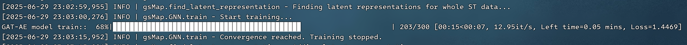
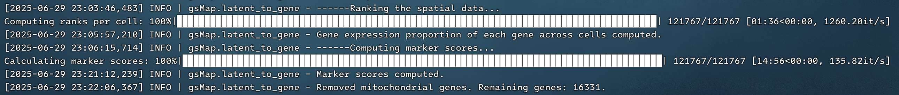
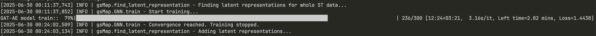

# <center>gsMap运行复现测试</center>
## 基于北溟智算集群的双卡V100机器
### 运行环境配置
#### 环境配置
```plaintext

```
#### 安装和检查依赖
##### 硬件检查
```shell
# 检查CPU
lscpu
# 检查内存
free -h
# 检查硬盘

# 检查显卡
lspci | grep -i nvidia  # 可能会看到：05:00.0 3D controller: NVIDIA Corporation GV100GL [Tesla V100 PCIe 32GB]
```
##### 安装驱动
```shell
# 检查版本
ubuntu-drivers devices  # 可能看到：driver : nvidia-driver-550 - distro non-free recommended


# 清除已有驱动或残留
sudo apt remove --purge '^nvidia-.*'
sudo apt autoremove

# 安装驱动
sudo apt update
sudo apt install nvidia-driver-550

# 重启
sudo reboot

# 检查驱动是否安装成功
nvidia-smi
```
##### 安装`Miniconda`
```shell
# 拉取安装脚本
wget https://repo.anaconda.com/miniconda/Miniconda3-latest-Linux-x86_64.sh -O ~/Miniconda3-latest-Linux-x86_64.sh

# 检验完整性
md5sum Miniconda3-latest-Linux-x86_64.sh

# 执行安装
bash Miniconda3-latest-Linux-x86_64.sh

# 初始化环境变量
source ~/.zshrc

# 激活conda环境测试
conda activate
```
##### 安装`PyTorch`
```shell
conda create -n gsMap python=3.11.5

conda activate gsMap


```

### 运行情景
#### Quick Mode
##### GNN拟合

超级离谱的训练性能，V100双卡真的太离谱了（甚至根据`nvidia-smi`查看，根本不需要用到双卡，单卡`32GB`显存绰绰有余），3秒钟完成了GNN拟合任务，计算速度为`12.95it/s`
##### 空间分数排名计算与标记分生成

主要由租用CPU核心数较少引起、
##### 拆分

## 基于Apple Silicon M4Pro(14+20 cores)
### 运行环境配置
```plaintext

```
### 运行情景
#### Quick Mode
##### GNN拟合

应该不是走MPS的，不然不至于这么慢，应该是代码里没有针对mps进行适配，可以进一步调整和测试，13分钟完成了GNN拟合任务，平均计算速度为`3.16s/it`
##### 空间分数排名计算与标记分生成
