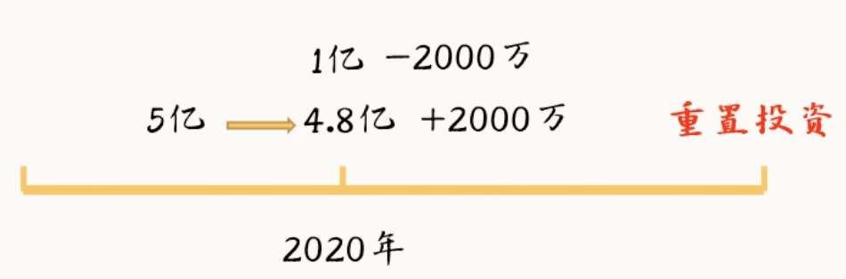

# 第一课：导论
## 概念与研究领域界定
### 宏观的研究对象
> 宏观经济学研究的是**社会整体**，而不是**解释个别现象**
> 本质上研究的是**经济增长**，归根结底研究的是**人的行为**，经济关系归根结底也是**人与人的关系**
- **产出（经济增长）**：
- **失业（就业）**：
- **通胀（物价）**：

### 社会整体
宏观经济学视域下社会主要由**三种**主体构成
- **家庭**：社会中负责消费但总体上不产出的主体
- **企业**：生产各种产品供家庭消费或供其他企业生产的经济主体
- **政府**：消费一定社会资源，但提供管理机制与政策应到规范和维持社会经济运行的

### 宏观经济学运行的平台
宏观经济学运行的平台主要是三个**市场**
- **产品**：
- **货币**：
- **劳动力**：

### 宏观与微观的区别
- 总量与个量的区别
- 资源配置与资源利用的区别
- 总体与个体的区别
- 围观以价格为核心，宏观以产出为核心

# 第二课：**GDP**及其核算方法
## 定义与概念
- **国内生产总值（Gross Domestic Product）**：**在一段时间内**，**在某一地区**新生产的所有**最终**产品与**劳动**的全部市场价值。
- **最终产品**：**在一定时间内生产**，被最终消费者消费掉的**产品或劳务**
> 使用最终产品计算GDP可以避免对价值增值的链路的复杂展开

### 流量与存量之辩
- **存量**：到某一时间点积累的量
- **流量**：在某一时间段新产生的量
> 因此，GDP是一个**流量**
#### 举例说明
一个房子在某一刻被以**20万元**人民币出售，其中19.5万为房屋价格，5000元为中介费，则19.5万元为**存量**，5000元为**流量**。

## GDP的具体核算方法
### 核心观点

1. **全社会在一段时间里的总产出或者说全部最终餐品的价值，就应该等于在同一段时间里全社会的总支出（总产出=总支出）**
2. **如果所有环节的价值增值都等于参与到这个环节的所有人的收入总和，而一件商品的产出又是所有这些环节价值增值的总和。那么一件商品的产出，就应该等于生产这件商品的全部环节中，所有各种要素提供者的收入总和，也就是总收入（总产出=总收入）**
> 因此，**总产出=总支出=总收入**

### 主要的GDP核算方法
- 支出法：侧重描绘一个国家花钱、消费方面的事，公式为：
- $$C+I+G+(X-M)(消费+投资+政府购买+出口额-进口额)$$
- 收入法：侧重描绘一个国家，各个产业的生产成本方面的事，是一种把所有要素提供者的收入加起来核算GDP的方法，公式为：
$$S+I+P+R+IDT+TRP+D+e（工资+利息+利润+租金+间接税+企业转移支付+折旧+统计误差）$$
- 产出法：侧重描绘一个国家，劳动和服务的价值增值方面的事，就是把一段时间内各个生产环节的价值增值全部加起来。（基本不具有）
$$$$
### 对“支出”的展开
1. 家庭的支出主要目的是消费
2. 企业的支出主要目的是生产，支出的目的是扩大生产，被视为一种**投资行为（注意是生产性投资，是一定时间内加入到存量资本中的流量资本，而不是金融性的投资，其本质是投机，具体被定义为`在一段时间里为了增加生产资料或者换一批新生产资料所花费的总支出`）**
    同时，企业支出分为以下几类：
	- 固定资产投资：新的生产设备或耐用品的投资，不包括原材料（）
	- 存货投资：当年新生产但未消费的投资（譬如企业当年生产了10亿元衬衫，卖出了8亿元的货，剩下的两亿元衬衫就成了当年的`存货投资`，相当于“自己买自己的东西囤了货”）
3. 政府的支出主要目的是管理，维持市场秩序，让企业好好生产，让家庭好好消费，这一部分支出被称为**政府购买**

### 对“收入”的展开
1. 收入法主要核算的是生产经营中的各种**成本**，包括
    - **对生产要素所有者的补偿**：`工资`（劳动要素，包括劳动报酬、劳动所得税、社保等部分）、`利息`（资本要素，包括企业债在内的各种资企业使用的资金所有者的补偿）、`租金`（土地要素，但专利费、版权费等着知识产权的租用也算入）
    - **非公司企业主收入**：雇用人员的报酬（包括个体户的收入【如自己开律所的律师，形式上是“自己给自己发工资”，企业性质上属于非公司企业】也属于这一类收入）
    - 公司税前利润：未交税且**未给股东分红前**的利润
    - **企业转移支付和间接税**：做慈善、捐款等可能会引起消费品价格升高的企业活动。以及消费税、增值税等会增加消费者购买成本的间接税款
    - **固定资产的折旧成本**
    #### 成本法中的“折旧”
    ##### 常见疑问
- 这就不是设备的损耗吗？没有实际支出怎么是成本？
- 这些设备不是说在当年投资买来它们的时候算做最终产品，已经算入到当年的GDP了吗?怎么后面这些设备磨损还算入后面年份的GDP呢?这不是重复计算吗?
##### 系统回应
1. 首先，把折旧算进GDP是收入法，而不是支出法
2. 折旧被视为企业使用**重置投资**进行弥补的资本：生产资料折旧后损耗的价值需要算入一定的资本成本才能维持原有价值，这一生产资料价值的“修复”被称为**重置资产**
##### 举例说明
**情境**：一家企业当年投资1亿元买生产资料，这1亿元是流量，你在该年以前该企业已有5亿元存量生产资料，这5亿元生产资料会折旧，每年自然磨损2000万元。

##### 具体操作
- 支出法：计算的是包括重置投资在内的总投资（企业当年支出1亿元投入生产资料）
- 收入法：仅仅计算公司在生产要素上实际得到的**增加值**（即公司在生产要素上的净收入为8000万元）
> 因此，为了保证总支出等于总收入的原则，在进行公司资产核算时，需要对总收入加上折旧成本来弥补折旧损失，这是一步**会计处理**

### 补充知识
#### 补充信息
1. 政府购买不包括转移支付，因为没有购买产品或公共服务，因此**转移支付不计入GDP**
2. 折旧是不能一次性用完的生产资料在身缠过程中产生的价值下降
3. 支出法认为在本段时间内新生产出来但没有卖出去的库存属于企业自己花钱买自己的东西，然后放在仓库里明年直接拿来卖，所以这个算做投资
#### 考研真题
1.  为什么从公司债中得到的利息收入能算入GDP，而从政府公债中得到的利息就不算GDP？
> 因为公司借债后会投入生产经营产生的利息，属于公司的增值对资本要素提供者的补偿，属于投资者的收入；而政府公债是用后续纳税人的税款缴纳的利息，因此属于转移支付而非生产增值。故前者记入GDP，而后者不计入GDP。

2. 买卖股票的收益为何不计入GDP？
> 因为股票买卖是纯二级市场行为，你的收益是来自股权的接盘者的更高价格，而不是公司生产经营的收入增加。

3. 生产了10个亿，卖了8个亿，剩下2亿算存货投资。那明年把今年剩下的2亿库存卖出去了，明年消费支出那边就增加了2个亿，而这2个亿在今年已经算成投资支出了，明年要是再算一次消费支出，是不是就重复计算了呢?
> 存货投资可为负，没问题

4. 以下哪些交易可计入GDP？如果能，说明进入到哪一部部分，不能请说明理由。
    - 买一台二手的海信电视：不能，不属于当年生产的**新产品**
    - 买2000股海信的股票：不能，二级市场股票交易不属于**生产经营增值所得**
    - 海信电器库存电视增加了10000台：能，属于当年的**存货投资**
    - 也门政府购买1000台海信电视：能，属于**净出口支出**
    - 政府向海信电器的下岗工人提供失业救济金：不能，属于**转移支付**

## 第三课：国民收入的其他衡量指标
### 国民生产总值（Gross National Production，GNP）
#### 定义
**在一段时间内**，**一国国民**新生产的所有**最终**产品与**劳动**的全部市场价值。也可以用支出法和收入法计算，而这可根据如下准则换算：
$$GNP = GDP - 本国的外国人创造的最终产品和劳务价值 + 外国的本国人创造的最终产品和劳务价值$$
> **与GDP区别**：GDP是属地原则，GNP是属人原则

### 国内生产净值（Neat Domestic Production，NDP）
#### 定义
减去了折旧的GDP，能更好地反映经济体的经济活力
$$NDP = GDP-折旧$$
### 国民收入（NI，National Income， NI）
#### 定义
$$NI = NDP - 间接税 - 企业转移支付 + 政府给企业的补贴$$
### 个人收入（Personal Income，PI）
#### 定义
$$NI- 企业未分配利润 - 公司所得税 - 社会保险 - 政府转移支付$$
### 个人可支配收入（Disposable Personal Income，DPI）
#### 定义
$$DPI = PI - 个人所得税$$

### 补充知识
#### 补充信息
1. 国内生产总值（GDP）的统计遵循属地原则，国民生产总值（GNP）的统计遵循属人原则
2. 

#### 考研真题

- **情境**：假设橘子岛国只有两家公司：橘子公司生产橘子，橘子汁公司购买橘子并生产橘子汁。两家公司当年的经营数据如下（单位均为“万元”）

| 项目      | 橘子公司 | 橘子汁公司 |
| ------- | ---: | ----: |
| 员工支出    |  100 |    20 |
| 利息支出    |    5 |     8 |
| 缴纳税额    |   10 |    20 |
| 原材料支出   |    0 |   200 |
| 销售给消费者  |  100 |   350 |
| 销售给其他企业 |  200 |     0 |

1. **请使用产出法计算橘子岛国当年的GDP**
    - 产出法的核心是将各生产环节创造的**增加值**相加：
    $$GDP=\sum 各企业增加值$$
    其中：
    $$增加值=总产出-中间产品投入$$
    橘子公司的总产出为：
    $$100+200=300$$
    橘子公司没有中间产品投入，因此其增加值为：
    $$300-0=300$$

    橘子汁公司的总产出为350万元，使用了200万元橘子作为原材料，因此其增加值为：
    $$350-200=150$$
    所以：
    $$GDP=300+150=450$$

    也可以直接计算最终产品价值：
    $$
    GDP=100+350=450
    $$

    > 橘子公司卖给橘子汁公司的200万元橘子属于中间产品，不能重复计入GDP。

2. **请使用支出法计算橘子岛国当年的GDP**
    - 支出法公式为：
    $$GDP=C+I+G+(X-M)$$
    本题中，居民购买了100万元橘子和350万元橘子汁，因此：

    $$C=100+350=450$$

    题目没有给出投资、政府购买和进出口，所以：
    $$I=0,\quad G=0,\quad X=0,\quad M=0$$
    因此：
    $$GDP=450+0+0+(0-0)=450$$

    > 橘子汁公司购买200万元橘子属于购买中间产品，不属于宏观经济学中的投资。

3. **请使用收入法计算橘子岛国当年的GDP**
    - 收入法可以表示为：

    $$GDP=工资+利息+利润+间接税$$

    工资总额为：
    $$100+20=120$$
    利息总额为：
    $$5+8=13$$
    间接税总额为：
    $$10+20=30$$
    橘子公司的利润为：
    $$300-100-5-10=185$$
    橘子汁公司的利润为：
    $$350-20-8-20-200=102$$
    利润总额为：
    $$185+102=287$$
    所以：
    $$GDP=120+13+287+30=450$$
    因此：
    $$\boxed{总产出=总支出=总收入=450万元}$$
4. **如果橘子公司从中国进口了1万元橘子，并将其原价出售给消费者，请重新计算三种方法下的GDP**
> 常识性思考：进口橘子属于外国生产的产品。假设橘子公司以1万元进口并原价出售给消费者，则消费和进口同时增加1万元，本国增加值不变。

**具体解答**：
-  支出法：$GDP=C+I+G+(X-M)=451-1=450$。消费增加1万元，但进口也增加1万元，二者抵消。
- 收入法：$GDP=120+13+287+30=450$。橘子公司的销售收入和进货成本同时增加1万元，利润不变。
- 产出法：$GDP=(301-1)+(350-200)=450$。橘子公司总产出增加1万元，但中间投入也增加1万元，增加值不变。

5. **如果橘子汁公司从中国进口了1万元橘子作为原材料，并且橘子汁销售额不变，请重新计算三种方法下的GDP**
> 常识性思考：橘子汁公司进口的橘子属于生产中的中间投入。最终产品销售额不变，而进口中间投入增加1万元，因此本国增加值减少1万元。

**具体解答**：
- 支出法：$GDP=C+I+G+(X-M)=450-1=449$。最终消费不变，但进口增加1万元。
- 收入法：$GDP=120+13+(185+101)+30=449$。橘子汁公司的原材料成本增加1万元，利润由102万元降至101万元。
- 产出法：$GDP=300+(350-201)=449$。橘子汁公司的中间投入由200万元增加至201万元，增加值减少1万元。

## 第四课：国民经济恒等式
### 理论经济学里的几个基本套路
- 自己下定义，然后拿着这个定义往死里扣
- 从简单到复杂
- 把碍眼的东西都视而不见（假设不存在或归零）
#### 经济系统里的四个主体（Again）
- 家庭（消费）
- 企业（投资）
- 政府（管理）
- 外国（外贸）
#### 几种不同主体组合出的经济系统中的国民经济恒等式
##### 两部门经济（家庭+企业）
###### GDP核算
- 支出法：$GDP= C（消费）+ I（投资）$
- 收入法：$GDP= C（消费） + D（储蓄）$
###### 得到的国民经济恒等式
$$C（消费） + I（投资） = C（投资） + D（储蓄）$$
$$==> I（投资） = D(储蓄)$$
##### 三部门经济（家庭+企业+政府）
###### GDP核算
- 支出法：$GDP= C（消费） + D（储蓄） + T（税收）$
- 收入法：$GDP = C（消费）+ I（投资） + G（政府购买）$
###### 得到的国民经济恒等式
$$C（消费） + D（储蓄） + T（税收） = C（消费）+ I（投资） + G（政府购买） $$
$$==>D（储蓄） + T（税收） = I（投资） + G（政府购买）$$
$$==> = I（投资） = D（储蓄） + T（税收） - G（政府购买）$$
$$==> = I（投资） = D（个人储蓄） + (T - G)（政府储蓄）$$
##### 四部门经济（家庭+企业+政府+外国）
###### GDP核算
- 支出法：$GDP = C（消费）+ I（投资） + G（政府购买） + (X- M)（净出口）$
- 收入法：$GDP= C（消费） + D（储蓄） + T（税收） + K（对外转移支付）$
###### 得到的国民经济恒等式
$$C（消费） + D（储蓄） + T（税收）+ K（对外转移支付） = C（消费）+ I（投资） + G（政府购买）+ (X- M)（净出口）$$
$$==>D（储蓄） + T（税收）+ K（对外转移支付） = I（投资） + G（政府购买）+ (X- M)（净出口）$$
$$==>I（投资） = D（个人储蓄） + (T - G)（政府储蓄） + (M+ K- X)（外汇储备）$$

## 第五课：名义GDP与实际GDP
### 从物价问题说起
**价格不是一成不变的，因此，在统计GDP时可能会由于物价上涨引起GDP，实际值虚高**
### 定义
- **名义GDP**：单纯用当年的物价水平，确定的全部新生产的最终产品和劳务总价值
- **实际GDP**：以某一年的物价作为基期价格计算出来的新生产的全部最终产品和劳务总价值
- **基期**：以该年物价作为计价单位价格的基准日期
- **GDP折算指数（也称GDP平减指数）**：形式为$\text{GDP核算指数} = \frac{\text{名义GDP}}{\text{实际GDP}}$
- 
## 第六课：就业的衡量
### “失业”的定义
- **失业**：**有劳动能力**且**想工作**的人找不到工作的事实叫失业，失业率形式上表示为：
    $$\text{失业率} = \frac{\text{失业人口}}{\text{社会总劳动力人口}}\text{（注意）}$$
- **劳动力人口**：除去未成年人、军人、囚犯、和精神病患者等第一类人口和学生、家庭主妇（夫）、退休和残障人士等第二类人口外的所有人口
### “失业率”的指标缺陷
1. **无法反映失业结构**：譬如无法呈现出女性/男性更容易失业，黑人/白人更容易失业等结构性问题
2. **无法反映就业质量**：譬如劳动力技能与职业的匹配情况
3. **容易造假**：容易通过
### “失业率”与GDP的关系
 - **奥肯定律**：经济增长与就业率呈**反比**关系

## 第七课：衡量物价水平的重要指标

### 定义
- **物价水平**：不是指某种商品的价格，而是所有**商品**和**劳务价格**总额的**加权平均值**

### 价格指数（Price Index， PI）
1. 通用的计算公式为：
	    $$PI = \frac{\sum_{i \in C_{所有消费品}}当期价格_i \times 当期销量_i}{\sum_{i \in C_{所有消费品}}基期价格_i \times 基期销量_i} \times 100 \%$$
2. **生产者价格指数（Producer Price Index，PPI）**：表示了**一篮子工业原料**（包括可供消费的劳务，如剪头发、按摩等）**相对于某一基期**的价格水平的变化情况
3. **消费者价格指数（Consumer Price Index，CPI）**：表示了**一篮子消费品**（包括可供消费的劳务，如剪头发、按摩等）**相对于某一基期**的价格水平的变化情况
### 同比与环比
- **同比**：与去年同期相比
- **环比**：与自己的上一期相比

### CPI算法的缺陷（CPI通常都会偏高一点）
1. 一揽子商品必须和基期一样，不能改变
2. 无法反映新商品淘汰旧商品，导致CPI被高估，产生CPI替代偏向（）
3. 无法反映商品质量变得更好，更便宜了，消费数量被高估，导致CPI被高估（）

### 补充信息
1. 
    - CPI指衡量的消费品的价格水平变化
    - PP指衡量的工业品的价格水平变化
    - GDP平减指数在衡量通货膨胀方面要比CPI和PP更全面一些
2. 价格指数和GDP平减指数的算法是不一样的：
    - **价格指数**：$PI = \frac{计算期}{基期（物价篮子）}$（拉氏指数）
    - **GDP平减指数**：$GDP平减指数 = \frac{计算期（物价篮子）}{基期}$（帕氏指数）

## 本章小结
### 核心知识点
- 什么是宏观经济学？它和微观经济学的区别是什么？
- GDP的概念，以及GDP的三种核算方法，尤其是支出法和收入法。
- GNP、NDP、NI、PI、DPI等等这些其他宏观经济指标，尤其是他们之间的换算关系
- 二、三、四部门的储蓄和投资恒等关系（即国民经济恒等式）
- 失业率的计算方法
- GDP平减指数以及CPI的计算方法
### 例题
1. 解释什么是GDP平减指数和消费者价格指数CPI
    - **GDP平减指数**：是一种**帕氏指数**，一律用计算期的篮子。优点是覆盖范围广，缺点是太笼统，缺乏针对性，且**计算期篮子类的新商品，在基期可能不存在**
    - **消费者价格指数CPI**：是一种**拉氏指数**，一律用基期的篮子。优点是有针对性，主要针对消费品，缺点是范围较窄只能表示消费品的价格变化，且**存在替代偏向问题，导致CPI被系统性高估**
2. 解释什么是名义GDP和实际GDP
    - **名义GDP**：基于计算期物价和生产量计算的GDP
    - **实际GDP**：基于机器物价和计算期生产量计算的GDP（需要再确定比较基期的情况下才能计算）

3. GDP有什么缺陷？应该如何改进现在的GDP？
    - GDP的本质是一种记账方法，是一种全面反映国民经济状况的核算指标在经济学理论指导下，综合了会计统计定义分类和记账的一整套核算标准和制度。（目前所讲的这一套叫**SNA体系**）
    - 当前的GDP核算体系存在四大主要缺陷：
            1. GDP不能有效反应**社会成本**（以环境成本【如环境破坏】，社会文化成本【如黄赌毒产业的收入】等隐性成本）
            2. GDP不能反映经济增长质量
            3. GDP不能反映经济增长效率（具体直观体现在GDP作为一项正畸指标，无法保证地方经济发展是否有较多**短期行为**）
            4. GDP不能反映人民生活水平
    - 对当前GDP核算体系的几种可能改进措施：
            1. 国际上最流行的改进措施是**绿色GDP**，要将经济发展质量、自然资源的消耗、环境质量等都纳入到GDP的核算体系中
            2. 我国已经将科研支出，环保支出都纳入GDP核算体系中，实现对科研投入和环保投入的鼓励
            3. 不再鼓励各地搞GDP增长率排名
            4. 把经济发展质量效率、民生、资源保护、环境保护、安全生产、教育文化、就业、居民收入、社会保障、人民健康等指标都纳入到官员的考核体系中