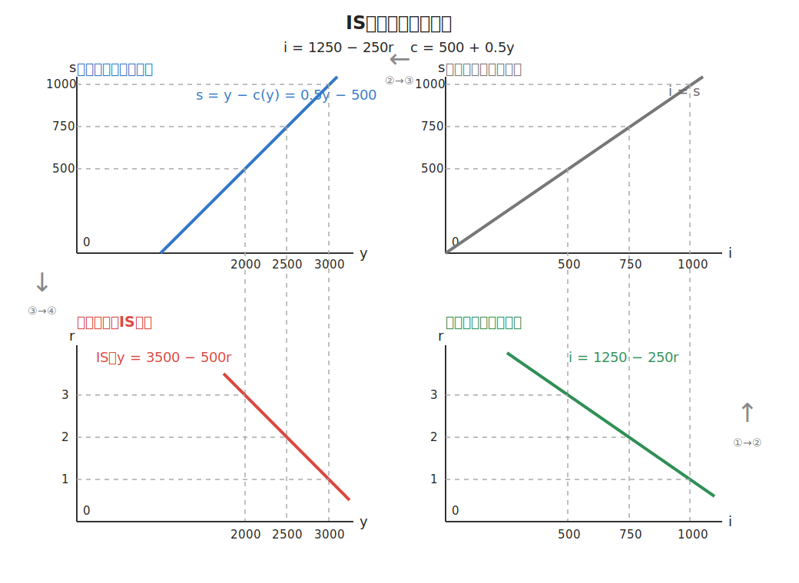

# 第三章：国民收入的决定

## 第一课：“IS-LM”曲线的形式与功能
### 本节所用的所有符号汇总

| 符号                 | 含义           |
| ------------------ | ------------ |
| $I$、$i$            | 投资           |
| $S$                | 储蓄           |
| $L$                | 货币需求（流动性偏好）  |
| $M$                | 货币供给         |
| $y$                | 总产出          |
| $r$                | 利率           |
| $e$（投资函数中）         | 自主投资         |
| $d$                | 投资需求对利率的敏感程度 |
| $MEC$              | 资本的边际效率      |
| $MEI$              | 投资的边际效率      |
| $F$                | 本息和          |
| $A$                | 本金           |
| $\mathrm e$（复利公式中） | 自然常数         |
| $r_p$              | 周期复利率        |
| $t$                | 计息周期         |
| $R_i$              | 第$i$期预期收益    |
| $J$                | 资本品残值        |
| $Price$            | 资本品价格        |

### 图示

  

### 重要性
“IS-LM”模型是凯恩斯流派宏观经济学的核心逻辑、理论和思想体系，目前主流的凯恩斯主义宏观经济学对宏观经济的分析基本都是从“IS-LM”模型出发的 
### 定义
 - IS是一条曲线，LM也是一条曲线，“IS-LM”模型就是分析两条曲线的模型
 - **“IS-LM”模型的定义**：
    1. **IS曲线**：指的是产品市场均衡的时候，产出$y$与利率$r$的关系，其中“I”指的是投资，“S”指的是储蓄，就是说在I等于S的时候，$y$相对于$r$是一种什么关系，且横坐标是产出$y$，纵坐标是利率$r$。
    2. **LM曲线**：指的是在货币市场达到均衡的情况下，也就是**货币需求**等于**货币供给**的情况下产出$y$和利率$r$的关系，其中：
        - “L”是**流动性（Liquidity）**，是拿来就能用的钱，代表**货币需求**
        - “M”是**货币（Money）**，既包括可流动的货币，也包括各种形式的资产，因此代表**货币供给**
### 用途
1. 最直接用途是推导总需求和总供给曲线，也就是推导宏观经济的供给和需求曲线
2. 分析财政和货币政策是宏观经济的入门绝学
3. 考试

## 第二课：经济学里的“投资”
### 定义
#### 与金融领域的广义投资的辨析
- **经济学里的投资**：直接投入生产中，用于购买生产资料扩大生产的资本支出，必须有形式上直接的价值增值产出
- **金融学上的广义投资**：包含购买股票，债券等金融产品将资本投入金融市场流动的交易行为，可以没有形式上直接的价值增值产出 
#### 计划投资与实际投资
- **计划投资**：还未发生或者正在进行的投资，是一个**内生变量**
- **实际投资**：已经发生完的，已经正在获将被会计处理的投资，是一个**外生变量**
#### 外生变量与内生变量（Again）
- **外生变量**：从经济系统外来，影响经济系统，自己不受系统影响的变量
- **内生变量**：被正在研究的经济系统影响，反过来也能影响经济系统的变量

### 投资的影响因素：利率
#### 相关定义
- **投资的本质**：花钱和生产性资本，其中花钱是因，生产性资本是果
- **投资的机会成本**：利率
- **利润率**：投资生产的回报率
- **利率**：将资本出街获得的收益率
- **净利润率**：利润率和利率的利差
#### 利率和投资的相互作用机制
- 利率是投资的机会成本，企业只会选择预期收益率高于市场利率的投资项目
- 当利率上升时，能覆盖资金成本的投资项目减少，因此投资量下降
- 当利率下降时，能覆盖资金成本的投资项目增加，因此投资量上升
> 因此，在其他条件不变时，利率$r$与投资$i$呈反向关系

##### 投资受利率影响函数
$$i = i(r) = e\text{（自主投资）} - dr\text{（投资需求对利率的敏感程度）}$$
假定d是一个常数，即可绘制出IS曲线：
##### 示意图

  

### 投资的影响因素：资本的边际效率（Marginal Effeciency of Capital，MEC）
#### MEC的三个关键特点
1. 资产的收益发生在未来，所以未来的收益要考虑时间价值，要贴现
2. 计算一笔投资的真实收益率要搞清两个数字，一是成本，现在花出去多少钱，二是收入，未来赚回来多少钱
3. 当一项资产未来所有收益的贴现和正好等于资产买入价的时候，此时的贴现率恰好等于这项资产的资本边际效率，也就是这笔投资的预期真实收益率
#### 定义
- **资本的边际效率**：使得一项资本品全部使用期内，所有预期未来收益的总和正好等于这项资本品购买价格的贴现率
- **贴现率**：用来将未来价值折算成现在价值的比率，贴现率越高，同一笔未来收益的现值越低
> 资本的边际效率MEC是一笔投资的**预期真实收益率**
- 到期收益率（Yield to Maturity, YTM）：使得债券持有到期所获得的所有现金流的贴现总和，正好等于债券购买价格的贴现率，但债券一般保证每期都有收益率，资本的边际效率不一定存在每一期正收益，往往是事后计算的预期真实收益率。
### 贴现公式及其应用
#### 相关概念
- **连续复利终值（复利）**：
    $$F = Ae^{rt} = A(1 + r_p)^t$$
- **连续复利现值（贴现）**：
    $$A = Fe^{-rt} = F(1 + r_p)^{-t}$$
    > 其中$F$为本息和，$A$为本金，$r$为连续复利率，$r_p$为周期复利率，$t$为计息周期
#### 贴现和的规律与机制
- 贴现和大于投资成本，代表这项投资的净现值（NPV）大于0，有利可图
- 贴现和小于投资成本，代表这项投资的净现值（NPV）小于0，会亏本
- **还有一种特殊情况**，未来收益的贴现**恰巧**等于投资成本，此时用来贴现的贴现率就等于资本的边际效率
> 利用这种**巧合**，联立资产价格和未来预期收益的贴现和，就能求出等于资产的预期真实收益率的贴现率$r$
##### 例题讲解
假设一台挖掘机要¥457,970，使用约五年后报废，购买挖掘机后，五年中每年的预期净收益为¥100,000，请问现在是否应该投资这台挖掘机？

**解答**：首先，根据题意，得到该投资的现金流表：

| 时间（年） | 第一年 | 第二年 | 第三年 | 第四年 | 第五年 |
| --- | --- | --- | --- | --- | --- |
| 终值（元） | 100,000 | 100,000 | 100,000 | 100,000 | 100,000 |
| 现值（元） | $\frac{100,000}{1 + r_p}$ | $\frac{100,000}{(1 + r_p)^2}$ | $\frac{100,000}{(1 + r_p)^3}$ | $\frac{100,000}{(1 + r_p)^4}$ | $\frac{100,000}{(1 + r_p)^5}$ |

然后列出资本边际效率方程：
$$457970 = \sum_{i = 1}^5 \frac{100,000}{(1+r_p)^i}$$
解得：
$$r_p \approx 0.03$$
即：**该挖掘机的资本边际效率为3%**，因此，如果认为自己所能取得的市场利率$r$高于该边际效率，这笔投资就不值得做。

> **补充**：如果五年后挖掘机没有报废，还可以二手出售获得**残值$J$**，就需要在方程的右边加上$\frac{J}{(1 + r_p)^5}$的终期贴现。
#### 结论
当资本边际效率$MEC$一定时利率而越高，投资$i$越低，即**利率$r$与投资$i$呈反向关系**

#### 补充：投资的边际效率（Marginal Efficiency of Investment，MEI）
##### 图示

  

##### MEI与MEC的关系
对一个资本品的投资可以表示为：
    $$Price = \sum_{i=1}^t \frac{R_i}{(1 + MEC)^i} + \frac{J}{(1 + MEC)^t}$$
如果只有一期收益，且资本品没有残值，则：
$$
Price = \frac{R_1}{1 + MEC}
\to MEC = \frac{R_1}{Price} - 1
$$
> 因此，在预期收益$R_1$不变时，资本品价格$Price$越高，资本边际效率$MEC$越低

一般来说，一个行业或者一项投资的年际收益$R_i$是相对稳定的，$t$期后资本品的残值$J$也相对可预测。因此，就可能出现这样一个经济现象：
1. 如果利率下降（降息），原本收益率低于利率、无利可图的投资项目也变得有利可图，企业就会增加投资
2. 投资增加会带来更多的资本品需求，如厂房、设备、机器等
3. 在资本品供给没有及时增加时，资本品的价格$Price$就会上升
4. 当年际收益$R_i$和残值$J$不变时，方程左边的$Price$上升，右边的贴现和也必须上升
5. 要使同一组未来收益的贴现和上升，分母中的贴现率必须下降，因此资本品价格上升会进一步压低这笔投资的实际预期收益率

> 这条推理链路可以简写为：**利率下降 $\to$ 投资增加 $\to$ 资本品需求增加 $\to$ 资本品价格上升 $\to$ 投资的实际预期收益率进一步下降**

##### 为什么MEI曲线比MEC曲线更陡？
- **MEC曲线**：只考虑随着投资量增加，新增项目的边际收益逐渐下降
- **MEI曲线**：除了考虑新增项目的边际收益下降，还考虑了投资增加引起的资本品价格上升
- 因此，当投资量增加同样的数量时，MEI不仅要受到边际收益下降的影响，还要额外受到资本品价格上升的影响，所以MEI的下降幅度更大

$$
\left|\frac{\Delta MEI}{\Delta i}\right| > \left|\frac{\Delta MEC}{\Delta i}\right|
$$

> **最终结论**：MEI曲线比MEC曲线更陡，即MEI曲线斜率的绝对值更大
### 投资的影响因素：预期收益
### 定义
- **预期收益**：指现在的时间点基于现有知识和经验去预测的未来可能发生的收益
- **加速数**：多投资的钱与多产出的价值之比
- **托宾Q**：**企业总市场价值**与**企业重置成本**的比值
- **企业重置成本**：重新办一个一模一样的企业要多少钱（企业的资产价值）

### 情景导学
在整个公式中，同样时间周期数量下，可以变化的变量，只有资本品价格$Price$，资本编辑效率$MEC$和预期未来收益$R$，那么预期些什么会影响$R$呢？
$$Price = \sum_{i=1}^t \frac{R_i}{(1 + MEC)^i} + \frac{J}{(1 + MEC)^t}$$
#### 从需求角度来看
预期收益可能这样被放大：
$$\textbf{预期未来需求增加} \to \textbf{增加投资} \to \textbf{产出增加}$$
譬如烤肉师傅看市场行情比较好，新投资100块钱多买了一个炉子，让未来每个月可以多产出2000块钱的肉串，那么美多头的¥1多产出了¥20的价值，这个比值$\frac{1}{20}$就是**加速数**
#### 从成本角度来看
- **简单**：预测未来的固定成本和可变成本
- **困难**：预测可变成本里的人工成本
##### 提问：工资上涨为什么会导致投资增加？
**回答**：工人工资高了会**导致投资者去投资机器来代替人**，而机器属于耐用生产资料，买一次可以用很多年，每年的平摊成本会很低，反而**增加了投资人对未来成本降低的预期**，然后让投资量增加，同时：从全社会角度来看买机器的人多了，对机器的需求就会**增加生产机器的投资项目**，未来预期的需求就会增加，这又会增加生产机器行业的投资，从而**进一步增加了总投资**

##### 从其他角度来看
- 预测税收
- 预测政策变数
- 预测经营风险、市场风险

### 托宾Q值的意义与应用
#### 与1的关系
- $q \gt 1$时，有新增投资产生且$q$随新增投资而增大
- - $q \lt 1$时，不会产生新的投资
> 隐含了股票价格上涨，会让投资上涨，股价和投资成正比的结论

## 第三课：IS曲线与IS曲线的各种推导
### 本节所用的所有符号汇总

| 符号       | 含义           |
| -------- | ------------ |
| $y$      | 总产出/总支出/总收入  |
| $c$      | 消费           |
| $\alpha$ | 自主消费         |
| $\beta$  | 边际消费倾向       |
| $r$      | 总产出          |
| $r$      | 利率           |
| $i$      | 投资           |
| $d$      | 投资需求对利率的敏感程度 |
| $t$      | 边际税率/总税收     |
| $g$      | 政府购买支出       |
| $s$      | 储蓄           |
### IS曲线特点与推导
#### 特点
- $r$与$y$才是主角
- $I$与$S$只是模型的背景假设
#### 推导
##### 数学推导
**已知：**
$$
\begin{cases}
\text{投资函数：} & i=e-dr\\
\text{均衡条件：} & i=s\\
\text{产出公式（均衡时）：} & y=c+s\\
\text{消费函数：} & c=\alpha+\beta y
\end{cases}
$$
$$
\begin{aligned}
&\because i=s=y-c\\
&\phantom{\because i}=y-(\alpha+\beta y)\\
&\phantom{\because i}=(1-\beta)y-\alpha\\
&\therefore e-dr=(1-\beta)y-\alpha\\[10pt]
&\therefore y=\frac{\alpha+e-dr}{1-\beta}\\[10pt]
&\text{不过，我们也看到，两部门的均衡产出公式为：}y=\frac{\alpha+i}{1-\beta}\\
&\text{代入}i = e - dr \text{即可得到IS曲线的表达式}

\end{aligned}
$$
##### 图示推导

  

##### 总结
 **加息降息是一类经济政策**，是通过调控利率实现对经济过热或过冷的反向调控的重要手段
    1. **加息（即提高利率）**：是一种**紧缩**政策，是通过提高利率吸纳社会资金降低经济社会流动性和总产出的政策
    2. **降息（即降低利率）**：是一种**宽松**政策，是通过降低利率将资金释放到社会面以增强经济社会流动性并增加总产出的政策

### IS曲线斜率的变化
#### 将IS曲线拆解为降幂形式
$$r = \frac{\alpha + e}{d} - \frac{1 - \beta}{d}y$$

#### 如果引入三部门
$$\text{可化简得：}r = \frac{\alpha + e + g}{d} - \frac{1 - \beta (1 - t)}{d}y$$

因此可以总结为：
> 影响IS曲线斜率的三个因素分别是：**边际消费倾向$\beta$**、**投资对价格敏感度$d$**、**边际税率$t$**

#### 预期收益与曲线斜率
- 预期是
- 预期是通过影响$d$和$\beta$使得IS曲线斜率增大，曲线的形态变得更陡峭

### IS曲线截距的变化
由上文可得：
$$
\begin{cases}
r = \frac{\alpha + e}{d} - \frac{1 - \beta}{d}y \text{（两部门）}\\
r = \frac{\alpha + e + g}{d} - \frac{1 - \beta (1 - t)}{d}y \text{（三部门）}
\end{cases}
$$
#### 自主支出类变量
1. **自主消费（$\alpha$）**：家庭部门的自主消费支出
2. **自主投资（$e$）**：
3. **政府购买（$g$）**：政府部门的自主消费支出

> 这两类消费属于**自主支出类变量**
#### 不同变量影响IS曲线截距的方式

- **消费（储蓄）怎样影响IS曲线**：消费和储蓄是一种半对称关系，自主消费$\alpha$是通过**影响家庭储蓄数量**来改变IS曲线的，即使收入没有增加，但储蓄意愿变得更强时，消费就会减少自主消费，$\alpha$就会降低，截距变小
- **投资对IS曲线的影响**：相同利率水平$r$下，即使收入没有增加，但投资意愿变得更强时，就表现为自主投资$e$的增大，截距变大
- **政府购买（$g$）对IS曲线的影响**：如果政府增加政府购买支出，只有其中**自主支出部分**能导致IS曲线的移动，而不论经济好坏都要支出的部分本质上相当于**增加的社会总投资**，也就是增加了投资支出，所以政府购买增加对IS曲线移动的影响和投资增加的影响一样，都是IS曲线向右移动，而政府购买减少会使得IS曲线向左移动
> 税收虽然未出现在截距的表达式里，但会通过影响收入期望的方式间接影响$\alpha$和$e$，且其影响程度**可以通过税收乘数和税收变化量计算得出**
#### 计算截距移动的数量
 **本质上就是用该值的变化量呈上对应的乘数**：
#### 政府政策的类型
- **扩张型政策（引起IS曲线右移）**：增加政府支出、减少税收
- **紧缩型政策（引起IS曲线左移）**：减少政府支出、增加税收

### 第四课：利率、流动性偏好和货币供求
#### 经济系统中的两大模块
1. **实体经济**：以行政管理部门为核心职能部门，以**财政政策**为主要调节手段
2. **金融部门**：央行为核心职能部门，以**货币政策**为主要调节手段
二者会构成经济层面的均衡：
    $$P \text{（物价水平）} \times Q \text{（商品/服务的总数量）} = M \text{（货币数量）} \times \text{（货币流通速度）}$$
#### 
 