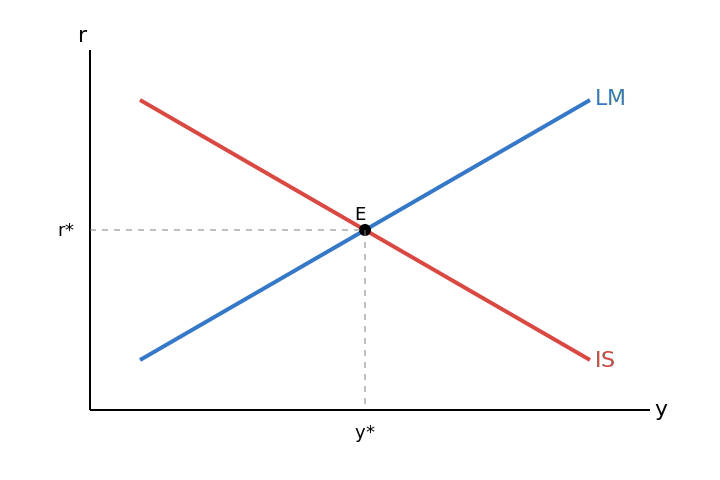
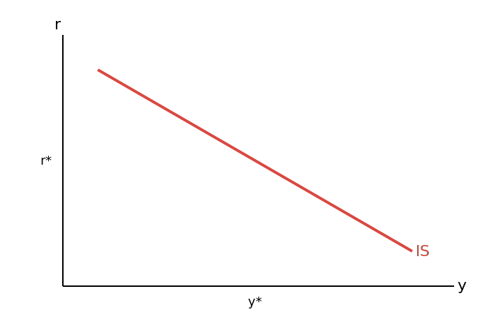
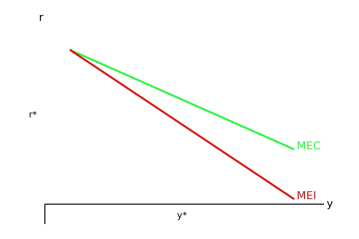

# 第三章：国民收入的决定
## 本章所用的所有符号汇总
| $I$ | $S$ | $L$  | $M$ | $y$ | $r$ | $MEC$   | $F$ | $A$ | $e$  | $t$  |
| --- | --- | ---- | --- | --- | --- | ------- | --- | --- | ---- | ---- |
| 投资  | 储蓄  | 流动资本 | 总资本 | 总产出 | 利率  | 资本的边际效率 | 本息和 | 本金  | 自主投资 | 计息周期 |
## 第一课：“IS-LM”曲线的形式与功能
### 图示

  

### 重要性
“IS-LM”模型是凯恩斯流派宏观经济学的核心逻辑、理论和思想体系，目前主流的凯恩斯主义宏观经济学对宏观经济的分析基本都是从“IS-LM”模型出发的 
### 定义
 - IS是一条曲线，LM也是一条曲线，“IS-LM”模型就是分析两条曲线的模型
 - **“IS-LM”模型的定义**：
    1. **IS曲线**：指的是产品市场均衡的时候，产出$y$与利率$r$的关系，其中“I”指的是投资，“S”指的是储蓄，就是说在I等于S的时候，$y$相对于$r$是一种什么关系，且横坐标是产出$y$，纵坐标是利率$r$。
    2. **LM曲线**：指的是在货币市场达到均衡的情况下，也就是**货币需求**等于**货币供给**的情况下产出$y$和利率$r$的关系，其中：
        - “L”是**流动性（Liquidity）**，是拿来就能用的钱，代表**货币需求**
        - “M”是**货币（Money）**，既包括可流动的货币，也包括各种形式的资产，因此代表**货币供给**
### 用途
1. 最直接用途是推导总需求和总供给曲线，也就是推导宏观经济的供给和需求曲线
2. 分析财政和货币政策是宏观经济的入门绝学
3. 考试

## 第二课：经济学里的“投资”
### 定义
#### 与金融领域的广义投资的辨析
- **经济学里的投资**：直接投入生产中，用于购买生产资料扩大生产的资本支出，必须有形式上直接的价值增值产出
- **金融学上的广义投资**：包含购买股票，债券等金融产品将资本投入金融市场流动的交易行为，可以没有形式上直接的价值增值产出 
#### 计划投资与实际投资
- **计划投资**：还未发生或者正在进行的投资，是一个**内生变量**
- **实际投资**：已经发生完的，已经正在获将被会计处理的投资，是一个**外生变量**
#### 外生变量与内生变量（Again）
- **外生变量**：从经济系统外来，影响经济系统，自己不受系统影响的变量
- **内生变量**：被正在研究的经济系统影响，反过来也能影响经济系统的变量

### 投资的影响因素：利率
#### 相关定义
- **投资的本质**：花钱和生产性资本，其中花钱是因，生产性资本是果
- **投资的机会成本**：利率
- **利润率**：投资生产的回报率
- **利率**：将资本出街获得的收益率
- **净利润率**：利润率和利率的利差
#### 利率和投资的相互作用机制

##### 投资受利率影响函数
$$i = i(r) = e\text{（自主投资）} - dr\text{（投资需求对利率的敏感程度）}$$
假定d是一个常数，即可绘制出IS曲线：
##### 示意图

  

### 投资的影响因素：资本的边际效率（Marginal Effeciency of Capital，MEC）
#### MEC的三个关键特点
1. 资产的收益发生在未来，所以未来的收益要考虑时间价值，要贴现
2. 计算一笔投资的真实收益率要搞清两个数字，一是成本，现在花出去多少钱，二是收入，未来赚回来多少钱
3. 当一项资产未来所有收益的接线和正好等于资产买入价的时候，此时的贴现率恰好等于资产的真实收益率，贴现率和预期收益率，三者是相等关系，并不是同一样东西
#### 定义
- **资本的边际效率**：使得一项资本品全部使用期内，所有预期未来收益的总和正好等于这项资本品购买价格的贴现率
- **贴现率**：
> 资本的边际效率MEC是一笔投资的**预期真实收益率**
- 到期收益率（Yield to Maturity, YTM）：使得债券持有到期所获得的所有现金流的贴现总和，正好等于债券购买价格的贴现率，但债券一般保证每期都有收益率，资本的边际效率不一定存在每一期正收益，往往是事后计算的预期真实收益率。
### 贴现公式及其应用
#### 相关概念
- **连续复利终值（）**：
    $$F = Ae^{rt} = A(1 + r_p)^t$$
- **连续复利现值（）**：
    $$A = Fe^{-rt} = F(1 + r_p)^{-t}$$
- 
#### 贴现和的规律与机制
- 贴现和大于投资成本，代表这项投资的净现值（NPV）大于0，有利可图
- 贴现和小于投资成本，代表这项投资的净现值（NPV）小于0，会亏本
- **还有一种特殊情况**，未来收益的贴现**恰巧**等于投资成本，此时用来贴现的贴现率就等于资本的边际效率
> 利用这种**巧合**，联立资产价格和未来预期收益的贴现和，就能求出等于资产的预期真实收益率的贴现率$r$
##### 例题讲解
假设一台挖掘机要¥457,970，使用约五年后报废，购买挖掘机后，五年中每年的预期净收益为¥100,000，请问现在是否应该投资这台挖掘机？

**解答**：首先，根据题意，得到该投资的现金流表：
|时间（年）|第一年|第二年|第三年|第四年|第五年|
|-|-|-|-|-|-|
|终值（元）|100,000|100,000|100,000|100,000|100,000|
|现值（元）|$\frac{100,000}{1 + r_p}$|$\frac{100,000}{(1 + r_p)^2}$|$\frac{100,000}{(1 + r_p)^3}$|$\frac{100,000}{(1 + r_p)^4}$|$\frac{100,000}{(1 + r_p)^5}$|
然后列出资本边际效率方程：
$$457970 = \sum_{i = 1}^5 \frac{100,000}{(1+r_p)^i}$$
解得：
$$r_p \approx 0.03$$
即：**该挖掘机的资本边际效率为3%**，因此，如果认为自己所能取得的市场利率$r$高于该边际效率，这笔投资就不值得做。

> **补充**：如果五年后挖掘机没有报废，还可以二手出售获得**残值$J$**，就需要在方程的右边加上$\frac{J}{(1 + r_p)^5}$的终期贴现。
#### 结论
当资本边际效率$MEC$一定时利率而越高，投资$i$越低，即**利率$r$与投资$i$呈反向关系**

#### 补充：投资的边际效率（Marginal Efficiency of Investment，MEI）
##### 图示

  

##### MEI的比较优势
对一个资本品的投资可以表示为：
    $$Price = \sum_{i=1}^t \frac{R_i}{(1 + MEC)^i} + \frac{J}{(1 + MEC)^t}$$
一般来说，一个行业或者一项投资的年际收益$R_t$是相对稳定的，$t$期后投资品的残值也相对可预测。因此，就可能会出现这连一个经济现象：
- 如果利率下降（降息），企业就会增加投资，进而**增加资本品需求**
- 因此增加投资在资本品供给未跟上时就会**引起资本品价格上升**
- 根据资本品价格与MEC的方程可知，资本品价格与
- 
### 投资的影响因素：预期收益
### 定义
- 指现在的时间点去预测的未来可能发生的收益
