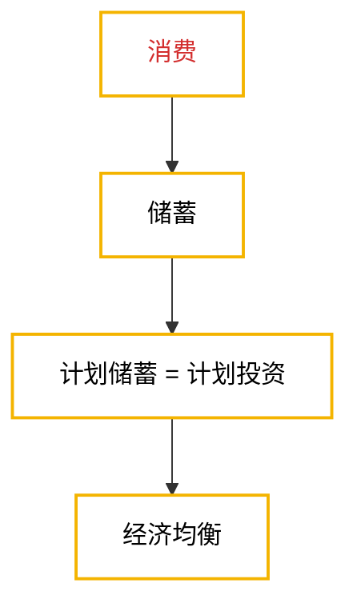

# 国民收入决定理论：收入-支出模型
## 第一课：凯恩斯定律与萨特伊定律
### 核心观点
#### 凯恩斯定律（扩大内需刺激消费才能推动生产进步）
- **核心观点**：需求决定供给和均衡产出，一个经济社会的总产出是由需求决定的
- **观点主张**：扩大内需，增加需求，刺激消费，需要“看得见的手”（政府）介入。
- **提出背景**：1936年《就业利息和货币通论》，是对大萧条后世界经济的总结。是生产力和生产资料极大丰富，供给能力大于实际需求的经济现状。但到了20世纪70年代也因为引起了显著通货膨胀也接近不适用了
#### 萨伊定律（所有人都努力，就都有活干，经济就能达到“充分就业”状态）
- **核心观点**：供给会创造自己的需求，一个经济社会的总产出是由供给决定的
- **观点主张**：扩大生产，提高生产力，政府不必过度介入，以“看不见的手”（市场）发挥作用为主
- **提出背景**：生产力落后的大短缺时代，生产不能太高，物资匮乏，需求被迫随供给变化。

## 第二课：均衡产出
### 定义
- **均衡产出**：社会经济运行期间，企业的库存投资+新生产价格 = 
- **非计划存货投资**：企业对于家庭需求的错误估计引起新生产产品超出了消费需要所产生的库存

### 两部门经济的均衡产出
#### 达到均衡时
- 凯恩斯定律下**需求决定供给**，企业的任务是**配合需求确定产量，没有能力改变价格**
- 达到均衡时**总供给=总需求=总产出**，且**短期内物价水平有粘性**
    具体原理：
	1. 需求和花钱直接挂钩，因此**总需求=总支出**
	2. 总共给就是所有企业总共能生产多少，因此**总供给=总产出（总收入）**
- 最终表现为：
    $$
	\begin{aligned}
	&\text{总支出（总需求）} E=\text{消费}+\text{投资}=c+i,\\[8pt]
	&\text{总收入（总供给）} y=\text{消费}+\text{储蓄}=c+s,\\[12pt]
	&E=c+i=y=c+s,\\[8pt]
	&c+i=c+s,\\[8pt]
	&\therefore\ i=s.
	\end{aligned}
	$$

$$
\boxed{\text{计划投资 }i=\text{计划储蓄 }s}
$$
- 
#### 与第一章的“总是相等”矛盾吗？
不矛盾。因为第一章是事后的会计处理，相等是处理准则；而第二章是经济现实，经济运行中真正能达到完美均衡，是极少数的时候。

## 第三课：消费

> 从经济社会运行的系统来看，刺激和调控消费是推动经济社会达到均衡产出的**主要途径**
### 定义
- **边际消费倾向（Marginal Propensity to Consume, MPC）**：收入每增加一块钱，增加的这一块钱里用来消费的部分，一般来说来，**编辑消费倾向是递减的**，其标准化定义为：
    $$\text{边际消费倾向（MPC）}=\frac{\text{消费变化量 } \Delta C}{\text{收入变化量 } \Delta Y}$$
- **平均消费倾向（Average Propensity to Consume, APC）**：收入中用来消费的部分，**平均消费倾向也是递减的，等地减速度比边际消费倾向更慢**，其标准化定义为：
    $$\text{平均消费倾向（APC）}=\frac{\text{消费 } \Delta C}{\text{收入 } \Delta Y}$$
- **边际/平均储蓄倾向（Marginal/Average Propensity to Save，MPS/APS）**：收入或新增收入中未消费或新增消费的占比，即：
	$$
	\begin{aligned}
	\text{边际储蓄倾向（MPS）} = 1 - \text{边际消费倾向（MPC）}\\
	\text{边际储蓄倾向（APS）} = 1 - \text{平均消费倾向（APC）}
	\end{aligned}
	$$
> **一般规律**：好事边际收益递减，坏事边际收益递增，且**未能跨越阶级的收入增长不会改变这个规律，形成消费粘性**。
### 影响消费的因素
- **收入（核心要素）**
- 价格
- 利率
- 贫富差距
- 偏好
- 家庭财产
- 信用等级
- 年龄
- 风俗
- 社会保障

## 第四课：消费与储蓄函数
### 两部门经济
#### 两部门经济线性消费函数
- 形式为：
    $$c = \alpha + \beta y$$
- 因此，**平均消费倾向（APC）**在此表示为：
    $$APC = \frac{c}{y} = \frac{\alpha + \beta y}{y} = \frac{\alpha}{y} + \beta\text{（此时$\beta$为边际消费倾向，即MPC）}$$
    > 其中$\alpha$为自主消费，$\beta y$为边际消费倾向引致消费

#### 两部门经济线性储蓄函数
- 形式为：
    $$c = \alpha + \beta y$$
- 因此，**平均消费倾向（APC）**在此表示为：
    $$APS = y - c = y - (\alpha + \beta y) =  = \alpha + (1 - \beta )y\text{（此时$(1 - \beta)$为边际储蓄倾向，即MPS）}$$
    > 其中$\alpha$为自主消费，$\beta y$为边际消费倾向引致消费

#### 两部门经济均衡产出公式
$$
\begin{aligned}
&\because y\text{（总收入）} = c\text{（消费）} + i\text{（投资）}\\
&\text{且 } c = \alpha + \beta y\\[8pt]
&\therefore y = c + i = \alpha + \beta y + i\\
&\therefore y = \frac{\alpha + i}{1 - \beta}
\end{aligned}
$$
#### 均衡产出公式的应用场景
- 对于一个经济部门来说，边际消费倾向和自主消费都是相对固定的，主要是投资引起了产出均衡性的变化，因此，往往会告诉你自主消费1000和边际消费倾向0.8，然后告诉你计划投资是600，就可以通过以下方式求得：
    $$y\text{（总收入）} = \frac{1000 + 600}{1 - 0.8} = 8000\text{（元）}$$
> 8000元就是达到均衡产出的总产出
## 第五课：投资乘数
### 定义
- 一般**小写字母**代表经济变量的**实际值**，而**大写字母**代表经济变量的**名义值**，实际值是这个变量**剔除了价格变化影响后的真实价值**
- **投资乘数**：铲除的变化是**引起这种变化的投资**的多少倍，其本质是一个幂级数的求和，定义为$\frac{1}{MPS} = \frac{1}{1 - MPC} = \frac{1}{1 - \beta}$。
	$$
	\sum_{n=0}^{\infty}\beta^n
	=1+\beta+\beta^2+\cdots
	=\frac{1}{1-\beta},
	\qquad |\beta|<1.
	\text{（进一步可转化为等比数列求和公式）}
	$$

### 举例说明
在一个边际消费倾向为0.8的经济体里，计划投资每提高100元，社会总产出会增加多少？
答：会增加——
$$100 \times \frac{1}{1-0.8} = 500\text{（元）}$$

## 第六课：三部门均衡与其他乘数
### 三部门经济
#### 三部门经济均衡产出公式
$$
\begin{aligned}
&\because y\text{（总收入）} = c\text{（消费）} + i\text{（投资）} + g\text{（政府购买）}\\
&\text{且 } c = \alpha + \beta(y - t)\\[8pt]
&\therefore y = c + i + g\\
&\phantom{\therefore y} = \alpha + \beta(y - t) + i + g\\
&\phantom{\therefore y} = \alpha + \beta y - \beta t + i + g\\[8pt]
&\therefore y = \frac{\alpha + i + g - \beta t}{1 - \beta}
\end{aligned}
$$
> 其中，$y-t$为**家庭可支配收入**，$t$为**定量税**，是外生于$y$的税收

#### 政府购买乘数（$k_g$）
- **定义**：总产出的变化量是引起产出变化的**政府购买变化量**的多少倍
- **数学推导**：
    $$
    \begin{aligned}
    & \because \Delta y = y_1 - y_0 = \frac{\alpha_0 + i_0 + g_1 - \beta t_0}{ 1 - \beta} - \frac{\alpha_0 + i_0 + g_0 - \beta t_0}{ 1 - \beta} \\
    & \phantom{\therefore \Delta y} = \frac{g_1 - g_0}{1 - \beta} = \frac{\Delta g}{1 - \beta}\\
    & \text{又}\because k_g = \frac{\Delta y}{\Delta g}\\
    & \phantom{\text{又}}\therefore k_g = \frac{1}{1 - \beta}
    \end{aligned}
    $$

#### 税收乘数（$k_t$）
- **定义**：均衡产出的变化量是引起均衡产出这种变化的**政府税收变化量**的多少倍
- **数学推导**：
    $$
    \begin{aligned}
    & \because \Delta y = y_1 - y_0 = \frac{\alpha_0 + i_1 + g_0 - \beta t_1}{ 1 - \beta} - \frac{\alpha_0 + i_0 + g_0 - \beta t_0}{ 1 - \beta} \\
    & \phantom{\therefore \Delta y} = \frac{-\beta t_1 - (- \beta t_0)}{1 - \beta} = \frac{- \beta \Delta t}{1 - \beta}\\
    & \text{又}\because k_t = \frac{\Delta y}{\Delta t}\\
    & \phantom{\text{又}}\therefore k_t = \frac{-\beta}{1 - \beta}
    \end{aligned}
    
    $$

#### 转移支付乘数（$k_{t_r}$）
- **定义**：均衡产出的变化量是引起均衡产出这种变化的**政府税收变化量**的多少倍
- **与税收乘数的关系**：政府转移支付作为一项政府支出，**相当于少收的税**，因此，该乘数及为税收乘数$k_t$的**相反数**
- **数学推导**：
    此时，因考虑政府转移支付，三部门经济的均衡产出公式变换为：
    $$
    \begin{aligned}
    & c = \alpha + \beta (y - t + t_r)\\
    & y = c + i + g \\
    & \phantom{y} = \frac{\alpha + i +g - \beta t + \beta t_r}{1 - \beta} 
    \end{aligned}
    $$
    $$
    \begin{aligned}
    & \because \Delta y = y_1 - y_0 = \frac{\alpha_0 + i_1 + g_0 - \beta t_1 + \beta t_{r1}}{ 1 - \beta} - \frac{\alpha_0 + i_0 + g_0 - \beta t_0 + \beta t_{r0}}{ 1 - \beta} \\
    & \phantom{\therefore \Delta y} = \frac{\beta t_{r1} - \beta t_{r0})}{1 - \beta} = \frac{\beta \Delta t_r}{1 - \beta}\\
    & \text{又}\because k_{t_r} = \frac{\Delta y}{\Delta t_r}\\
    & \phantom{\text{又}}\therefore k_{t_r} = \frac{\beta}{1 - \beta}
    \end{aligned}
    
    $$
#### 总结：
> 政府购买乘数、税收乘数和转移支付乘数本质上是均衡总产出相对于政府购买和税收和政府转移支付的**偏导数**

#### 补充：平衡预算乘数
- **定义**：政府购买和税收增加同样的数量，也就是政府预算平衡时**总产出多出来的那一部分**与**政府收支变化量绝对值**的比率
- **数学推导**：
    $$
    \begin{aligned}
    & \Delta y_{\text{（多余）}} = k_g \Delta g + k_t \Delta t\\
    & \phantom{\Delta y_\text{（多余）}} = \frac{1}{1 - \beta}\Delta g + \frac{- \beta}{1 - \beta}\Delta t \\
    & 一种常见的可能解是：k_b = \frac{\Delta y}{\Delta g} = \frac{\Delta y}{\Delta t} = 1
    \end{aligned}
    $$
> 平衡预算常数在初中级阶段的经济学，只考虑**税收是定量税**的情况（不考虑比例税、累进税等情况），则**总是等于1**

## 第七课：节俭悖论
### 悖论描述
家庭勤俭节约，会让国家变穷，而国家要富，家庭就得挥霍无度。
### 发挥作用场景
- 凯恩斯定律更适合低靡的经济，经济越热，凯恩斯定律（刺激消费），效果越差。且是不考虑科技与经济社会发展的静态理论。

## 第八课：四部门均衡与外贸乘数
### 定义
- **外生变量**：一种变量能影响系统中的其他变量，但本身却不受系统以及其他变量的影响
### 四部门经济
#### 四部门经济均衡产出公式
$$
\begin{aligned}
&\because y\text{（总收入）} = c\text{（消费）} + i\text{（投资）} + g\text{（政府购买）} + nx\text{（净出口）}\\
&\text{且 } c = \alpha + \beta(y - t + t_r)\\
&\text{且 } nx = x - m,　m = m_0\text{（自发性进口）} + \gamma y\text{（其中$\gamma$为边际进口倾向）}\\[8pt]
&\therefore y = c + i + g + nx\\
&\phantom{\therefore y} = \alpha + \beta(y - t + t_r) + i + g + x - \gamma y - m_0\\
&\phantom{\therefore y} = \alpha + \beta y - \beta t + \beta t_r + i + g + x - \gamma y - m_0\\[8pt]
&\therefore y = \frac{\alpha + i + g - \beta t + \beta t_r + x}{1 - \beta + \gamma}
\end{aligned}
$$

### 出口/外贸乘数
- **定义**：均衡产出的变化量是引起均衡产出的出口量变化的多少倍
- **数学推导**：
    $$
    k_x = \frac{\Delta y}{\Delta x} = \frac{\partial y}{\partial x} = \frac{1}{1 - \beta + \gamma}
    $$

## 本章小结
### 核心知识点
1. 凯恩斯定律和萨伊定律
2. 均衡产出，均衡时：计划投资i= 计划储蓄s
3. 消费函数边际消费倾向与边际储蓄倾向
4. 二、三、四部门的均衡产出公式：
    - 二部门：
        $$y = \frac{\alpha + i}{1 - \beta}$$
    - 三部门：
            $$y = \frac{\alpha + i + g - \beta t + \beta t_r}{1 - \beta}$$
    - 四部门：
        $$y = \frac{\alpha + i + g - t - t_r + x}{1 - \beta + \gamma}$$
5. 二、三、四部门的各种乘数：
    - 投资乘数（两部门+）/政府购买乘数（三部门+）：
        $$k_i = \frac{1}{1 - \beta}$$
    - 转移支付乘数（三部门+）：
            $$k_{t_r} = \frac{\beta}{1 - \beta}$$
    - 税收乘数（三部门+）：
        $$k_t = \frac{\alpha + i + g - t - t_r + x}{1 - \beta + \gamma}$$
    - 外贸乘数（四部门+）：
        $$k_x = \frac{1}{1 - \beta + \gamma}$$
    - 平衡预算乘数（补充，常考）：
        $$
        k_b = \frac{\Delta y}{\Delta g} = \frac{\Delta y}{\Delta t} = 1
        $$
6. 节俭悖论

### 真题解析
1. 解释一下平衡预算乘数
    - **考研（初、中级经济学）**：这是一个**衡为1**的常数
    - **考博（高级经济学）**：分情况讨论
        1. 第一
        2. 第二
        3. 第三
        4. 6……
    
	
2. 解释一下各种乘数（答案见上文笔记）

3. 为什么一些洗、西方经济学家说，将一部分国民收入从富人转移给穷人，将会提高总收入水平？你认为他们的理由是什么？
	- 西方经济学认为有钱人也就是富人的边际消费倾向比较低，而编辑储蓄倾向会比穷人高，而穷人的边际消费倾向比富人高，反过来编辑储蓄倾向就比较低，因为穷人没钱，所以只要有钱就会花出去，最起码需要维持生计，吃喝拉撒税都得花钱，如果把财富或者说把收入从富人转移给穷人穷人就会马上花掉，这符合凯恩斯主义认为的刺激消费可以推动社会经济运行，进而增加总收入。所以说，将一部分国民收入从富人转移给穷人将会提高总收入水平。
	- **本题采分点**：穷人和富人的边际消费倾向不同
	- **拓展思维**：其实这个表述也不全对，因为富人的储蓄增加，可能会推动**社会总投资的增加**，这也有可能推动社会总收入的提高。

4. 论述和评价一下凯恩斯定律和萨伊定律（**见本章节第一章笔记**）

5. 下面三种方式中哪种方式对总产出（总收入）的刺激最大，那种最小？
    1. 政府增加数量为$K$的开支
    2. 政府削减数量为$K$的税收
    3. 正负增加数量为$K$的开支，同时削减数量为$K$的税收
    - 本题考察对**政府购买乘数**、**税收乘数**和**平衡预算乘数**关系的认识，三者分别为：
        $$
        \begin{aligned}
        & \Delta y_1 = \frac{1}{1 - \beta} K \\
        & \Delta y_2 = \frac{- \beta}{1 - \beta} \times -K  = \frac{\beta}{1 - \beta} K \\
        & \Delta y_3 = K \\
        & \because \frac{1}{1 - \beta} \gt \frac{\beta}{1 - \beta}(\beta  \lt 1) \\
        & \therefore \Delta y_1 最大 \\
        & 而
        \begin{cases} 
        \Delta y_2 < \Delta y_3 & (\beta \lt 0.5) \\ 
        \Delta y_2 > \Delta y_3, & (\beta \gt 0.5)
        \end{cases}
        \end{aligned}
        $$
    - 就会得到：（1）情况始终最大，$\beta \lt 0.5$时，（2）情况最小，$\beta \gt 0.5$时，（3）情况最小。