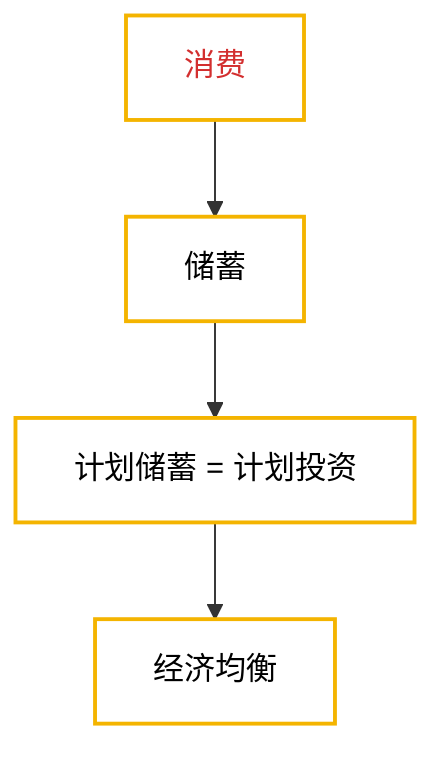

# 国民收入决定理论：收入-支出模型
## 第一课：凯恩斯定律与萨特伊定律
### 核心观点
#### 凯恩斯定律（扩大内需刺激消费才能推动生产进步）
- **核心观点**：需求决定供给和均衡产出，一个经济社会的总产出是由需求决定的
- **观点主张**：扩大内需，增加需求，刺激消费，需要“看得见的手”（政府）介入。
- **提出背景**：1936年《就业利息和货币通论》，是对大萧条后世界经济的总结。是生产力和生产资料极大丰富，供给能力大于实际需求的经济现状。但到了20世纪70年代也因为引起了显著通货膨胀也接近不适用了
#### 萨伊定律（所有人都努力，就都有活干，经济就能达到“充分就业”状态）
- **核心观点**：供给会创造自己的需求，一个经济社会的总产出是由供给决定的
- **观点主张**：扩大生产，提高生产力，政府不必过度介入，以“看不见的手”（市场）发挥作用为主
- **提出背景**：生产力落后的大短缺时代，生产不能太高，物资匮乏，需求被迫随供给变化。

## 第二课：均衡产出
### 定义
- **均衡产出**：社会经济运行期间，企业的库存投资+新生产价格 = 
- **非计划存货投资**：企业对于家庭需求的错误估计引起新生产产品超出了消费需要所产生的库存

### 两部门经济的均衡产出
#### 达到均衡时
- 凯恩斯定律下**需求决定供给**，企业的任务是**配合需求确定产量，没有能力改变价格**
- 达到均衡时**总供给=总需求=总产出**，且**短期内物价水平有粘性**
    具体原理：
	1. 需求和花钱直接挂钩，因此**总需求=总支出**
	2. 总共给就是所有企业总共能生产多少，因此**总供给=总产出（总收入）**
- 最终表现为：
    $$
	\begin{aligned}
	&\text{总支出（总需求）} E=\text{消费}+\text{投资}=c+i,\\[8pt]
	&\text{总收入（总供给）} y=\text{消费}+\text{储蓄}=c+s,\\[12pt]
	&E=c+i=y=c+s,\\[8pt]
	&c+i=c+s,\\[8pt]
	&\therefore\ i=s.
	\end{aligned}
	$$

$$
\boxed{\text{计划投资 }i=\text{计划储蓄 }s}
$$
- 
#### 与第一章的“总是相等”矛盾吗？
不矛盾。因为第一章是事后的会计处理，相等是处理准则；而第二章是经济现实，经济运行中真正能达到完美均衡，是极少数的时候。

### 第三课：消费

> 从经济社会运行的系统来看，刺激和调控消费是推动经济社会达到均衡产出的**主要途径**
#### 定义
- **边际消费倾向（Marginal Propensity to Consume, MPC）**：收入每增加一块钱，增加的这一块钱里用来消费的部分，一般来说来，**编辑消费倾向是递减的**，其标准化定义为：
    $$\text{边际消费倾向（MPC）}=\frac{\text{消费变化量 } \Delta C}{\text{收入变化量 } \Delta Y}$$
- **平均消费倾向（Average Propensity to Consume, APC）**：收入中用来消费的部分，**平均消费倾向也是递减的，等地减速度比边际消费倾向更慢**，其标准化定义为：
    $$\text{平均消费倾向（APC）}=\frac{\text{消费 } \Delta C}{\text{收入 } \Delta Y}$$
- **边际/平均储蓄倾向（Marginal/Average Propensity to Save，MPS/APS）**：收入或新增收入中未消费或新增消费的占比，即：
	$$
	\begin{aligned}
	\text{边际储蓄倾向（MPS）} = 1 - \text{边际消费倾向（MPC）}\\
	\text{边际储蓄倾向（APS）} = 1 - \text{平均消费倾向（APC）}
	\end{aligned}
	$$
> **一般规律**：好事边际收益递减，坏事边际收益递增，且**未能跨越阶级的收入增长不会改变这个规律，形成消费粘性**。
#### 影响消费的因素
- **收入（核心要素）**
- 价格
- 利率
- 贫富差距
- 偏好
- 家庭财产
- 信用等级
- 年龄
- 风俗
- 社会保障

### 第四课：消费与储蓄函数
#### 两部门经济
##### 两部门经济线性消费函数
- 形式为：
    $$c = \alpha + \beta y$$
- 因此，**平均消费倾向（APC）**在此表示为：
    $$APC = \frac{c}{y} = \frac{\alpha + \beta y}{y} = \frac{\alpha}{y} + \beta\text{（此时$\beta$为边际消费倾向，即MPC）}$$
    > 其中$\alpha$为自主消费，$\beta y$为边际消费倾向引致消费

##### 两部门经济线性储蓄函数
- 形式为：
    $$c = \alpha + \beta y$$
- 因此，**平均消费倾向（APC）**在此表示为：
    $$APS = y - c = y - (\alpha + \beta y) =  = \alpha + (1 - \beta )y\text{（此时$(1 - \beta)$为边际储蓄倾向，即MPS）}$$
    > 其中$\alpha$为自主消费，$\beta y$为边际消费倾向引致消费

#### 两部门经济均衡产出公式
$$
\begin{aligned}
&\because y\text{（总收入）} = c\text{（消费）} + i\text{（投资）}\\
&\text{且 } c = \alpha + \beta y\\[8pt]
&\therefore y = c + i = \alpha + \beta y + i\\
&\therefore y = \frac{\alpha + i}{1 - \beta}
\end{aligned}
$$
#### 均衡产出公式的应用场景
- 对于一个经济部门来说，边际消费倾向和自主消费都是相对固定的，主要是投资引起了产出均衡性的变化，因此，往往会告诉你自主消费1000和边际消费倾向0.8，然后告诉你计划投资是600，就可以通过以下方式求得：
    $$y\text{（总收入）} = \frac{1000 + 600}{1 - 0.8} = 8000\text{（元）}$$
> 8000元就是达到均衡产出的总产出
### 第五课：投资乘数
#### 定义
- 一般**小写字母**代表经济变量的**实际值**，而**大写字母**代表经济变量的**名义值**，实际值是这个变量**剔除了价格变化影响后的真实价值**
- **投资乘数**：铲除的变化是**引起这种变化的投资**的多少倍，其本质是一个幂级数的求和，定义为$\frac{1}{MPS} = \frac{1}{1 - MPC} = \frac{1}{1 - \beta}$。
	$$
	\sum_{n=0}^{\infty}\beta^n
	=1+\beta+\beta^2+\cdots
	=\frac{1}{1-\beta},
	\qquad |\beta|<1.
	\text{（进一步可转化为等比数列求和公式）}
	$$

#### 举例说明
在一个边际消费倾向为0.8的经济体里，计划投资每提高100元，社会总产出会增加多少？
答：会增加——
$$100 \times \frac{1}{1-0.8} = 500\text{（元）}$$

### 第六课：三部门均衡与其他乘数
#### 三部门经济
##### 三部门经济均衡产出公式
$$
\begin{aligned}
&\because y\text{（总收入）} = c\text{（消费）} + i\text{（投资）} + g\text{（政府购买）}\\
&\text{且 } c = \alpha + \beta(y - t)\\[8pt]
&\therefore y = c + i + g\\
&\phantom{\therefore y} = \alpha + \beta(y - t) + i + g\\
&\phantom{\therefore y} = \alpha + \beta y - \beta t + i + g\\[8pt]
&\therefore y = \frac{\alpha + i + g - \beta t}{1 - \beta}
\end{aligned}
$$

### 第七课：节俭悖论
#### 悖论描述

#### 发挥作用场景
- 凯恩斯定律更适合低靡的经济，经济越热，凯恩斯定律（刺激消费），效果越差

### 第八课：四部门均衡与外贸乘数
#### 定义
- **外生变量**：一种变量能影响系统中的其他变量，但本身却不受系统以及其他变量的影响
#### 四部门经济
##### 四部门经济均衡产出公式
$$
\begin{aligned}
&\because y\text{（总收入）} = c\text{（消费）} + i\text{（投资）} + g\text{（政府购买）} + nx\text{（净出口）}\\
&\text{且 } c = \alpha + \beta(y - t)\\
&\text{且 } nx = x - m,　m = \gamma y\\[8pt]
&\therefore y = c + i + g + nx\\
&\phantom{\therefore y} = \alpha + \beta(y - t) + i + g + x - \gamma y\\
&\phantom{\therefore y} = \alpha + \beta y - \beta t + i + g + x - \gamma y\\[8pt]
&\therefore y = \frac{\alpha + i + g - \beta t + x}{1 - \beta + \gamma}
\end{aligned}
$$
