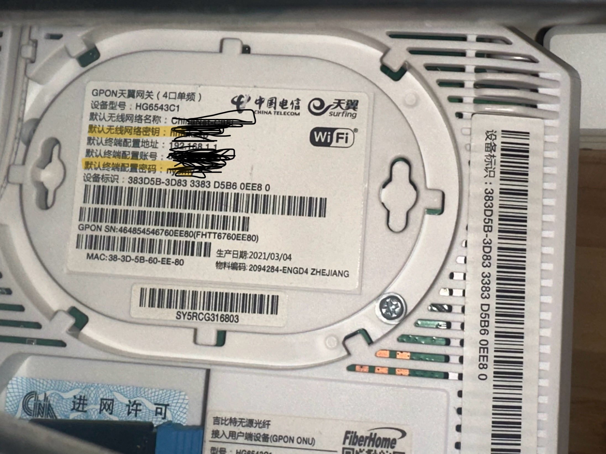

# 如何SSH访问天翼网关

如果你不知道家里的天翼网关的超级管理员及其密码，可以采用如下方式获取：

## 1. 重置天翼网关（或者说大多数人本就没有做过额外调整）

## 2. 开启天翼网关Telnet功能

接入家庭网络（如WiFi），使用浏览器访问`http://192.168.1.1:8080/cgi-bin/telnetenable.cgi?telnetenable=1`，浏览器返回`Telnet开启`即为打开成功

## 3. 在拥有telnet客户端的设备上进行`telnet 192.168.1.1`的操作

登陆用户和密码使用：

- login: root
- password: {默认无线网络密钥}{默认终端配置密码}
>
> - **注意**：密码拼接中间没有连接符，若网关重置过，请查看路由器上的默认配置铭牌（如下图）
> 
>
## 4.
