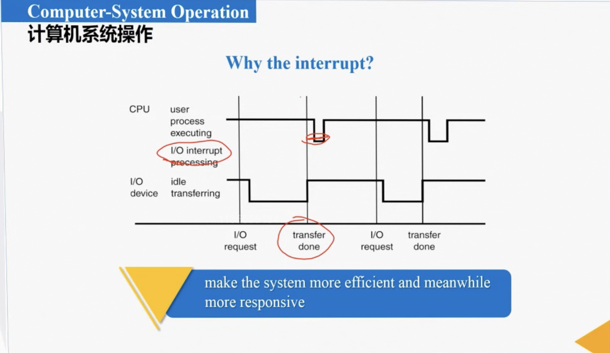
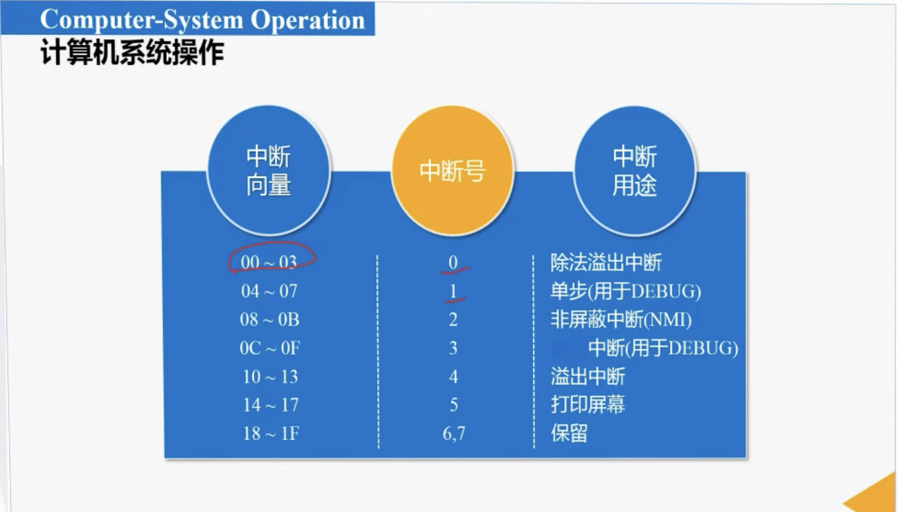
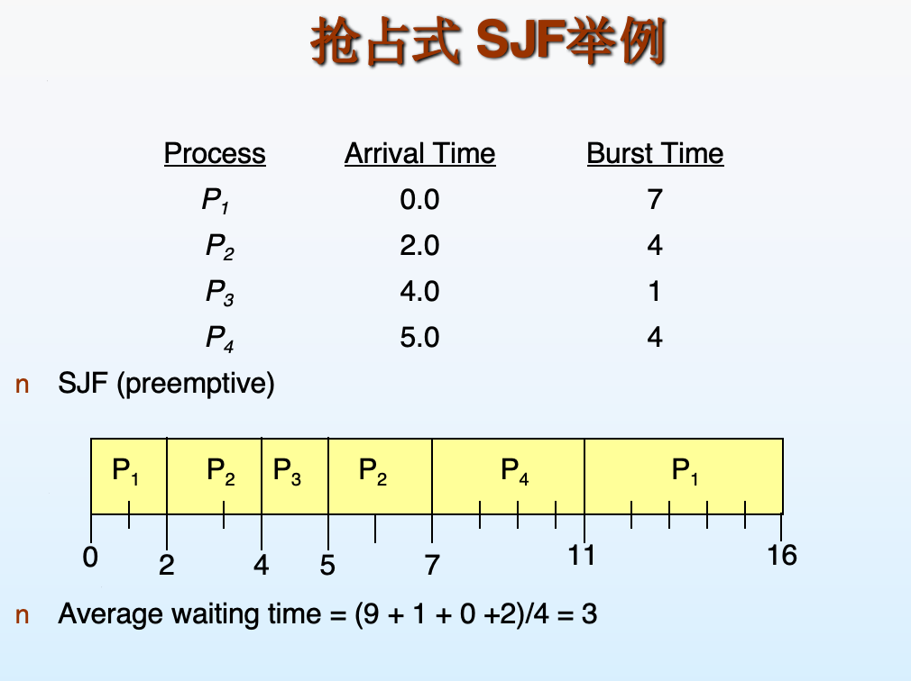
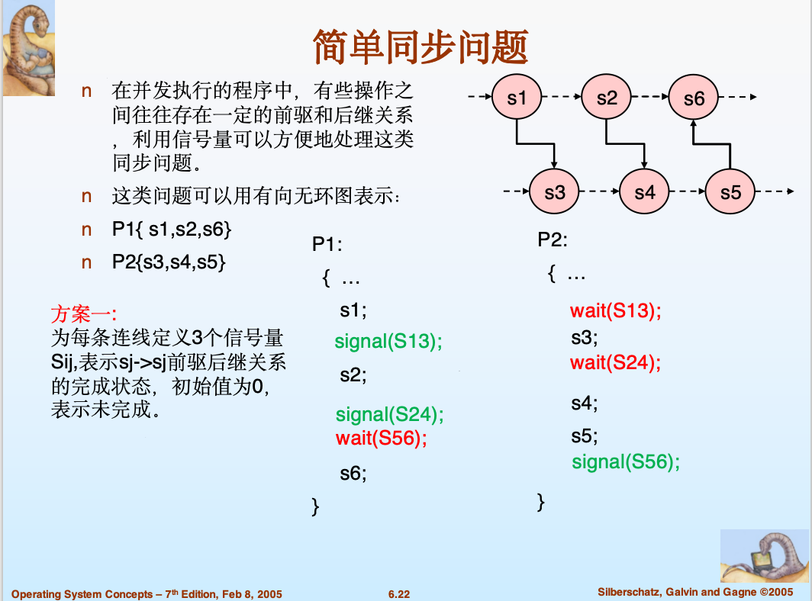
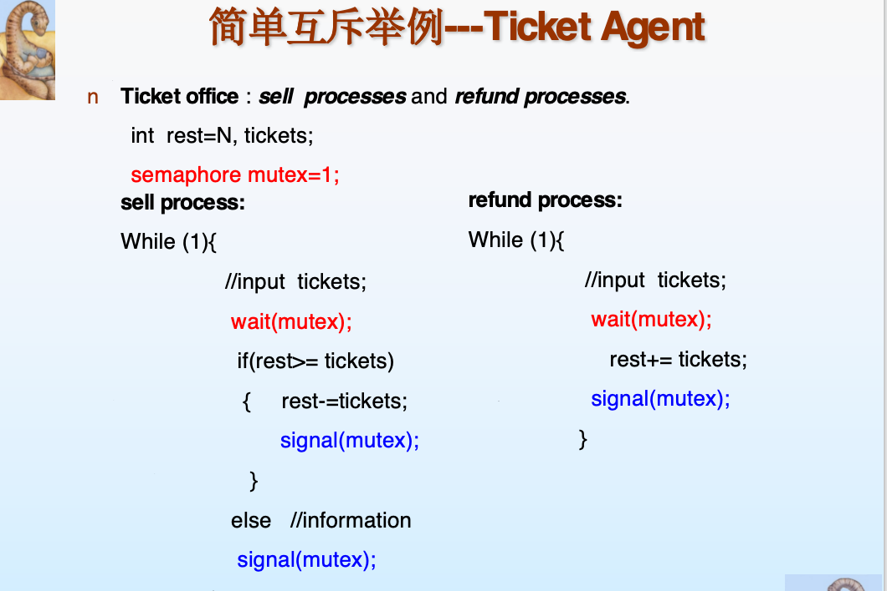
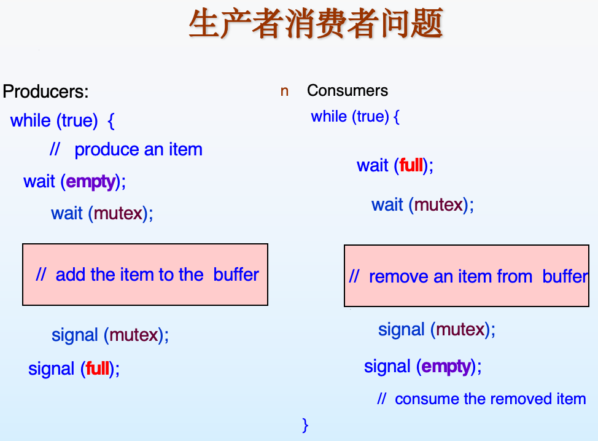
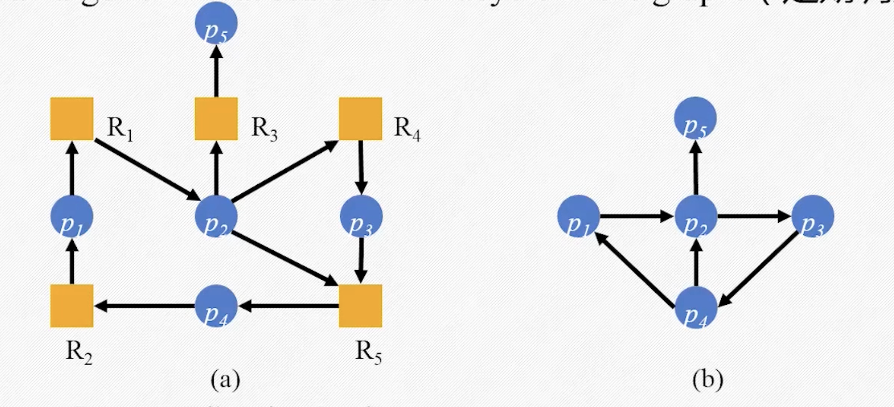
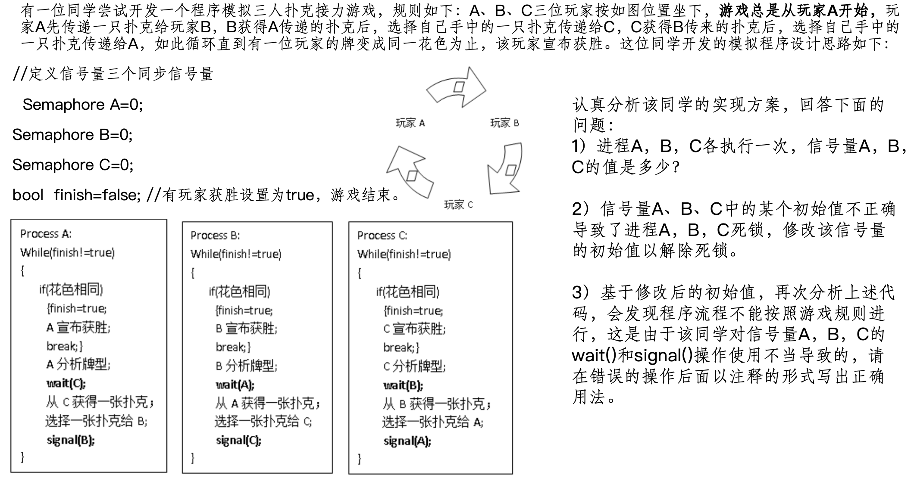
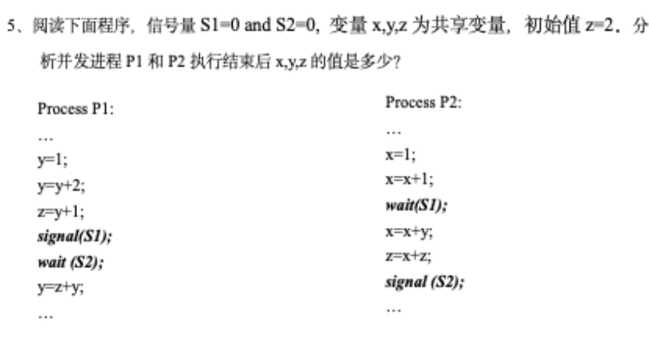
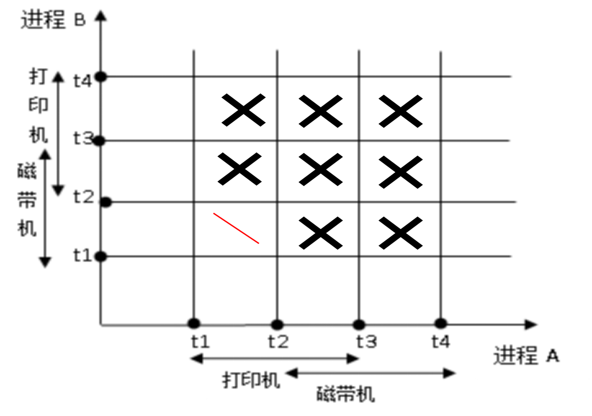

# <center>操作系统课堂笔记</center>
## Chap1：操作系统概论
### 操作系统的各种定义
 - `_______________`：管理和分配各种资源。
 - `____________`：控制`____________`的运行与`_______________`的操作
 - `______`：在`______`运行的一个程序，其他被称为`______`
### 计算机的启动
 - 引导程序（Bootstrap Program）
    1. 存储在**固件**中（ROM或EPROM）
### 操作系统的功能
 - 对计算机的`_______________`资源进行管理
 - 是计算机软硬件进行交互的`______`，是硬件之上的`_______________`

### 操作系统的目标
 - `______`用户程序使用户的问题`_______________`
 - 使计算机系统`_______________`
 - 使硬件的使用`____________`

### 操作系统的发展体现（核心是`__________________`）
 - **资源利用角度**：提高资源利用率与系统性能：
    1. 从单道到多道；
    2. 从集中到分布；
    3. 从专用到泛在；
 - **人机交互角度**：优化人机交互、方便用户使用（`____________`的出现）
 - **技术发展角度**：硬件的发展迭代（新功能特性的涌现）、规模的不断扩展
### 操作系统的发展历史（共5代）
 - **第一代（1946~1955）**：ENIAC（十进制，纸带存储，无操作系统，真空管计算机）
 - **第二代（1955~1965）**：晶体管时代（主要是批处理系统）
 - **第三代（1965~1980）**：集成电路（`____________`批处理系统，仍为批处理系统，但已有分时系统设计的思想）
 - **第四代（1980~至今）**：大规模与超大规模集成电路（分时系统，向巨型、微型、并行、分布式、网络化、智能化等方向发展）
### 操作系统的分类和发展历程
 - 无操作系统：人工操作，`__________________`，使用`____________`编程，使用`_______________`I/O，始终是`_____________________`，使用效率低
 - 简单批处理系统：使用`_______________`的方式，将一批任务通过磁带或磁鼓预载到主机前或主机后再进行处理或输出，每批作业由`__________________`自动依次处理
    1. `_________`：各道作业是**顺序执行**的
    2. `_________`：内存中只能有**一个任务**同时执行
    3. `_________`
    -  **存在的问题**：CPU与I/O不能同时使用，`____________`
 - 多道程序批处理系统：内存中有多个作业，CPU在不同任务中切换，只要系统中存在可执行的任务，CPU就不会空闲
    1. **多道性**：内存中同时`______________________________`，有效提高资源利用率与系统吞吐量。
    2. **无序性**：作业的完成顺序与他进入内存的顺序之间无`_____________________`。
    3. **调度性**：有`____________`和`____________`的流程。
    > **存在的问题**：无`____________`，用户响应时间长，作业`__________________`长。
 - 分时系统：可进行`_______________`且`_________`的系统
    1. **多任务处理**：分为`_______________`（多个程序存在内存中分别服务于不同用户，有用户输入时由CPU执行处理完后暂停，等待下一次输入）和`_______________`（后台程序，不占用终端I/O，不与用户交互），实现方式通常是`__________________`，多个程序在CPU上执行`__________________`
    2. **提出的要求**：主机，具备`____________`、`____________`的能力（分别通过`________________________`和`____________________________________`实现）
    3. **主要特点**
       - **多路性**：众多联机用户可以同时使用一个主机
       - **独占性**：各终端用户`______`自己独占一台主机
       - **交互性**：用户和计算机间可以进行`______`
       - **及时性**：用户的请求能在很短时间内获得响应
 - 实时系统：往往是`____________`，能够`____________`，具有`____________`和`____________`的特点
    1. **实时时钟管理**
    2. **高度可靠安全**
    3. **能够过载保护**
 - 分布式系统：是若干独立计算机的集合，但对用户来说就是单个相关系统
    - **硬件角度**：各个计算机都是`______`的，通过`______`互联
    - **软件角度**：用户看到的是`_____________________`
 - 交互式系统
 - 嵌入式系统
 - 并行系统
### 多道程序批处理系统引出的概念
 - **通道**：负责`_____________________`进行数据传输的专用部件
 - **中断**：当CPU`________________________`后，中断当前工作转而执行新插入的工作（往往是`_______________`），并在执行完该工作后从原中断点继续执行原工作，多个不同任务的I/O与计算可`____________`
   

## Chap2：操作系统的体系结构
### OS的定义
 - 操作系统是一个**软件**
 - 操作系统是一个**资源分配器** 
    *主要功能：*
    1. 管理所有计算机资源
    2. 处理冲突请求，公平地为用户和程序分配资源
 - 操作系统是一个**控制程序**
    1. 控制程序执行防止出错
    2. 控制各种I/O防止资源不当使用（如可以实现**外设并行**）
 - 操作系统是**一直处在运行状态的程序**，其中一直在内存中运行的部分叫**内核**，其余称**系统程序**，非操作系统的程序则为**应用程序**。
 - 不同操作系统的内核**基本功能模块设计**有所不同。
 > **备注**：一些嵌入式操作系统或基于解释型语言构建的操作系统是**没有内核态**，不在本课程讨论之列。

### 计算机系统的组成
 - `_________`：核心组件，计算的主要执行者
 - `_________`**（非常重要）**：对`_____________________`都有自己的控制器（如内存控制器、磁盘控制器、打印机控制器等），控制器可以使I/O设备与CPU`____________`，且拥有一定的`____________`
    1. 通过`____________`来向CPU报告操作的完成
    2. 局部缓存的功能：CPU与主存交换数据的媒介、I/O发生在`______________________________`间
 - `____________`：用于连接CPU和各种设备的控制器

### 具体介绍一下**中断**的概念
 - 现代操作系统都是`____________`的
 - 中断将控制权移交给`__________________`
   
 - **中断向量**：中断向量是特定类型的中断处理程序在CPU中存储的`______`，CPU根据中断向量找到中断处理程序，执行中断处理程序，一下是一些常见的中断向量
   
#### 中断（外中断，也称`____________`）机制
 - 原因：由外部设备完成某些操作后发送给CPU的指令，需要硬件支持引起，是异步执行的结果。
 - 触发：当某硬件完成了I/O操作后会发出一个中断信号（Interupt），硬件出现错误发出中断信号等
 - 性质：`____________`是`____________`，往往由独立于CPU的硬件触发
 - 
#### 陷阱（内中断，也称`____________`）机制
 - 原因：通常由于CPU执行程序时出现内部错误而引起
 - 触发：当CPU执行程序时，发生异常（Exception）后引起（即由`____________`引起的强制中断）
 - 性质：软件中断是`____________`，由CPU正在执行的进程触发。

### 系统调用
 - 分类
    1. 进程控制
    2. 文件管理
    3. 设备管理
    4. 信息维护
    5. （设备间）通讯
#### 操作系统中文件管理的五个主要操作
- 创建和删除目录
- 提供对操纵文件和目录的原语支持
- 将文件映射到二级存储器上
- 在稳定（非易失的）存储媒介上备份文件
- 创建和删除文件
### I/O结构
#### 主要设备
 1. I/O设备与其控制器相连
 2. 一组`_______________`和一组`_________`
 3. 有相应的`__________________`
#### 同步I/O vs. 异步I/O
 - 同步I/O：指两个事件发生时，只有在I/O事件的执行完成后才会让CPU继续执行该进程，两个事件是**串行**的。
 - 异步I/O：指两个事件发生时，I/O事件发生时CPU继续执行任务，直到收到I/O事件的中断指令前二者都处于异步I/O两个事件是**并行**的。

### 硬件保护

- 计算机系统可能会出现诸如`__________________`，`_______________________________________`
- 操作系统有义务为保护硬件`__________________`或`_______________`
- 要确保一个程序的执行`_________________________________`

- 将系统分为`_________`和`_________`（也叫`______`或`_________`）
- 因此，用一个`_________`来区分系统所处的不同状态

#### “状态位”机制（寄存器内）

 - 用于确定调用资源的权限
 - 仅一位，用于区分**用户模式**和**内核模式**

#### “特权”机制用来区分安全与不安全

 - 将指令分为**特权指令**和**非特权指令**
 - 其中`____________`不能在用户态调用，如果应用需要主动调用只能通过`_________`将控制权转交给操作系统（`__________________`）来实现

#### I/O保护
 - 所有I/O指令都是`____________`，用于确保用户不能通过`______`来控制计算机及其硬件
 - 因此也必须要`__________________`和`__________________`，所以也需要进行`____________`

#### 内存保护
 - **避免访问错误的内存地址**：使用`_______________`和`_______________`（分别用于存储内存空间的`____________`和`____________`）
 - 因此，`_________`下生成的每一个地址都需要经过以下规则检查：$$mealloc >= base register $$ $$ mealloc < base + limit$$
 - 操作系统可以在中断时提供的：
    - 更换两种寄存器位置
    - 将用户的程序段映射到内存中
    - 将出错的程序段从内存中移除
    - 访问和修改系统调用的参数

#### CPU保护
- 在用户程序出现`_________`等长时间不执行`____________`或不将控制权转交给操作系统的时候，需要操作系统对CPU进行保护
- 使用`_________`强制由操作系统中断程序
- 设置和加载计时器本身是一个`____________`
- 计时器在达到一定时间后会`__________________`将控制权移交给操作系统

### 操作系统提供的核心服务
 - 用户角度
    - 用户界面
    - 程序执行
    - I/O管理
    - 文件系统操作
    - 通信
    - 错误检测
 - 系统角度（其他服务）
    - 资源分配
    - 资源账务
    - 访问保护
 

### 操作系统的结构
#### 设计结构
 - 无结构
 - 分层结构：起源于`________________________`及其学生开发的`_________`系统
 - 模块化结构：`____________`
 - 微内核结构
 - 可加载的内核模块：类似微内核，以`____________`系统服务以`_______________`形式向`_______________`提供服务，可动态加载，且互相独立，可以`____________`，没有`____________`限制。
 - 混合结构：既有`____________`，又有微内核（但宏观上已经是`_________`了），也有`____________`，现代操作系统一般都属于这一类。
#### 存储结构（主要是一些基本硬件）
 - 内存：CPU唯一能直接访问的大容量存储区域
- 高速缓存：CPU-内存体系中的结构内辅助存储，用于匹配CPU速度和内存访问速度
 - 外部存储器：用于扩展内存存储能力，甚至具有冷存储功能的大容量存储器。
#### 内核设计理念不同
 - **微内核**：内核小、常驻内存少，系统程序易于扩展，用户软件资源利用率相对高，但可靠性低，且效率较低（以Windows为典型）；
 - **宏内核**：内核大，常驻内存多，扩展性差，用户应用软件资源利用率低，但可靠性高，且效率高（以Linux为典型）；

## Chap3：进程
### 并发 vs.并行
- 并发：在同一设备上同时运行多个程序（如**单个单核单线程**CPU），不同程序的指令有乱序执行导致一些意外错误，因此操作系统也需要将“共享变量”视为一种资源进行管理，因此操作系统往往引入**同步机制**以保证必要指令不乱序执行以避免影响共享变量出错。
- 并行：在同一设备上同时运行多个程序（如**多个单核多线程**CPU），
### 进程的一些概念与特点
 - 进程：`_______________`的一个程序（一个`__________________`的程序在一个`____________`上的`____________`过程）
 - 程序：一段具有特定功能的代码段（与进程的概念区别在后者不包含`________________________`和`_______________`）
 - 通过`____________`，一个程序可对应多个进程，通过`____________`，一个进程可包含多个程序
 - 进程是临时的，程序是永久的；进程是动态的，程序是静态的。
 - 进城的组成部分：
     1. 程序代码：`______`的`______`，`______`的`______`是`_______________`，`_______________`是`______`的`_________`。
     2. 数据：`______`的`______`，进程的数据是`__________________`。
     3. 进程控制块（PCB）：`_______________`是`______`的`_________`，`_______________`中包含进程的`______`、`______`、`____________`等信息。
 - 进程的性质
     1. 动态性：
     2. 并发性：多个进程实体可以`________________________`，且能在一段时间内`____________`。
     3. 独立性：每个进程都是一个`____________`，都有独立的`_________`，`______`和`_______________`分配。
     4. 异步性：ji进程会按`______`的、`____________`的速度向前推进。
#### 进程的状态
 - **创建态**：`____________`后，进程处于`_________`，直到`__________________________________________`后转入`_________`。
 - **就绪态**：`____________________________________`的进程状态。
    - 进出条件：转入`_________`
 - **运行态**：进程得到CPU资源并执行的状态。
    - 进入条件1：`_________________________________________________________`后转为`_________`。
    - 转出条件1：进程执行过程中遇到了`_______________`被中断后会进入`_________`
    - 转出条件2：`___________________________`、`_________`、`_____________________________________________________________________________________________________________________`后转`_________`
    > **备注**：抢占是系统调度的进程`______`行为。
    - 转出条件3：`_____________________`转为`_________`。
 - **等待态（阻塞态）**：进程被中断后等待`__________________`时的状态。
    - 进入条件：需要`_______________`或`_______________`而转为`_________`。
    - 转出条件：`_____________________`从`_________`转入`_________`。
    > **备注**：`______`是进程本身的进程`______`行为。
 - **终止态**：进程执行完毕，由`_________`进入`_________`。
### 进程控制块PCB


### 进程调度
**按阶段分类：**
 - `____________________________________`：从存储设备的缓冲池中选择进程，并将它们装入内存（新建进程）以执行。（将作业加入作业队列，几秒到几分钟，体现了`____________`的“道”）
 - `_______________________________________`：从内存中就绪可执行的进程中选择进程，并为其中之一分配CPU。可能只需要几毫秒
 - `__________________`：运行中的进程如果出现了资源不足，可能会`____________________________________`后重新分配。
**不同的进程队列：**
 - 作业队列：所有进程的集合。
 - 就绪队列：存储在主内存中的，`_____________________`的所有进程的队列
 - 设备队列：等待某一`_______________`的进程队列
 > **进程调度**就是进程`________________________`的过程

**调度策略不同：**
 - `__________________`：原则是`__________________`，即`____________`系统中CPU为主的进程和
 - I/O为主的进程。（算法也相对复杂，总体上要考虑所有系统资源）
 - `______________________________`：主要出现在`__________________`的情况下，将部分`__________________`（挂起）的进程换至`______`，图解如下：
   

### 上下文切换
 - **定义**：将CPU切换到另一个进程时需要保存原有进程的状态（PCB），同时装入新进程的保存状态。这一过程称为上下文切换。
 - **特点**：上下文切换时`________________________`，花费的时间是系统的额外开销，时间长短与硬件支持密切相关，通常为微秒级（1us-1000$\mu$s）

### 进程操作
 - 创建：在`____________`和`____________`、`____________`、`____________`时进行
    - 新进程在`____________`会以`____________`产生`_________`
    - 子进程可能：`______________________________`、`______________________________`、`___________________________`
    - 进程号（PID）用于`__________________`，在`_______________`系统中，PID是一个`_________`，`_______________`为父进程，`_______________`为子进程，`_______________`为无效进程
 - 调度：在进程就绪后由CPU调度决定何时由就绪态进入运行态
 - 撤销：运行态的进程由于某些原因被`__________________`（不再进入就绪态或等待态）
 - 阻塞：运行态的进程由于某些原因被`__________________`（进入等待态）
 - 唤醒：阻塞态的进程由于某些原因被`______`（进入就绪态）
### 经典案例：有限缓存与共享内存的实现（生产者/消费者模型）
```c
#include <stdio.h>
#include <stdlib.h>
#include <pthread.h>
#include <unistd.h>

#define BUFFER_SIZE 5

int buffer[BUFFER_SIZE];
int in = 0;
int out = 0;
int count = 0;

void* producer(void* arg) {
    int item = 0;
    while (1) {
        // 模拟生产一个数据
        item++;

        // 忙等：如果缓冲区满了就等待
        while (count == BUFFER_SIZE) {
            // do nothing
        }

        buffer[in] = item;
        printf("生产者生产了: %d\n", item);

        in = (in + 1) % BUFFER_SIZE;
        count++;

        usleep(100000); // 模拟耗时操作
    }
    return NULL;
}

void* consumer(void* arg) {
    int item;
    while (1) {
        // 忙等：如果缓冲区空了就等待
        while (count == 0) {
            // do nothing
        }

        item = buffer[out];
        printf("消费者消费了: %d\n", item);

        out = (out + 1) % BUFFER_SIZE;
        count--;

        usleep(150000); // 模拟耗时操作
    }
    return NULL;
}

int main() {
    pthread_t tid1, tid2;

    pthread_create(&tid1, NULL, producer, NULL);
    pthread_create(&tid2, NULL, consumer, NULL);

    pthread_join(tid1, NULL);
    pthread_join(tid2, NULL);

    return 0;
}
```
### 进程间通信（IPC）
#### 进程间消息传递的条件与过程
 - **条件**：进程间通信需要满足的条件，包括：
    - 连接的建立
       - 物理连接：`____________`、`____________`等
       - 逻辑连接：`____________`等
    - 通过`____________`/`_____________________`进行信息交换
 - 需要考虑的问题
    - 如何建立连接
    - 链接是否可多与两个进程共享（链接和进程的关系）
    - 1对通信进城可以有多少链接
    - 链接的容量是多大
    - 链接的容量是固定的还是可变的
    - 链接是有向的还是无向的

#### 进程间通信的不同分类方式
 - 直接通信
    - `____________`：进程间直接进行通信，发送者和接收者都需要知道对方的`_________`，如`____________________________________`、`_____________________________________________`，其条件和特点如下：
        - 进程需要`____________`：如进程P使用send向进程Q发送信息，进程Q使用receive从进程P接收信息。
        - 此时通信连接是`____________`的。
        - 直接连接是`______`进程上`______`的
        - 连接可以`______`，也可以`______`
    - `_______________`：发送消息依然指定接收方，但接受消息不声明发送方。
 - 间接通信：通信进程双方有一个`_________`邮箱进程，双方都要知道其唯一`_________`，发送和接收消息都到该`__________________`上执行。
    - 共享一个信箱进程时才能通信
    - 链接可与多个进程相关
    - 每对进程可共享多对链接
    - 连接可以`______`，也可以`______`
    - 进程可对邮箱进行操作：
       - 创建邮箱
       - 发送或接收消息
       - 销毁邮箱
 - 进程间通信的`_________`
    - 阻塞性通信：消息发出后在`__________________`前进程处于`_________`状态，在接收到`_______________`的消息时才会`_________`
    - 非阻塞性通信：消息发出后进程不需要等待接收方接受消息，进程可以继续执行其他操作
#### 进程间通信的**缓冲**问题：通过`_______________`的`____________`来实现管理（共3种类型）
 1. 0容量的`_________`：发送者必须等待接收者
 2. n个消息长度的有界容量：链接满则发送者必须等待
 3. 无限容量：发送者从不等待

## Chap4：线程
### 从**进程**出发
#### 进程的属性
 - `____________`的独立单位：创建、调度、撤销时具有`_____________________`（需要减小系统开销）
 - `____________`的基本单位：进程数目不宜过多，否则`__________________`会`__________________`（需要提高并发程度）
 > 这两个属性是可以`______`的，让`_____________________`不用频繁切换，让`______________________________`可以“轻装上阵”（不用`_______________`资源）
### 与进程的区别定义
- **线程**：进程的子集，是**进程的轻量级**，线程可以共享进程的资源，是`_____________________`，也被称为`_______________`。
- **进程**：**进程是**`___________________________`，是**进程的完整状态**，切换的效率**不如线程**。

### 多线程的优点
 - `____________`
 - `____________`
 - `____________`
 - 充分利用`____________`体系结构
### 线程的分类
 - `____________`：同一进程的线程切换是进程内部的性能开销，不属于`___________________________`，只有`_______________`的线程切换才属于，同时对操作系统而言就是进程切换调度。（也就是当进程中的`__________________`发起了`____________`，则`____________`都会被阻塞）
 - `____________`：操作系统`__________________`进行资源调度，原理同进程调度。
### 多线程模型（当用户级线程需要用到“某些系统功能”的时候）
 > **备注**：用户线程需要依赖`_________`功能实现向`____________`的映射
#### 一对一模型
 - 每个用户线程都有一个内核线程与之对应内核线程可以独立调度。（实现真正并发，但切换多，性能开销大）
 - 优点：`____________`，`____________`
 - 缺点：`_________`，`_______________`
#### 多对一模型
 - 多个用户线程对应一个内核线程，内核线程可能会被`______`用户线程阻塞。（不能实现“完全”并发，但切换少，性能开销小）
 - 优点：`_________`，`__________________`
 - 缺点：`____________`，`____________`
#### 多对多模型
 - 多个用户线程对应多个内核线程，内核线程可以独立调度。（实现真正并发，切换少，性能开销小）
 - 优点：`____________`，`____________`，`_________`，`__________________`
 - 缺点：实现复杂


## Chap 5: CPU调度
### 基本概念
 - 调度对象：进程
 - **并发**：在同一时间，多个进程在CPU上并发执行，主要有两个区间：
    1. I/O区间：I/O操作，如读写文件、网络传输等。
    2. CPU区间：计算、运算等。
    3. **特点**：以I/O为主的程序以**短CPU区间**为主，
 - **分派程序**：将CPU的控制权由短期调度程序分配给进程，主要有`_______________`、`_____________________`、`_____________________________________________`。
 - **调度准则**：：一般是`_________`调度准则，一般是`__________________`——最大化
    - `_________`——最大化
    - `__________________`——最小化：一个进程`__________________`的时间（包括`____________`）
    - `__________________`——最小化：进程执行过程中处于`_________`的时间
    - `__________________`——最小化：从`____________`到`____________`的时间，主要针对`____________`，与`____________`概念基本一致。
 - 常见的调度策略
    - `_______________`调度策略
       
       - 平均周转时间（$P_1$、$P_2$、$P_3$均为0时创建）：$$\frac{24+27+30}{3}=27$$
       - 平均等待时间（$P_1$、$P_2$、$P_3$均为0时创建）：$$\frac{0+24+27}{3}=17$$
    - `__________________`调度策略（也叫`__________________`调度策略,分为`_________`和`____________`两种）
       - 对于一个如下表所示的进程池：

| Process | Arrival | Burst | Waiting |
| :---: | :---: | :---: | :---: |
| $P_1$ | 0.00 | 7.00 | 0.00 |
| $P_2$ | 2.00 | 4.00 | 6.00 |
| $P_3$ | 4.00 | 1.00 | 3.00 |
| $P_4$ | 5.00 | 4.00 | 7.00 |

- **对于非抢占式策略**：  
        
 - **对于抢占式策略**：  
        
    - `_______________`(根据`_____________________`分为“静态策略”和“动态策略”)：进程按照优先级进行调度，优先级高优先级高，优先级低优先级低。
       - 主要问题：
          - `____________`
          - `______`
       - 解决方案：`______`，如等待时间越长优先级升高、占用CPU时间越长优先级降低等`_______________`调度策略
    - `______`调度算法：按照一个特定的`_________`将CPU资源以队列形式轮转给不同进程。
       - 重点：
          - 进程从`_____________________`开始排队，而不仅仅是在`__________________`或`__________________`时排队。
    - `____________`调度算法：将不同进程根据不同属性排成多条队列，然后以`______`为单位进行调度，队列内部则采用`_______________`调度。
    - `__________________`调度算法：第一个队列中完不成的任务，进入下一个队列，然后进入下一个队列，直到完成所有任务。
       - 队列内部则采用`_______________`调度
         - 队列按`_______________`排序
         - 最后一个队列遵循`_______________`调度策略
         - 

 - 抢占策略：将优先级较高进程抢占CPU，优先级低进程从`_________`释放进入`_________`。

 - `__________________`调度策略（自主探究）
    - 核心是这个公式：$$响应比 = \frac{等待时间 + CPU时间}{CPU时间}$$以他大为优先
    - 特点：可以同时满足多个调度准则：
       - `_______________`
       - `

## Chap6：同步工具
### 背景

### 临界区
 - 概念：并发进程中可能`__________________`、`__________________`、写同一个文件的代码段。
 - 认为其所处位置时：进入区（上锁）、**临界区**、退出区（开锁）、剩余区
 - **具体要求**：
    - `______`：进程Pi在临界区内执行，其他进程不得进入临界区
    - `______`：如果没有进程在临界区执行，那么允许不在剩余区的进程计入临界区
    - `____________`：从一个进程作出进入临界区的请求，直到该请求被允许为止，其他进程允许进入其临界区的次数有上限。
- - **总结**：`____________`，`____________`，`____________`，`____________`


### 让权等待

### 信号量机制
#### 一些概念
- 信号量：一个变量，表示进程的`__________________`，进程请求资源时先判断信号量是否大于0，如果大于0则信号量减1，否则阻塞进程。进程释放资源时，信号量加1。
```c
wait(s){
   while (s<=0){
      // Empty
   };

s--;
}
signal(s){
   s++;
}
```
但依然存在`______`问题
#### 忙等问题的解决
```c
wait(s){
   value--;
   if (s.value < 0){ 
      // add this process to waiting queue
      block(); // block current process itself
   }
}
signal(s){
   value++;
   if (s.value <= 0){
      // remove this process from waiting queue
      wakeUp(P); // wake up the head process in the waiting queue
   }
}
```
**这样就可以解决忙等问题，等待过程无需一直判断和消耗CPU资源**
### 死锁和饥饿

| P1 | P2 |
| :---: | :---: |
| wait(s) | wait(q) |
| wait(q) | wait(s) |
| Processing P1 | Processing P2 |
| signal(s) | signal(q) |
| signal(q) | signal(s) |
**如果两个进程并发，则P1阻塞在队列q，P2阻塞在队列s**
**解决方案**：s、q等队列必须有个全局的请求顺序（Chap7：破坏`____________`条件）

### 经典同步问题
#### 同步与互斥
 - 同步：两个进程必须要有先后执行的顺序(譬如后一个进程需要前一个进程的结果，或者二者本来就是一个大程序的前后部分)
 - 互斥：两个进程不能同时访问一个共享资源，必须有一种`_______________`，是一种`_______________`。
 - 简单的同步问题案例：
    1. **前驱-后继**（此类问题信号量一般为`_________`）
    
    
    2. 总结：
       1. 在多个并发进程中，同一信号量的wait和signal操作必须是成对出现的，`_________________________________`（因为分支语句的存在）
       2. 用于表示同步关系的信号量的wait和signal操作是交叉出现在需要同步进程中的
       3. 用于表示互斥关系的信号量的wait和signal操作是出现同一进程内部
1. > **备注：**一般`_______________`会在`_______________`前

 - 简单的互斥问题案例：
    1. **售票员问题**
    
    2. **司机与售票员问题**
    
    
#### 经典问题解析
 - “生产者-消费者”问题
    1. **有限缓冲问题**
    
    编程实现
    
 - “读者-写者”问题
    
    1. 读者优先
    2. 写者优先
 - “哲学家进餐”问题
    1. 问题描述
    
    2. 朴素实现
    
    3. **可能出现死锁**：所有哲学家都拿起左手的筷子时
    4. **解决方案**：
       - `____________`：拿不到两只筷子就不拿
       - `____________`：n只筷子最多只能有n-1个哲学家
       - `_________`：奇数位先拿左手筷子，偶数位先拿右手筷子

#### 引入**管程**（被封装的“信号量”）
- 管程：封装信号量的功能，提供`______`和`______`功能
- 组成：
   - 一组`____________`： 一组被共享的计算机资源（管程最大的特色，即将资源也封装在内）
   - 一组`____________`：一组用于同步、互斥的调度实现的函数
   - 至少一个`____________`：管程中的`_________`
   - 明确的`_____________________`


## Chap7：死锁
### 死锁定义
 - 计算机系统中许多软硬件资源是独占性的，如打印机，磁带以及`_________________________________`，`___________________________`等。
 - 一组阻塞的进程中，每个进程都占有一定的资源，同时又等待其它阻塞进程释放其所占有的资源，这样，所有进程都无法获得足够的资源，这样就导致了死锁。
 - 所以总结起来，四所共有四个必要条件：
    1. 互斥条件：一个资源只能被一个进程占有
    2. 占有并等待条件：进程占有资源，并等待其他进程释放资源
    3. 非抢占条件：进程只能获得空闲的未分配资源，不能抢占正在使用的资源
    4. 循环等待条件：进程之间形成资源占有的循环等待，即A等待B，B等待C，C等待A
### 引起死锁的原因
- 进程对共享资源的竞争
- 进程推进顺序的不合理
### 资源分配图（会画）
- `___`为进程，`______`为资源
- `___`指向`______`为请求资源，`______`指向`___`为占有资源
- 死锁在图中的直观特点：死锁出现一定有环，无环一定不发生死锁
#### 特点
- **是否有环：**如果资源`__________________`，则死锁发生，若有多个，则死锁可能发生
- 
### 死锁的解决方法
 1. 通过`______`避免死锁
 2. 允许系统进入死锁，`_____________________`
 3. 忽略死锁，认为死锁不会发生（死锁也确实是小概率事件）
 - 早期绝大多数操作系统采用了`_________`策略


### 死锁的预防
#### 死锁的特征（发生的`____________`）
 - `______`：资源不能被多个进程共享
 - `_______________`：一个进程占有资源后，继续请求其他资源
 - `_________`：资源不能被强制剥夺
 - `____________`：存在一个进程的集合，使得每个进程都在等待下一个进程所占有的资源
 > **死锁的预防方式**：破坏死锁的四个特征中的一个或多个
#### 一些预防策略（本质是`__________________`）
- `______`：不同进程具有天然的互斥性，无法打破
- `_______________`：保证申请资源时进程已不占有其他资源，如`___________________________`、`_________________________________`（导致`__________________`和`____________`）
- `_________`：当进程申请未实现时，必须`__________________`，释放的资源视为`_________`而放入该进程的`__________________`中，只有进程`________________________________________________`时，才继续执行。
- `____________`：所有的资源实例都要`______`，进程必须按照`_________`的`____________`顺序进行申请。（同样导致`__________________`）
### 死锁预防的副作用
- 可能会降低设备的`_____________________`
- 可能会引起`____________`


### 死锁的避免
#### 资源分配图（资源仅有`____________`时）
资源分配图上会有`_________`、`_________`和`_________`，其中`_________`是一种“虚边”，当其转换为`_________`时如果出现了环路，就说明死锁可能会产生，因此这类需求不去满足就可以避免死锁。

#### 银行家算法（资源有`____________`时）
 - 银行家算法是`__________________`的算法，主要用于`____________`，其核心是`_________`和`____________`。
 - 银行家算法的基本思想是：在每次分配资源前，先判断分配后是否处于安全状态，如果处于安全状态，则分配资源，否则不分配资源。
 - 银行家算法的基本步骤：
    1. 计算出当前系统的`__________________`
    2. 计算出当前系统的`__________________`
    3. 计算出当前系统的`____________`
    4. 判断当前系统是否处于安全状态
    5. 如果处于安全状态，则分配资源，否则不分配资源
 - 银行家算法的基本要素：
    1. `__________________`：表示每个进程对每种资源的最大需求量（**必要**）
    2. `____________`：表示每个进程已经分配的资源量
    3. `__________________`：表示系统中可用的资源量
    4. `____________`：表示每个进程还需要的资源量
#### 安全状态
 - 安全状态：系统处于安全状态时，表示系统可以分配资源给所有进程，并且所有进程都可以完成执行。（即`__________________`的系统状态）
 - 不安全状态：系统处于不安全状态时，表示系统不能分配资源给所有进程，并且所有进程都不能完成执行。
 - 安全序列：表示系统处于安全状态时的进程执行顺序
#### 具体实施（见**code**文件夹）

### 死锁检测和恢复
#### 进程等待图（资源仅有`____________`时）
进程等待图是对资源分配图的简化，将一对`_________`和`_________`合成为一个`_________`，图中的节点就只剩`____________`，如果存在环路就说明死锁已经发生。

#### 死锁检测算法（银行家算法变体）
- 与银行家算法结构一致
- Available = [0 0 ... 0 ]开始
- Request = [0 0 ... 0 ]开始（其中Request矩阵相当于银行家算法里的`____________`矩阵）
#### 死锁的处理（三种方式）
- `____________`：人工干预死锁
- `____________`：有终止所有死锁进程或基于某些最小化代价策略选择被终止进程
- `____________`：抢占一部分资源给其他进程以打破死锁


## Chap8：主存（内存）管理
### 操作系统的存储层次（由小到大，由快到慢）
- 寄存器（Register）
- 高速缓存（Cache）
- 主存（亦即“内存”， Memory）
- 闪存（）
### 需要掌握
 - 连续内存分配、分页、分段等各种内存分配方式
 - 内存内容保护机制
 - 逻辑地址和物理地址的转换
### 地址绑定的三个阶段
 - `__________________`：编译时直接生成`____________`代码
 - `__________________`：编译不知道装入位置时，生成`__________________`代码
 - `__________________`：进程执行时若`________________________`，则地址绑定延迟到`_______________`进行，需要硬件对`____________`的支持

### 地址映射
**使用两个寄存器的解决方案：**  
 - `_______________`：存放物理地址的起始地址
 - `_______________`：存放逻辑地址的长度
 - 逻辑地址=基址+偏移量
 - 物理地址=基址+界限+偏移量

**重定位与地址绑定：** 
 - `__________________`：与`_______________`相同，存放物理地址的起始地址
 - `____________`：将逻辑地址转换为物理地址的过程
 - `_____________________`：在编译时将逻辑地址转换为物理地址（往往用在**专用的**`_______________`中）
 - `__________________`：根据内存情况，将程序模块装入到内存适当的位置，之后不再改变。`________________________`在加载时将程序中的地址全部加上重定位寄存器中的地址，装载器需要辨别程序中的地址以及操作数。
 - `__________________`：允许程序运行时在内存中移动位置，需要依赖`________________________`，程序在内存中`_______________`，这个负责地址映射的硬件叫`_________________________________`

### 连续内存分配
 - 内存通常分为两部分：`__________________`和`____________`
 - 拥有`____________`
#### 内存分区
 - **固定分区**：分区的`______`是固定的。
 - **可变分区**：分区的`______`是可变的（基于`________________________________________________________________________`实现）。
 - **孔**：内存中的`____________`
#### 动态内存分配算法
**如何寻找`____________`：**
 - `_________________________________`：从头开始`__________________`搜索，找到第一个满足条件的孔分配给进程
 - `_________________________________`：从头开始全局搜索，找到最小的满足条件的孔分配给进程
 - `_________________________________`：从头开始全局搜索，找到最大的满足条件的孔分配给进程
 - `________________________`：从上次分配的位置开始搜索，找到第一个满足条件的孔分配给进程
 - `____________`：将内存划分为2的幂次方大小的块，分配时将相邻的块合并成一个大块，
#### 内存分页
##### 一些概念
 - **分页**：将内存划分为固定大小的`___`，每个页的大小相同，页的大小通常为2的幂次方。
 - **页表**：`________________________`创建，用于存放每个页的`___________________________`的映射关系。
 - **页表寄存器**：也分为`_____________________`和`_____________________`。
##### 基本特点
 - 只存在`____________`，不存在`____________`
##### 访存优化
 - **最初**：需要先基于“页号”和“页偏移量”访问内存中的`______`，再根据其映射的页号与帧号关系得到帧号，然后二次访存得到目标所在内存帧
 - **TLB（Translation Look-aside Buffer，`_______________`，也简称`______`）**：一个全局的`____________`，用于存放最近查询或使用过页号向帧号的映射，避免对页表的访存开销。
 - **层次化页表**：将`_______________`的区域继续划分为`______`和`_______________`并指向`____________`。
 - 有效访存时间的计算：
$$t_{\text{有效存取}}= (1 - p_{\text{命中TLB}}) \times (t_{\text{TLB访问}} + 2 \times t_{\text{内存访问}}) + p_{\text{命中TLB}} \times (t_{\text{TLB访问}} + t_{\text{内存访问}})$$
#### 段式内存+段页式内存
##### 段式内存
- **形式**：将程序先分为不同的功能段，然后将对每段的分配信息存储在属于该进程的`______`中（类似连续分配，但一个进程可被拆成不同部分离散，依然存在`_________`，但又一定程度缓解）
- **段表**：存储内容为存储某个段的内存基址和字节偏移量
##### 段页式存储
- **形式**：先将程序分为不同功能段，然后将每段的分配信息分页存储在内存中。
- **需求**：段表和页表都需要
- **段表**：存储`____________`和`____________`
- **页表**：页号、帧号

- 
## Chap9: 虚拟内存
### 内存不足的困境
- **背景**：进程大于内存容量或某作业需要多进程并发超出内存承载力该如何处理
- **非虚拟内存解决方案**：`___________________________`（需要开发人员做大量优化）

### “局部”现象
 - 在计算机执行一个程序时一个进程可能就只执行了一个大程序的“局部”，并认为在执行某个特定任务的时候这一部分“局部内存”会被频繁集中访问，那么此时这一部分在内存中即可，不需要整个程序读入内存。
 - 程序局部性的分类：
    - `_______________`：由`____________`引起
    - `_______________`：由`____________`引起

### 常规与虚拟存储器的区别
#### 常规存储器的特征
- `_________`：作业在运行前需要一次性装入内存
- `_________`：作业装入内存后，需要一直在内存中驻留，直到作业执行完成
#### 虚拟存储器的特征
- `_________`：**最重要的特征**，一个作业`_________`装入内存运行
- `_________`：内存分配时采用`____________`的方式
- `_________`：运行过程中信息在内存和外存的`_________`进行换进、换出
- `_________`：从`_________`扩展内存容量，使得所见内存比`____________`更大
### 页面调入策略
#### 主要分类
- `_______________`：主要用于`____________`，预测准确率不高
- `__________________`：当进程运行中遇到`______`时，有系统将`______`调入内存
#### “置换”+“缺页中断”（也称`_______________`）
##### 页面错误引起`____________`
 - 内存状态（引入`_________`，用于引起`____________`）
 - 缺页中断分为6个部分
    1. 内存加载（`____________`）
    2. 发现缺页，引起`_________`
    3. 陷入操作系统，`________________________`
    4. `______`缺失页
    5. `____________`
    6. 重新执行
 - “缺页中断”中的时间消耗主要在第四步
 - 带虚拟内存的有效访问时间：
$$t_{\text{有效访问}} = p_{\text{缺页}} \times (t_{\text{请求调页}} + 2 \times t_{\text{内存访问}}) + （ 1 - p_{\text{缺页}}) \times t_{\text{内存访问}}$$
##### 缺页中断不同于一般中断的特点
- 缺页中断是在访存指令的`_______________`触发的，而不是一般的`________________________`主动或被动触发
- 缺页中断后会`___________________________`重新执行，而不是一般的`_______________`继续执行
- 一条指令的执行期间可能会出现`__________________`
##### “置换”是有策略的

 - 需要考虑
    - 分配时间
    - 是否在内存（引入`____________`）
    - 是否访问过（引入`_________`）
    - 是否修改过（引入`_________`）
> 页表就有了`______`、`______`、`____________`、`____________`、`____________`、`____________`等六个字段
 - 主要问题
    - 帧分配算法：
    > 主要分为`______`分配和`______`分配
    - 置换算法：
        1. `____________`
        2. `____________`（定义上是`______________________________`，而不是用到次数最少的，但程序需要用到哪些页是不确定的，所以不可能实现，
        3. 所以一般用`__________________`（LRU）置换，用“最近的过去”模拟“最近的未来”，因为`______`现象的存在，所以认为有“访存聚集性”）
 - 一种**异常**
 > 诸如123412512345这种序列在4个帧分配的情况下反而比3个帧分配时缺页次数更多(亦即在一些特殊的序列中，内存帧较多的系统在执行同一任务时缺页次数可能会比内存帧较少的系统多)

|访存顺序|1|2|3|4|1|2|5|1|2|3|4|5|
|-|-|-|-|-|-|-|-|-|-|-|-|-|
|内存页1|1|1|1|4|4|4|5|-|-|5|5|-|
|内存页2|-|2|2|2|1|1|1|-|-|3|3|-|
|内存页3|-|-|3|3|3|2|2|-|-|2|4|-|
|**计数**|1|2|3|4|5|6|7|-|-|8|9|-|


|访存顺序|1|2|3|4|1|2|5|1|2|3|4|5|
|-|-|-|-|-|-|-|-|-|-|-|-|-|
|内存页1|1|1|1|1|-|-|5|5|5|5|4|4|
|内存页2|-|2|2|2|-|-|2|1|1|1|1|5|
|内存页3|-|-|3|3|-|-|3|3|2|2|2|2|
|内存页4|-|-|-|4|-|-|4|4|4|3|3|3|
|**计数**|1|2|3|4|-|-|5|6|7|8|9|10|
 - 常见的实际使用的置换算法
    - “近似LRU算法”——时钟算法（主要使用了`_________`）：访问后置为1，在替换时先从访问位为0的开始替换，若不存在，则全部置零再替换（是访问到为`___`的页表项后就将其访问位置0,因此也称`__________________`，全置0后退化为`__________________`）
    - “二次机会近似LRU算法”（再引入一个`_________`）：因为修改过的程序在被置换时涉及到`_________`，所以置换开销大，所以优先置换未修改过的内存页，且置换优先级低于`_________`
    - LFU、MFU等策略可以了解
 - 全局置换和局部置换
    - 全局置换：当内存页数达到上限时，从所有帧集合中挑选帧置换，晋城的真分配数量可能会变化（往往基于操作系统自己维护的一个带访问位和帧分配信息的`____________`，而不是遍历`_____________________`，全局置换能够`______________________________`，但往往难以控制`____________`，因为进程间会存在互相抢占空闲的已分配帧）
    - 局部置换：当内存页数达到上限时，置换当前进程页表中的内存帧，此时进程被分配的内存帧数量是不变的。
 - 固定置换与可变置换（主要取决于进程被分配的内存页数量是否改变，全局置换和局部置换分别是典型的可变和不可变分配）
 - **可变局部置换**：预分配时（如根据`_____________________`或`_______________`）内存帧分配数量可变，但发生缺页中断时只能在`_________________________________`里选择内存帧置换。
##### 系统颠簸（也叫系统`______`）
###### 过程
 - 当系统内存紧张时，内存页置换的频繁`_________`操作会导致CPU频繁等待缺失内存页再执行，导致`______________________________`
 - CPU在意识到CPU利用率过低时会引入新进程来`______________________________`
 - 但新进程的引入会进一步加剧内存紧张，最终导致整个系统陷入频繁的页面置换，CPU利用率几乎`____________`
##### 解决策略
- `_______________`：一段时间内的作业执行的`______`需要用到`_____________________`（不重复）视为一个`_________`
- **基础策略**：系统跟踪`______________________________`，并为之分配略大于其需求的内存，`_____________________`，就进一步提高`_______________________________________`
- **判定条件**：当所有并发程序在一个时间段内的`_______________`大于了系统所能提供的所有`_______________`，就会`____________`
- **解决策略**：系统主动降低`_______________________________________`
- **具体实施**：`___________________________`部分进程。


## Chap10: 存储管理
### 文件类型
- 流式文件：以字节流的形式呈现的文件
- 记录式文件：
### 文件的访问结构
- 顺序存取
- 随机存取（也称`____________`）
### 文件的逻辑结构
#### 主要分类
- `____________`：
- `____________`：
- `__________________`：
### 文件的物理结构
#### 文件物理结构的三种结构，及其优劣与改进措施
   1. 连续分配：文件指向起始块地址，
       - 优点：`_________________________________`、`______________________________________________________`、`__________________`
       - 缺点：`___________________________________________________`、`__________________`、`_________________________________`
       - 改进措施：
   2. 链接分配
       - 优点：`__________________________________________________________________________________________`、`__________________________________________`
       - 缺点：`____________________________________`、`___________________________`、`______________________________`、`_______________________________________________________________`
       - 改进措施：引入`_______________`（FAT），相当于给磁盘上每个`___`的及其下一个块的指针做成了一个二维表，避免了磁头跨过大量数据查询查询下一地址的寻道时间，文件名直接指向`_________`的地址
   1. 索引分配：文件指向其`_________`地址
       - 优点：`_______________`、`__________________`、`__________________`
       - 缺点：`____________________________________`、`______________________________`、
       - 改进措施：会使用`____________`、`____________`、`____________`等复杂结构扩展文件存储（其中UNIX将使用的混合索引模式如下图，由15个指针构成文件索引部分，其中12Ω个直接指向`_________`，后三个分别指向`_________________________________`）
### 文件目录
文件目录就是文件的基本信息的集合，一般是所有`_______________`的集合，其中任意一条被称为`_______________`，可保存为一个`____________`。
#### 文件控制块（FCB）
**包括以下几个部分**：
- **基本信息**：`_________`、`_________`、`____________`、`____________`、`__________________`、`____________`
- **管理信息**：`____________`、`____________`、`____________`、`__________________`、`__________________`
- - **存取控制信息**：文件的`____________`
#### 文件目录的功能
1. 查询文件
2. 创建文件
3. 删除文件
4. 重命名文件
5. 列出目录
6. 遍历文件系统
### 目录结构
#### 要求
- `______`：能够快速检索和定位文件
- `______`：能够方便用户操作文件（尤其是`_________`）
#### 目录结构的分类
1. 单级目录：所有文件平铺在一个目录空间里
2. 两级目录：第一级是`_________`及其`__________________`，每个用户的文件以`____________`的形式存储在二级目录里
3. 多级目录（树形目录）：层次清晰、便于管理和保护、便于分类、解决重名问题、优化局部检索速度（但是查找文件需要`____________`，文件`_______________`）
4. 无环图目录：同一个文件可以有`____________`指向，不同路径`__________________`
> **备注**：无环图目录可能会出现`____________`问题（一个用户通过一个路径删除的文件，可能会导致其他用户访问不到引起`__________________`），一般通过`____________`或`____________`的方法来避免。
### 空闲空间管理


## Chap11：外部存储
### 存储方式
 - 顺序存储：
 - 链接存储：
 - 索引存储：

## Chap12：大容量存储
### 磁盘结构
- **存储结构**：柱面组成一个弧状的扇区，一圈扇区组成圆环型的磁道，连续的同心圆的磁道构成一层盘面，叠起来的盘面构成一组磁盘。
- **存取结构**：横跨所有盘面的核心支架是`______`，从磁柱伸入每层盘面得延展机构是`______`，上面有一个可以沿半径滑动的读取机构是`______`
- **编号方式**：用`_________`、`_________`、`_________`描述存储定位，最外层的磁道为0磁道，向内逐圈增大；最顶层的磁头为0磁头，从上往下逐层增大；各盘面分为大小相同（`_________`相同，不是角度相同）的几个扇区
- **逻辑抽象**：抽象为一个`_______________`，从0磁盘0磁道0扇区开始编址、`_________`是最小编址和传输单位，由`____________________________________`构成
### 磁盘I/O
#### 提高磁盘I/O性能的途径有
- `___________________________`
- `______________________________`
- `_________________________________`
#### 磁盘访问时间的计算
$$t_{\text{磁盘访问时间}}=t_s(\text{寻道时间})+t_r(\text{旋转等待时间})+t_t(\text{磁盘传输时间})$$
其中：
$$t_s=m\times n + s,t_r=\frac{1}{2r}, t_t=\frac{b}{rN}(s为磁臂启动时间，n为磁头滑过的磁道数目，r为磁盘转速，b为访问字节数，N为所在磁道总字节数)$$
> **备注**：s、m、r、n、N都是常数，只能通过避免存储碎片化，`__________________`，来提高访问速度。
### 磁盘寻道策略
- 先来先服务（FCFS）：先请求的柱面先寻道
- 最短寻道时间策略（SSTF）：物理距离最近的柱面先寻道
- 全盘扫描策略（SCAN）：沿上一次寻道方向逐一访问柱面并到达`___________________________`后反向执行同样的扫描
- 全盘单向扫描策略（C-SCAN）：沿固定寻道方向（一般是`__________________`）逐一访问柱面后返回`__________________`重新执行该扫描任务
- 有限扫描策略（LOOK）：沿上一次寻道方向逐一访问柱面并到达`____________`的`___________________________`后反向执行同样的扫描
- 有限单向扫描策略（C-LOOK）：沿固定寻道方向（一般是`__________________`）逐一访问柱面并抵达`_____________________`后返回`____________`的`___________________________`重新执行该扫描


## Chap13：I/O系统
### I/O的硬件构成
- I/O设备不直接与CPU通信，而是与`_______________`通信
- I/O设备通过`_______________`与计算机的`____________`和`____________`相连
  - bufenI/O设备（如磁盘设备）是`_____________________`的
### 设备控制器
结构如图所示：

### I/O控制方式
**发展宗旨**：减少主机对I/O控制的干预，将主机从I/O控制事务中解放出来。
- `__________________`（也成为`______`）：无中断，由操作系统反复用CPU查询I/O设备的状态并决定和调度I/O任务
- `__________________`：`__________________`触发I/O中断，触发时CPU接管并处理I/O任务
- `_______________`：数据以`_________`为单位，`_______________________________________`（或反向），过程由`__________________`完成。
DMA控制器的结构图：

### Spool系统（Simultaneous Peripheral Operations On-Line，也称`_________`技术）
#### DMA机制
 - 原理：直接在内存中开辟空间，不经过CPU缓存，以减少触发CPU中断机制。
 - 条件：只有**快设备**才能进行
 - 功能：全部磁盘传输完了再进行**DMA中断**，可以大大减少中断次数（原本是1Byte一次中断）。
 - 
 


 
# 平时测试与作业整理
## 第一次测试
### 选择题
- 无论系统是否支持线程，`______`都是资源分配的基本单位，`______`是系统调度的基本单位（对于不支持线程的系统，进程与线程等同）。
- 在分时系统中，一个进程的时间片耗尽时，该进程由`_________`转入`_________`（注意不是`_________`）
- 在支持多线程的系统中，进程P创建的若干个线程可以共享`________________________`、`_____________________`、`________________________`，但不能共享`________________________`
- 有利于I/O为主的进程的调度策略
    - 短作业优先（SJFS）
    - 高响应比优先（HRRF，相对）
- 有利于CPU为主的进程的调度策略
    - 先来先服务（FCFS）
- 没有明显进程偏好的调度策略
    - 时间片轮转（RR）
    - 优先级调度（PS，看情况）
- “当进程在建立时就为之分配所有的资源，如无法满足，则暂时不为进程分配任何资源。”的静态资源分配方法破坏了死锁的`_______________`条件。
- 假设系统有10个并发进程通过Wait和Signal操作共享同一临界资源，若该临界资源互斥信号量为mutex,初始值为1，则进程执行后，mutex可能的值域为`_____________________`
- 时间片过大的时间片轮转算法会退化为`_______________`算法
- 资源的有序分配策略可以破坏死锁的`____________`条件
- 支持多级反馈队列的调度算法降低进程优先级的合理时机是`___________________________`
- 不会创建新进程的常见系统调用是`_____________________`
- 某系统中有11台打印机，有N个进程共享打印机，每个进程要求3台，则N满足：
- $N \le \lfloor\frac{11-1}{3-1}\rfloor=5$时系统不会死锁。
- 若控制访问某临界区资源的信号量S的初值为3，当前值为-2，说明当前有`___`个进程正在访问临界区，有`___`的进程被挂起等待进入临界区。
- 常见调度算法是否会引起饥饿的判断：
    - 先来先服务（FCFS）：不会
    - 轮转调度（Round-Robin）：不会
    - 短作业优先（SJF）：会
    - 优先级调度（Priority）：会
    - 最短剩余时间优先（SRTF）：会
### 简答题：

- **题目一**：
   
   **答案**：
   1. (1)是ABC都变`___`（这里假定进程都执行完了一遍，所以不是均为`______`）
   2. (2)是C变1
   3. (3)是A wait(C), Signal(A);B wait(A), Signal(B); C wait(B), Signal(C)


- **题目二**：

   **解决方案**：
   以P1先开始执行为例（实际上甚至交替执行都无妨）

   | 执行语句 | x | y | z | S1 | S2 |
   | - | - | - | - | - | - |
   | <center>P1执行</center> |
   | y=1 | - | 1 | 2 | 0 | 0 |
   | y = y+2 | - | 3 | 2 | 0 | 0 |
   | z=y+1 | - | 3 | 4 | 0 | 0 |
   | Signal(S1) | - | 3 | 4 | 1 | 0 |
   | wait(S2) | - | 3 | 4 | 1 | -1 |
   | <center>P2执行</center> |
   | x=1 | 1 | 3 | 4 | 1 | -1 |
   | x=x+1 | 2 | 3 | 4 | 1 | -1 |
   | wait(S1) | 2 | 3 | 4 | 0 | -1 |
   | x=x+y | 5 | 3 | 4 | 0 | -1 |
   | z=x+z  | 5 | 3 | 9 | 0 | -1 |
   | Signal(S2) | 5 | 3 | 9 | 0 | 0 |
   | **y=y+z** | **5** | **12** | **9** | 0 | 0 |

   故答案为`__________________________________________`。

- **题目三**：某系统有一台打印机和一台磁带机，进程A和B竞争上述两个资源，假设进程A在t1到t3时刻将请求使用打印机，在t2到t4时刻将请求使用磁带机。进程B在t1到t3时刻将需要使用磁带机，在t2到t4时刻将需要使用打印机。若系统没有任何死锁避免机制，请在图中标记出不安全状态（\标记）和死锁状态(X标记)的格子，并简要说明不安全状态和死锁状态之间的关系。
   
   **解决方案**：死锁状态是不安全状态的子状态，不安全状态下的程序如果没有死锁避免机制的介入会进入死锁状态，死锁状态是不同进程间进入循环等待且均无法执行下去的状态。

- **题目四**：


   **答案**：
   本资源分配图表明系统存在死锁（分配图又换且形成循环等待）
   1. `______`：不同进程对于同一资源的使用是互斥的，不可以同时使用。
   2. `_________`：进程不能抢占其他进程正在使用的资源。
   3. `_______________`：进程在被分配资源后即使无法推达到执行条件，也会占有已分配资源并等待所需剩余资源的分配。
   4. `____________`：进程P2占有资源R4请求资源R2，进程P3占有资源R2请求资源R4。

- **题目五**：某系统有A,B,C,D四类资源，有5个并发进程P0，P1，P2，P3，P4竞争这四类资源。当前系统的资源状态如图所示，采用银行家算法，回答以下问题：
   1）计算需求矩阵Need。
   2）系统当前是否处于安全状态，说明理由。
   3）进程P2此时发出请求向量Request(0,3,0,2)，系统能立即满足吗？
   
   **解答**：
  1. Need矩阵为：
     | 进程名称 | <center>Need(ABCD)</center> |
     | - | - |
     | P0 | 0 0 0 0 |
     | P1 | 0 7 5 0 |
     | P2 | 1 0 0 2 |
     | P3 | 0 0 2 0 |
     | P4 | 0 6 4 2 |
  2. 系统处于安全状态，因为至少具有如下安全执行路径：
     | 执行进程 | 可用资源 | 释放资源 |
     | - | - | - |
     | P0 | 1 5 0 2 > 0 0 0 0 | 0 0 1 2 |
     | P2 | 1 5 1 4 > 1 0 0 2 | 1 3 5 4 |
     | P1 | 2 8 5 6 > 0 7 5 0 | 1 0 0 0 |
     | P3 | 3 8 5 6 > 0 0 2 0 | 0 6 3 2 |
     | P4 | 3 14 8 8 > 0 6 4 2 | 0 0 1 4 |
     | <center>完成执行</center> |
  3. 不能，因为P2请求的资源大于其需求。

## 第二次测试
- 磁盘属于`_________`，主要采用`_________`访问
- 地址映射是`______`地址向`______`地址的转换过程，控制寄存器存储`____________________________________`
- 存储管理应具有`____________`、`____________`、`____________`和`____________`等功能
- 再分也是虚拟内存中，当某页不在`______`中时，会引发`____________`（I/O中断的一种），如内存中已没有空闲帧了，则需要进行`____________`，如果页面置换算法选择不合理，会出现频繁的页面调度，系统会产生`______`现象。
- 不会引起**I/O中断**的事件是`____________`
- `____________`不属于炒作系统提供给用户的**可用资源**
- CPU输出数据的速度远高于打印机等I/O设备的速度，可以使用`______`技术来缓解这一问题（注意不是`____________`）
- `__________________`
- 文件物理结构的三种结构，各有何优劣
   1. 连续分配
       - 优点：`_________________________________`、`______________________________________________________`、`__________________`
       - 缺点：`___________________________________________________`、`__________________`、`_________________________________`
   2. 链接分配
       - 优点：`______________________________________________________`、`__________________________________________`
       - 缺点：`________________________`、`___________________________`、`_______________________________________________________________`
   1. 索引分配
       - 优点：`_______________`、`__________________`、``
       - 缺点：`_____________________`、`___________________________`、`____________________________________________________________________________________`

- 内部碎片与外部碎片的定义：
    - 内部碎片：内存分配单元之内未利用的空间碎片
    - 外部碎片：内存分配但愿之间未分配的空间碎片

计算题与绘图题
- 带快表（TLB）的分页式内存管理方式（见课本P249，书上几幅图要都会画(8-8, 8-6 分区分配, ···)）
- 页面大小为4KB，逻辑地址24KB，页表的内容为：2,5,6,8,3,11。则逻辑地址12293转换成物理地址为多少？给出计算过程。
$$12293 \div 4096 = 3\text{（帧号索引）} ······ 5\text{（帧内偏移量）}$$

| 页表 | 2 | 5 | 6 | 8 | 3 | 11 |
| ---- | - | - | - | - | - | - |
| 索引 | 0 | 1 | 2 | **3** | 4 | 5 |

$$8 \times 4096 + 5 = 32773$$

- 对于某种特定的序列，FIFO算法的缺页次数可能会`_________________________________`