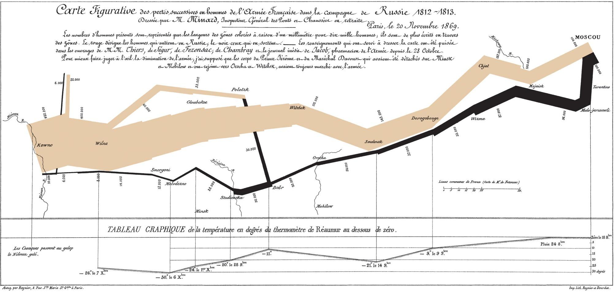

# 视觉感知与认知
## 本课大纲
 - 视觉感知
 - 认知
 - 视觉通道*
 - 色彩
### 数据可视化的目的
 - 辅助人类感知（利用大脑外的资源增强大脑本身的认知能力）
 - 
### 感知 vs. 认知
 - 感知：关于输入信号的本质，即看见的东西
 - 认知：关于输入信号的抽象，即对输入信号的理解和解释
 - 人脑：感知和认知无法充分分离（要利用人在感知同时所进行的经验性认知）
 - 电脑：感知和认知可以充分分离
## 视觉感知
1. 人类的视觉感知对颜色比对形状更敏感
2. 人类感知会形成自然趋势（如点排成行可以替代横线）
## 认知
### 概念界定
 - 认知心理学：信息的获取、分析、归纳、解码、储存、概念形成提取和使用
 - 科学领域：
### “看不见的大猩猩”实验
 - 结论
    1. 记忆是人类认知中的重要因素，但工作记忆容量有限。
    2. 可视化可以作为增强工作记忆的工具。
### “”

### 对比变化图像实验
 - 结论
    1. 人类视觉系统观察的是变化，而不是绝对值，切容易被边界吸引
    2. 在不同物体间使用高对比度来增强区分度
OL0
## 经典作品（拿破仑东征俄国图）
