# <center>挖挖网易云的外链加密过程</center>
## 一. 访问歌曲的外链播放界面
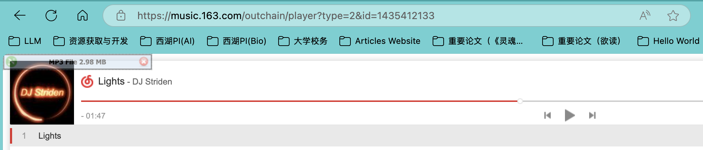
点击播放后在开发人员工具观察到：
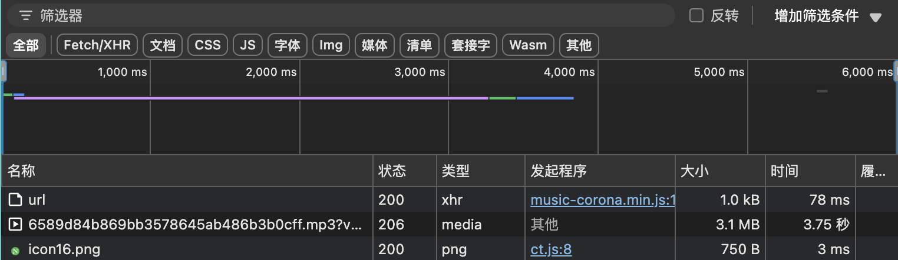
这里有两个主要内容：
- 一个`xhr`POST请求
- 一个`media`的GET

其中，这个media没有“发起程序”，即浏览器发起GET，且请求URL为https://m704.music.126.net/20250608201619/0983dae2040bed0ecee510b3e39d0d23/jdymusic/obj/w5zDlMODwrDDiGjCn8Ky/1981562724/8671/6b85/b045/6589d84b869bb3578645ab486b3b0cff.mp3?vuutv=JF5X8QDe+BxG7QLsAZJLuUPGCCzMV+uZqQ3RPi1STT/5A9dlF6Y2EKS74JiuGRoAng9zULB5+CbtNq3bLUrTz1Yebwloocdy6GOoBrsArio=&authSecret=000001974f617f821ee90a30845810d9
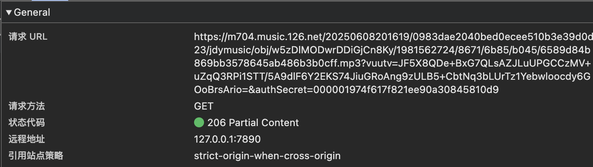
经过观察，该URL来自前一个XHR的POST请求的相应内容的“url”字段：
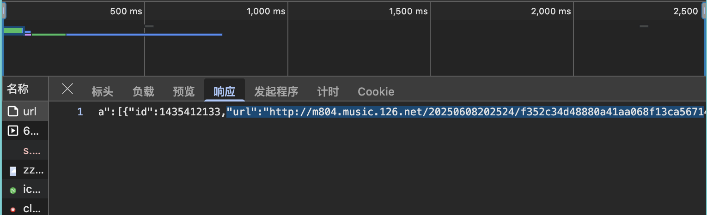
该XHR的POST请求结构如下：
- 请求头url为：
https://music.163.com/weapi/song/enhance/player/url
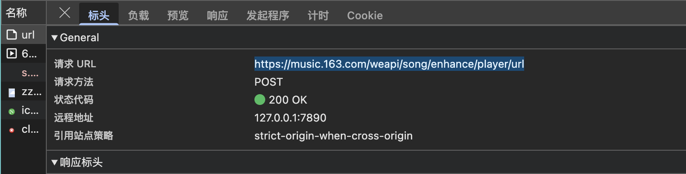
- 所带参数为：
params: 9IQU7xs1qBjzCHQhAxTvdwu8v/lqqxF+voZEA27K8b+nyi/D1hDq+tgJ6rMWARLmw1u+OdmBLtHwPyO95juBc5Vkf3jT2ckpdL7YPE9aT6IgtKYh+YrxxXvx1GDOO5JDpewX3s1hGsNEaregHbRsKy+58rFi0iTqad5IOG3GWdKUYLh0sSC5qkUY3v/BACeC
encSecKey: 1685fe1f9db07483e00b6151d4dea1f9da7f0c8253d6d4cde22173bd429675c7006a316cbf07d9b6c127b25428b1b0e7c5b21ce6c4dd383920879733589c9f1e490274d270c05d771998eb07bceac04f6857517ccf190a2173b830feb50db20c9a3d7aa25b864ed52dbe7247b5b04a5f1a8c80e1f283d0a358d0de758c5c504a
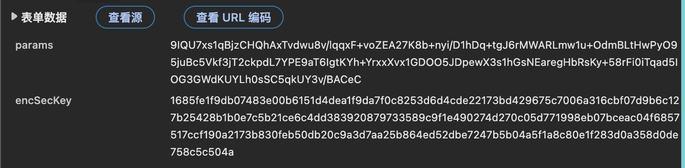
经测试，该请求可以正常POST并获取到目标链接：
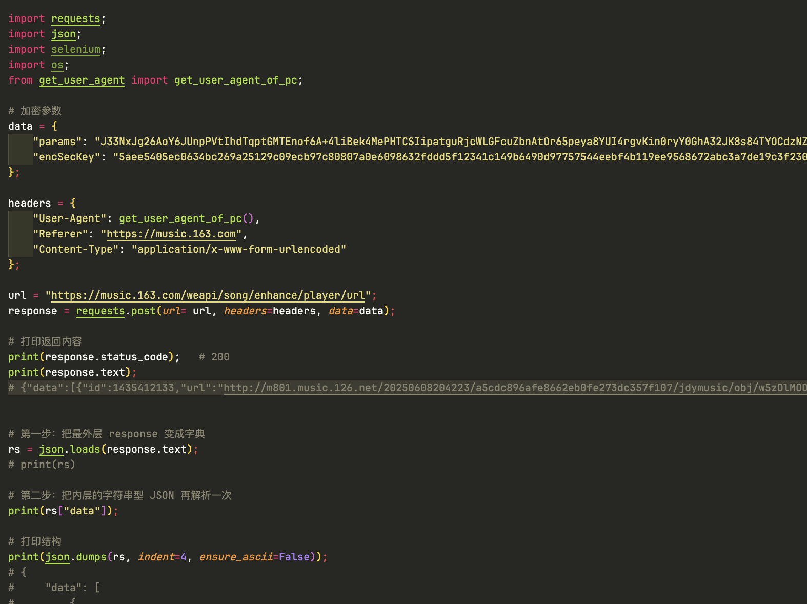
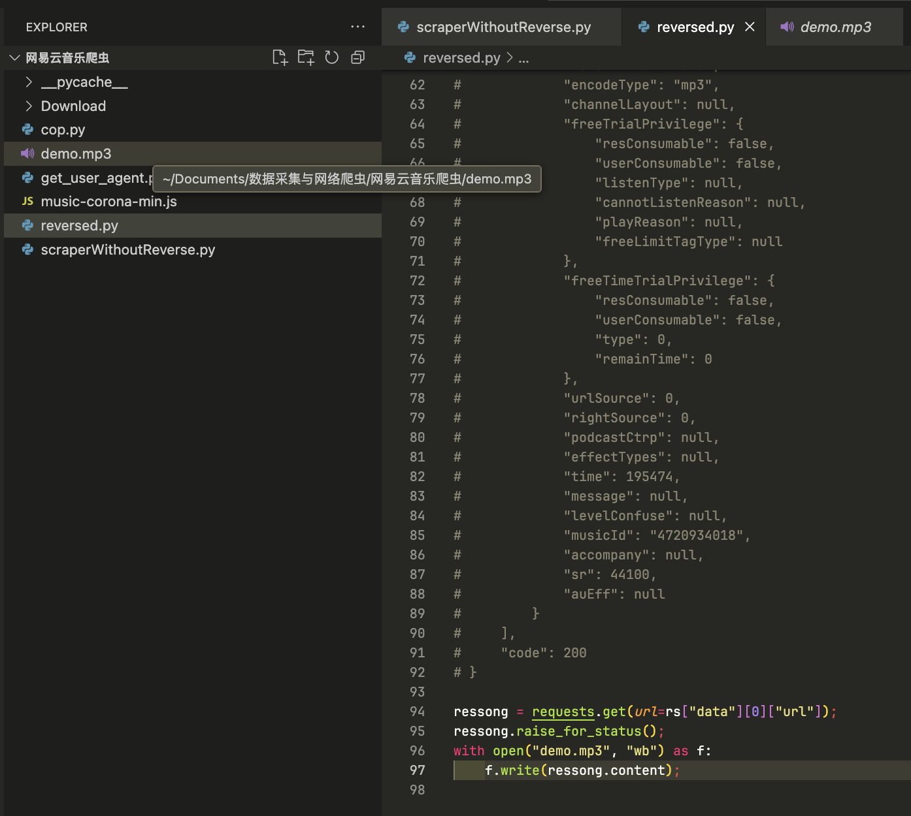
于是目标明确，寻找两个加密参数的生成过程：
## 二、解析加密栈
- 查看栈调用：
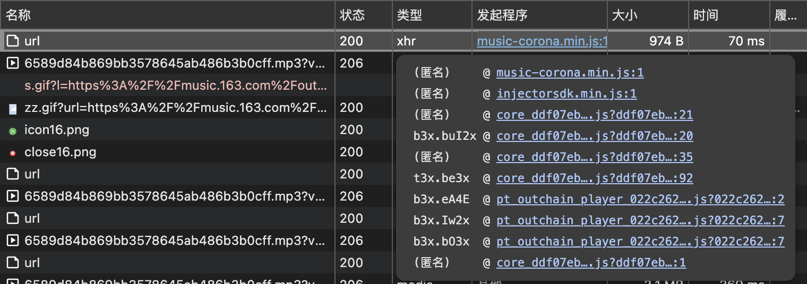
于是给每个调用栈的调用位置都打上断点，然后多次单步调试（第一次学习着弄可能需要1h左右），最终在第二层的
>
找到了目标过程：
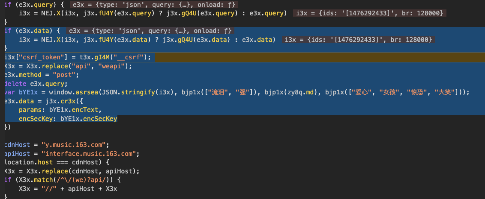
在控制台拆解一下该过程：
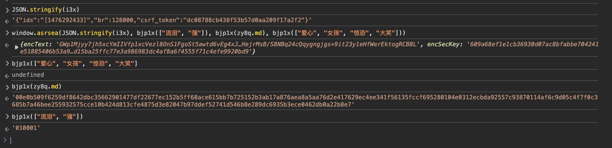
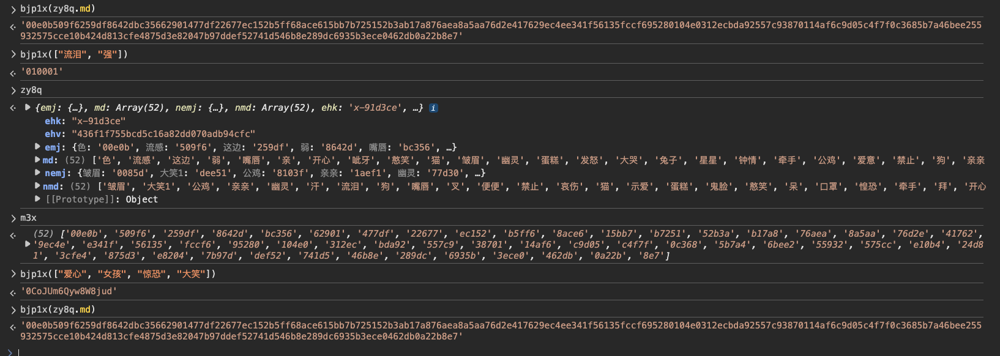
注意到：
- `JSON.stringify(i3x)`：字符串化的json对象，含歌曲id，音频比特率以及取自cookies中的csrf_token
- `bjp1x(["流泪", "强"])`：一个固定的数字字串`010001`
- `bjp1x(zy8q.md)`：是一个中文emoji字典的全部值的哈希映射的拼接串
- `bjp1x(["爱心", "女孩", "惊恐", "大笑"])`：同上面两个的构造
其中的映射字典为：
```js
"emj": {
亲: "62901"
亲亲: "95280"
便便: "462db"
兔子: "76aea"
公鸡: "9ec4e"
叉: "104e0"
发怒: "52b3a"
口罩: "24d81"
可爱: "7b97d"
吐舌: "3cfe4"
呆: "557c9"
呲牙: "22677"
嘴唇: "bc356"
圈: "3ece0"
圣诞: "8e7"
外星: "0a22b"
大哭: "b17a8"
大笑: "d"
女孩: "m6Qyw"
奸笑: "289dc"
小鸡: "6bee2"
幽灵: "15bb7"
开心: "477df"
弱: "8642d"
强: "1"
心碎: "875d3"
怒: "c4f7f"
惊恐: "8W8ju"
惶恐: "e10b4"
憨笑: "ec152"
拜: "c9d05"
撇嘴: "575cc"
星星: "8a5aa"
晕: "bda92"
汗: "5b7a4"
流感: "509f6"
流泪: "01000"
爱心: "0CoJU"
爱意: "e341f"
牵手: "41762"
狗: "fccf6"
猪: "6935b"
猫: "b5ff6"
生气: "e8204"
生病: "38701"
男孩: "46b8e"
痛苦: "55932"
皱眉: "8ace6"
示爱: "0c368"
礼物: "312ec"
禁止: "56135"
色: "00e0b"
蛋糕: "b7251"
跳舞: "741d5"
这边: "259df"
钟情: "76d2e"
钻石: "14af6"
鬼脸: "def52"
}

"md": [
    "色",
    "流感",
    "这边",
    "弱",
    "嘴唇",
    "亲",
    "开心",
    "呲牙",
    "憨笑",
    "猫",
    "皱眉",
    "幽灵",
    "蛋糕",
    "发怒",
    "大哭",
    "兔子",
    "星星",
    "钟情",
    "牵手",
    "公鸡",
    "爱意",
    "禁止",
    "狗",
    "亲亲",
    "叉",
    "礼物",
    "晕",
    "呆",
    "生病",
    "钻石",
    "拜",
    "怒",
    "示爱",
    "汗",
    "小鸡",
    "痛苦",
    "撇嘴",
    "惶恐",
    "口罩",
    "吐舌",
    "心碎",
    "生气",
    "可爱",
    "鬼脸",
    "跳舞",
    "男孩",
    "奸笑",
    "猪",
    "圈",
    "便便",
    "外星",
    "圣诞"
]
```
因此，我们得到了所有的固定字串
```python
# bjp1x(["流泪", "强"])
'010001'
# bjp1x(zy8q.md)
'00e0b509f6259df8642dbc35662901477df22677ec152b5ff68ace615bb7b725152b3ab17a876aea8a5aa76d2e417629ec4ee341f56135fccf695280104e0312ecbda92557c93870114af6c9d05c4f7f0c3685b7a46bee255932575cce10b424d813cfe4875d3e82047b97ddef52741d546b8e289dc6935b3ece0462db0a22b8e7'
# bjp1x(["爱心", "女孩", "惊恐", "大笑"])
'0CoJUm6Qyw8W8jud'
```
然后就开始加密了（图中的`d(d, e, f, g)`函数）：
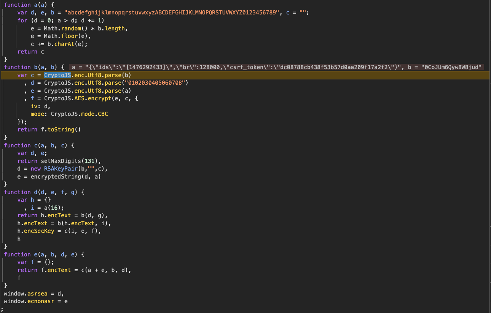

```js
!function() {
    function a(a) {
        var d, e, b = "abcdefghijklmnopqrstuvwxyzABCDEFGHIJKLMNOPQRSTUVWXYZ0123456789", c = "";
        for (d = 0; a > d; d += 1)
            e = Math.random() * b.length,
            e = Math.floor(e),
            c += b.charAt(e);
        return c
    }
    function b(a, b) {
        var c = CryptoJS.enc.Utf8.parse(b)
          , d = CryptoJS.enc.Utf8.parse("0102030405060708")
          , e = CryptoJS.enc.Utf8.parse(a)
          , f = CryptoJS.AES.encrypt(e, c, {
            iv: d,
            mode: CryptoJS.mode.CBC
        });
        return f.toString()
    }
    function c(a, b, c) {
        var d, e;
        return setMaxDigits(131),
        d = new RSAKeyPair(b,"",c),
        e = encryptedString(d, a)
    }
    function d(d, e, f, g) {
        var h = {}
          , i = a(16);
        return h.encText = b(d, g),
        h.encText = b(h.encText, i),
        h.encSecKey = c(i, e, f),
        h
    }
    function e(a, b, d, e) {
        var f = {};
        return f.encText = c(a + e, b, d),
        f
    }
    window.asrsea = d,
    window.ecnonasr = e
}();
```
加密步骤：
1. 随机生成一个16位长度的字串`i`
2. 用`JSON.stringify(i3x)`与`0CoJUm6Qyw8W8jud`进行一轮`AES-128-CBC`加密
3. 用**步骤2**的结果与`i`再进行一次`AES-128-CBC`加密得到`params`加密参数
4. 以`params`为明文，`‘010001‘`为公钥指数，`bjp1x(zy8q.md)`为模，进行RSA加密，并最终得到`encSecKey`加密参数

**到这里我们已经完成了对网易云外链加密方式的解析**
## 三、使用Python复现加密过程
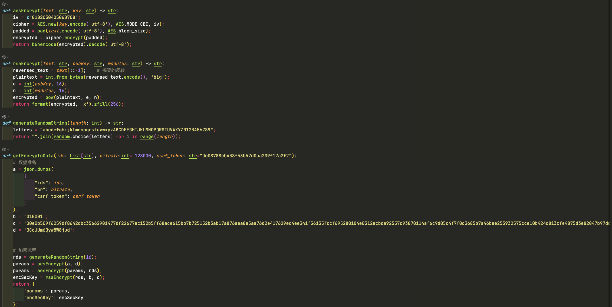
于是，我们就可以实现基于歌曲ID的自由下载啦