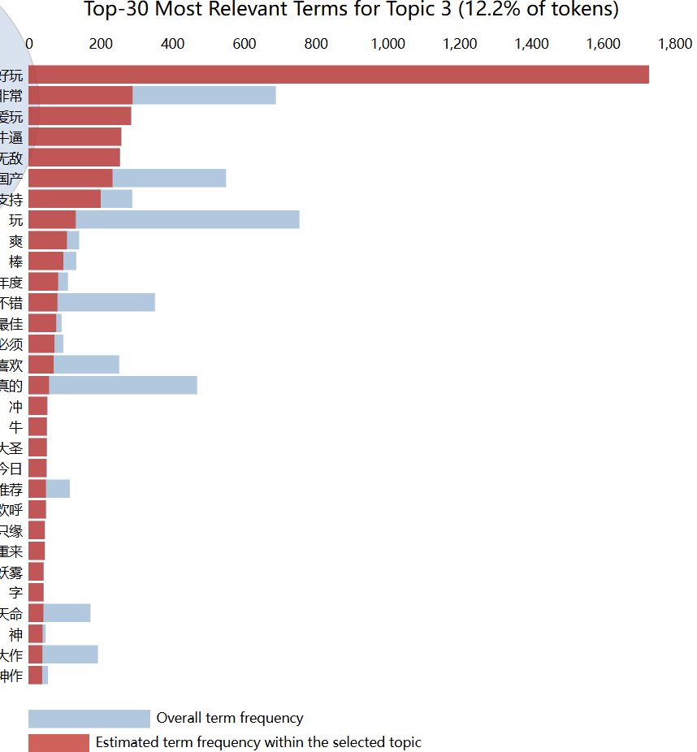

# 总体设计

## 研究背景

## 数据的预处理
 - 数据提取（使用正则表达式提取游戏时长中的小时数值）
 - 去重（共去除1004条重复）
 - 缺失填充（3条其他外语翻译为英语）
 - 中英区分（使用正则表达式）
-  1. 评论含中文记为中文评论
-  2. 评论仅含英语记为英语评论
-  3. 评论纯英语但用户名称含中文额外记为国人英语评论
-  4. 中英双语评论保留中文部分
## 数据的初步统计
 - 词频统计（词云）
 - 游玩时长直方图
 - 评论长度直方图
 - 各语言评论数柱形图
 - 中英用户的推荐数饼图
## 玩家态度分析
 - NLTK情感分计算（简单介绍原理）
 - 情感直方图
 - 情感分对游玩时间做回归
 - 给出分析结论并对比中英评论
## LDA主题分析
 - 分中英LDA建模
 - 对不同主体内进行简单统计分析然后命名各个主题
   - **中文评论**
   - 推荐
     1. 大部分评论是“讨论派”（讨论游戏具体体验，也会讨论部分问题，占**67.6%**）
       
     2. 少部分评论是体验党（对游戏体验给予更直白强烈的溢美之词，但没有过多具体内容的讨论，占**12.2%**）
       
     3. 还有一类是“文化派”（譬如对“国产”或是“齐天大圣”提及较多，占**20.2%**）
       
   - 不推荐
     1. “技术不足型”（针对游戏动作系统的吐槽以及一部分对向美术妥协的空气墙设计+对于较弱性能设备的优化不足问题的不满，占**35.5.5%**）
       
     2. “内容不适口”（对游戏的没有地图的引导缺失、剧情、动画设计等技术经验领域的吐槽，占**36.6%**）
       
     3. 以及混合了前两派理由但混合了大量谩骂的不礼貌评论（占比**20.5**%）

   - **英语评论**
   - 推荐
     1. 绝大多数评论是“讨论派”但讨论游戏问题的更少，更多的是对来自中国游戏“奇迹”的赞美和体验的优秀（国人英语评论虽然多是些简短的溢美之辞，但也多在此类，占**76.3%**）

     2. 再者是“香槟党”，不吝溢美之词且直呼游戏可以赢下今年“年度游戏”桂冠（占**5.8%**）

     3. 则是文化上的“好奇派”，由于黑神话悟空这款游戏产生了对中华文化和民间传说的好奇（**占比17.9%**）

   - 不推荐
     1. 对战斗系统和视觉效果的“内容性吐槽”（从措辞来看大概率是`combat setting`之类的动作组合不流畅，结合专业媒体分析是预输入设计缺失引起的难度过大，占**54.6%**）

     2. 对游戏的性能和优化等“技术性问题”提出批评（譬如游戏崩溃，帧率低等，占**38.6%**）

     3. 对于游戏中空气墙，叙事节奏、音效和严重性能问题等可以靠游戏开发经验积累得到改善的问题并没有被大肆讨论（占**6.8%**）

 - 使得主题变为一个特征
## 对玩家群体内在关系的进一步探索
 - t-SNE
 - UMAP
 - 呈现并对比多种聚类方法的结果
## 总结

  
